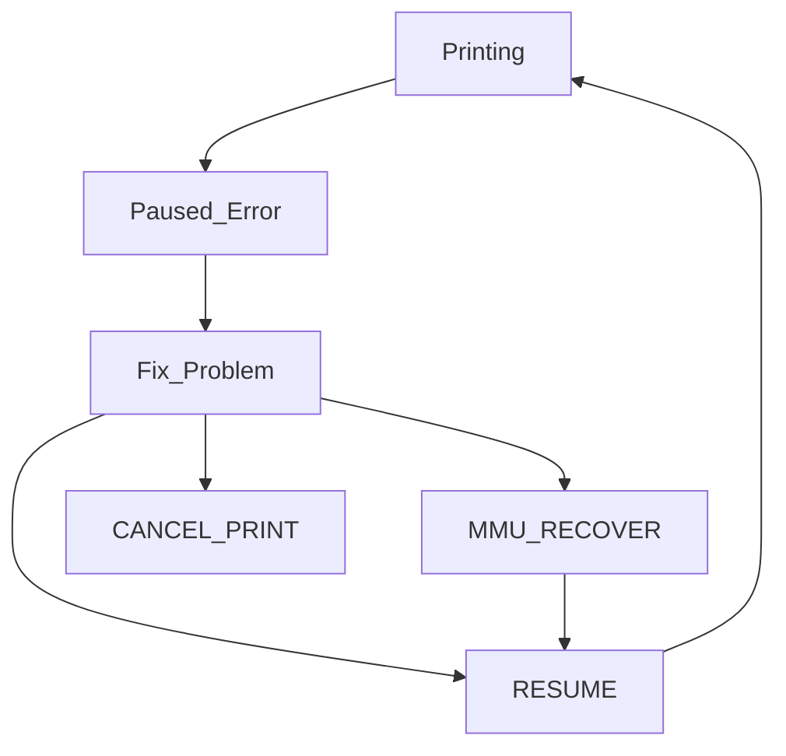
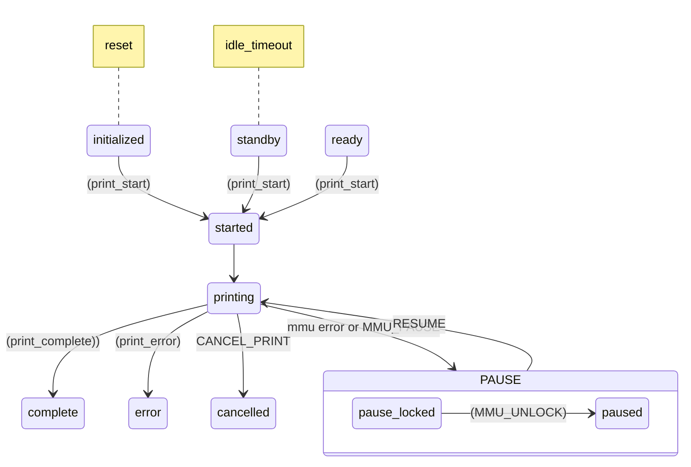

<p align="center">
  
  <h1 align="center">Happy Hare</h1>
</p>

<p align="center">
Universal MMU driver for Klipper
</p>

<p align="center">
<!--
  <a aria-label="Downloads" href="https://github.com/moggieuk/Happy-Hare/releases">
    
  </a>
  -->
  <a aria-label="Stars" href="https://github.com/moggieuk/Happy-Hare/stargazers">
    </a> &nbsp;
  <a aria-label="Forks" href="https://github.com/moggieuk/Happy-Hare/network/members">
    </a> &nbsp;
  <a aria-label="License" href="https://github.com/moggieuk/Happy-Hare/blob/master/LICENSE">
    </a> &nbsp;
  <a aria-label="Commits" href="">
    </a> &nbsp;
</p>

Happy Hare (v2) is the second edition of what started life and as [alternative software control](https://github.com/moggieuk/ERCF-Software-V3) for the ERCF v1.1 ecosystem. Now in its second incarnation it has been re-architected to support any type of MMU (ERCF, Tradrack, Prusa) in a consistent manner on the Klipper platform. It is best partnered with [KlipperScreen for Happy Hare](#---klipperscreen-happy-hare-edition) until the Mainsail integration is complete :-)

Also, some folks have asked about making a donation to cover the cost of the all the coffee I'm drinking (actually it's been G&T lately!). Although I'm not doing this for any financial reward I have put hundreds of hours into this project and if you find value and feel inclined a donation to PayPal https://www.paypal.me/moggieuk will certainly be spent making your life with your favorate MMU more enjoyable. Thank you!
<p align="center"><a href="https://www.paypal.me/moggieuk"></a></p>

<br>

##    Readme Table of Contents

**[Major feature](#---major-features)**<br>
**[Installation](#---installation)**<br>
**[Basic Commands](#---basic-commands-and-printer-variables)**<br>
**[Setup & Calibration](#---setup-and-calibration)**<br>
**[Important Concepts and Features](#---important-concepts-and-features)**<br>
\- [1. How to handle errors](#1-how-to-handle-errors)<br>
\- [2. State and Persistence](#2-state-and-persistence)<br>
\- [3. Tool to Gate Mapping](#3-tool-to-gate-ttg-mapping)<br>
\- [4. Synchronized Gear/Extruder](#4-synchronized-gearextruder-motors)<br>
\- [5. Clog, Runout, EndlessSpool, Flowrate](#5-clogrunout-detection-endlessspool-and-flowrate-monitoring)<br>
\- [6. Logging](#6-logging)<br>
\- [7. Pause/Resume/Cancel](#7-pause--resume--cancel_print-macros)<br>
\- [8. Recovering MMU state](#8-recovering-mmu-state)<br>
\- [9. Gate statistics](#9-gate-statistics)<br>
\- [10. Filament bypass](#10-filament-bypass)<br>
\- [11. Pre-print functions](#11-useful-pre-print-functionality)<br>
\- [12. Gate map, Filament type and color](#12-gate-map-describing-filament-type-color-and-status)<br>
\- [13. Job state transitions](#13-job-state-transistions-and-print-startend-handling)<br>
\- [14. LEDs](#14-leds)<br>
\- [15. Debugging](#15-debugging)<br>
**[Loading and Unloading Sequences](#---filament-loading-and-unloading-sequences)**<br>
**[KlipperScreen Happy Hare Edition](#---klipperscreen-happy-hare-edition)**<br>
**[My Testing / Setup](#---my-testing)**<br>
**[Revision History](#---revision-history)**<br>

#### Other Docs:

**[Slicer Setup](/doc/slicer_setup.md)** 🆕<br>
**[Understanding Operation with MMU_STATUS](/doc/operation.md)** 🆕<br>
**[Command Reference](/doc/command_ref.md)**<br>
**[Hardware Configuration, Movement and Homing](/doc/hardware_config.md)**<br>
**[Calibration Guide](/doc/calibration.md)**<br>
**[Configuation Reference](/doc/configuration.md)**<br>
**[Toochange Movement and Slicer Setup](/doc/toolchange_movement.md)** 🆕<br>
**[Happy Hare Macro Customization](/doc/macro_customization.md)** 🆕<br>
**[Tip Forming and Purging](/doc/tip_forming_and_purging.md)** 🆕<br>
**[Gcode Preprocessing](/doc/gcode_preprocessing.md)** 🆕<br>
**[LED Support](/doc/leds.md)**<br>
**[Spoolman Support](/doc/spoolman_support.md)** 🆕<br>
**[Conceptual MMU Design](/doc/conceptual_mmu.md)**<br>
**[Third Party Addons](/config/addons/README.md)** 🆕<br>

<br>
 
##    Major features:
<ul>
  <li>Support any brand of MMU and user defined monsters. (Caveat: ERCF 1.1, 2,0 so far, Tradrack and Prusa comming very soon)</li>
  <li>Companion <a href="#---klipperscreen-happy-hare-edition">KlipperScreen for Happy Hare</a> for very simple graphical interaction</li>
  <li>Synchronized movement of extruder and gear motors during any part of the loading or unloading operations or homing so it can overcome friction and even work with FLEX materials!</li>
  <li>Sophisticated multi-homing options including extruder!</li>
  <li>Implements a Tool-to-Gate mapping so that the physical spool can be mapped to any tool</li>
  <li>EndlessSpool allowing a spool to automatically be mapped and take over from a spool that runs out</li>
  <li>Sophisticated logging options (console and mmu.log file)</li>
  <li>Can define material type and color in each gate for visualization and customized settings (like Pressure Advance)</li>
  <li>Spoolman integration</li>
  <li>Automated calibration for easy setup</li>
  <li>Supports MMU "bypass" gate functionality</li>
  <li>Ability to manipulate gear and extruder current (TMC) during various operations for reliable operation</li>
  <li>Moonraker update-manager support</li>
  <li>Complete persistence of state and statistics across restarts. That's right you don't even need to home!</li>
  <li>Highly configurable speed control that intelligently takes into account the realities of friction and tugs on the spool</li>
  <li>Optional integrated encoder driver that validates filament movement, runout, clog detection and flow rate verification!</li>
  <li>Vast customization options most of which can be changed and tested at runtime</li>
  <li>Integrated help, testing and soak-testing procedures</li>
  <li>Gcode pre-processor check that all the required tools are avaialble!</li>
  <li>Drives LEDs for functional feed and some bling!</li>
  <li>Built in tip forming and filament cutter support</li>
  <li>Lots more...</li>
</ul>

Companion customized [KlipperScreen for Happy Hare](#---klipperscreen-happy-hare-edition) for easy touchscreen MMU control!


<br>
 
##    Installation
The module can be installed into an existing Klipper installation with the install script. Once installed it will be added to Moonraker update-manager to easy updates like other Klipper plugins:

```
cd ~
git clone https://github.com/moggieuk/Happy-Hare.git
cd Happy-Hare

./install.sh -i
```

The `-i` option will bring up an interactive installer to aid setting some confusing parameters. For popular external mcu boards it will also configure all the pins for you. If not run with the `-i` flag it defaults to update current installation which is sometimes necessary on significant version updates (see [here](doc/update.md)). Note that if existing install it found it will never be overwritten, it will be moved to numbered backups with a `<file>.<date>` extension and read for current configuration defaults. If you still choose not to install the new `mmu*.cfg` files automatically you can copy the templates an fill in all the tokens and blanks by hand. Frankly it is easier to run through an initial install and use the generated config files as a starting point.
<br>

Note that the installer will look for Klipper install and config in standard locations. If you have customized locations or multiple Klipper instances on the same rpi, or the installer fails to find Klipper you can use the `-k` and `-c` flags to override the klipper home directory and klipper config directory respectively. Also, if installing on Repetier-Servo add the `-r` option. E.g.
```
./install.sh -k /opt/klipper/LK5_Pro_ERCF -c /var/lib/Repetier-Server/database/klipper -m /opt/klipper/LK5_Pro_ERCF/moonraker -r LK5_Pro_ERCF -i
```

If you have multiple Klipper instances installed with for example Kiauh. You can use the `-a` flag to specify the service name. E.g.
```
./install-sh -a klipper-two -k <klipper_home_dir> -c <klipper_config_dir>
```

<br>

> [!IMPORTANT]  
> `mmu.cfg`, `mmu_hardware.cfg`, `mmu_macro_vars.cfg` & `mmu_parameters.cfg` (and other base config files) must all be referenced by your `printer.cfg` master config file with `mmu.cfg` and `mmu_hardware.cfg` listed first (the recommended way to achieve this is simply with `[include mmu/base/*.cfg]`). `mmu/optional/client_macros.cfg` should also explicitly be referenced if you don't already have working PAUSE / RESUME / CANCEL_PRINT macros (but be sure to read the section before on macro expectations and review the default macros). The install script can also include these optional config files for you.
<br>

> [!TIP]  
> If you are concerned about running `install.sh -i` then run like this: `install.sh -i -c /tmp -k /tmp` This will build the `*.cfg` files for you but put then in /tmp. You can then read them, pull out the bits your want to augment existing install or simply see what the answers to the various questions will do...

```
Usage: ./install.sh [-k <klipper_home_dir>] [-c <klipper_config_dir>] [-m <moonraker_home_dir>] [-b <branch>] [-r <Repetier-Server stub>] [-i] [-d] [-z]

-i for interactive install
-d for uninstall
-z skip github check (nullifies -b <branch>)
-r specify Repetier-Server <stub> to override printer.cfg and klipper.service names
(no flags for safe re-install / upgrade)
```

> [!WARNING]  
> TCRT 5000 encoders on ERCFv1.1 can be problematic. A new backward compatible alternative "Binky" is available is strongly recommended (standard in ERCFv2). If you insist on fighting with the original encoder be sure to read my [notes on Encoder problems](/doc/ercf_encoder_v11.md) - the better the encoder the better this software will work for MMU's with encoders.
> Hall effect toolhead sensors can be problematic in a heated chamber because their characteristics change with temperature. Microswitch versions are preferred.

<br>

##    Video Tutorials & Other Resources

### English: 
<i>comming soon</i>

### German:
<div align="left">
  <a href="https://www.youtube.com/watch?v=uaPLuWJBdQU">
    </a>
    Instructional video created by the Crydteam
<!--
    
-->
  </a>
</div>
<br>

##    Overview

Happy Hare has been built to support most types of MMU's connected to the Klipper ecosystem. That includes ERCF, Tradrack, AMS-style and other custom designs. It has extensive configuation to allow for customization allow using the installer and selecting type through `vendor` and `version` minimizes the need for customiztion.  The three conceptual types of MMUs and the function and operation of their various sensors can be [found here](doc/conceptual_mmu.md) and should be consulted for any customized setup.

<br>

##    Basic Commands and Printer Variables

Happy Hare has a built in help system to aid remembering the command set. It can accessed with the `MMU_HELP` command and can also be used to view testing commands and user extensible macros which are called by Happy Hare on certain conditions. The full list of commands and options can be [found here](/doc/command_ref.md). A very useful command for understanding MMU operate (`MMU_STATUS`) is explained [in detail here](/doc/operation.md).

Also Happy Hare exposes a large array of 'printer' variables that are useful in your own macros.

<details>
<summary><sub>🔹 Click to read more....</sub></summary>
<br>
 
  > MMU_HELP

```yml
    Happy Hare MMU commands: (use MMU_HELP MACROS=1 TESTING=1 for full command set)
    MMU : Enable/Disable functionality and reset state
    MMU_CHANGE_TOOL : Perform a tool swap
    MMU_CHECK_GATE : Automatically inspects gate(s), parks filament and marks availability
    MMU_EJECT : aka MMU_UNLOAD Eject filament and park it in the MMU or optionally unloads just the extruder (EXTRUDER_ONLY=1)
    MMU_ENCODER : Display encoder position or temporarily enable/disable detection logic in encoder
    MMU_ENDLESS_SPOOL : Display TTG map or redefine the EndlessSpool groups
    MMU_GATE_MAP : Display or define the type and color of filaments on each gate
    MMU_HELP : Display the complete set of MMU commands and function
    MMU_HOME : Home the MMU selector
    MMU_LED : Manage mode of operation of optional MMU LED's
    MMU_LOAD : Loads filament on current tool/gate or optionally loads just the extruder for bypass or recovery usage (EXTUDER_ONLY=1)
    MMU_MOTORS_OFF : Turn off both MMU motors
    MMU_PAUSE : Pause the current print and lock the MMU operations
    MMU_PRELOAD : Preloads filament at specified or current gate
    MMU_RECOVER : Recover the filament location and set MMU state after manual intervention/movement
    MMU_RESET : Forget persisted state and re-initialize defaults
    MMU_SELECT : Select the specified logical tool (following TTG map) or physical gate
    MMU_SELECT_BYPASS : Select the filament bypass
    MMU_SENSORS : Query state of sensors fitted to mmu
    MMU_SERVO : Move MMU servo to position specified position or angle
    MMU_SLICER_TOOL_MAP : Display or define the tools used in print as specified by slicer
    MMU_GATE_MAP : Display or define the type and color of filaments on each gate
    MMU_STATS : Dump (and optionally reset) the MMU statistics
    MMU_STATUS : Complete dump of current MMU state and important configuration
    MMU_SYNC_GEAR_MOTOR : Sync the MMU gear motor to the extruder stepper
    MMU_TOOL_OVERRIDES : Displays, sets or clears tool speed and extrusion factors (M220 & M221)
    MMU_TTG_MAP : aka MMU_REMAP_TTG Display TTG map or remap a tool to a specific gate and set gate availability
    MMU_UNLOCK : Wakeup the MMU prior to resume to restore temperatures and timeouts
```

> MMU_HELP MACROS=1 TESTING=1

To additionaly see testing command set and macros.
<br>
Happy Hare exposes a large array of 'printer' variables that are useful in your own macros.

```yml
    printer.mmu.enabled : {bool} True if MMU is enabled
    printer.mmu.is_locked : {bool} True if MMU is paused after an error DEPRECATED: use print_job_state
    printer.mmu.is_homed : {bool} True if MMU has been homed
    printer.mmu.tool : {int} 0..n | -1 for unknown | -2 for bypass
    printer.mmu.gate : {int} 0..n | -1 for unknown
    printer.mmu.active_filament : {dict} of active filament attributes (from gate_map, e.g. active_filament.material, active_filament.color)
    printer.mmu.next_tool : {int} 0..n | -1 for unknown | -2 for bypass (during a tool change)
    printer.mmu.last_tool : {int} 0..n | -1 for unknown | -2 for bypass (during a tool change after unload)
    printer.mmu.last_toolchange : {string} description of last change similar to M117 display
    printer.mmu.runout : {bool} True while MMU is handling a runout
    printer.mmu.filament : {string} filament state in extruder (Loaded | Unloaded | Unknown)
    printer.mmu.filament_pos : {int} state machine - exact location of filament
    printer.mmu.filament_direction : {int} 1 (load) | -1 (unload)
    printer.mmu.servo : {string} Up | Down | Move | Unknown
    printer.mmu.ttg_map : {list} defined gate for each tool
    printer.mmu.gate_status : {list} per gate: 0 empty | 1 available | 2 available from buffer |  -1 unknown
    printer.mmu.gate_material : {list} of material names, one per gate
    printer.mmu.gate_color : {list} of color names, one per gate
    printer.mmu.gate_color_rgb : {list} of color rbg values from 0.0 - 1.0 in truples (red, green blue), one per gate
    printer.mmu.gate_spool_id : {list} of IDs for Spoolman, one per gate
    printer.mmu.custom_color_rgb : {list} of color rbg values from 0.0 - 1.0 in truples (red, green blue), one per gate
    printer.mmu.slicer_tool_map : {dict} of slicer defined tool attributes (in form slicer_tool_map.tools.x.[color|material|temp])
    printer.mmu.endless_spool_groups : {list} membership group (int) for each tool
    printer.mmu.tool_extrusion_multipliers : {list} current M221 extrusion multipliers (float), one per tool
    printer.mmu.tool_speed_multipliers : {list} current M220 extrusion multipliers (float), one per tool
    printer.mmu.action : {string} Idle | Loading | Unloading | Forming Tip | Heating | Loading Ext | Exiting Ext | Checking | Homing | Selecting
    printer.mmu.has_bypass : {int} 0 (not available) | 1 (available)
    printer.mmu.sync_drive : {bool} True if gear stepper is currently synced to extruder
    printer.mmu.sync_feedback_state : {string} State of sync feedback sensor (compressed | expanded | neutral | disabled)
    printer.mmu.print_job_state : {string} current job state seen by MMU (initialized | standby | started | printing | pause_locked | paused | complete | cancelled | error)
    printer.mmu.clog_detection : {int} 0 (off) | 1 (manual) | 2 (auto)
    printer.mmu.endless_spool : {int} 0 (disabled) | 1 (enabled) | 2 (additionally enabled for pre-gate sensor)
    printer.mmu.print_start_detection : {int} 0 (disabled) | 1 (enabled)
```

Optionally exposed on mmu_encoder (if fitted):

```yml
    printer['mmu_encoder mmu_encoder'].encoder_pos : {float} Encoder position measurement in mm
    printer['mmu_encoder mmu_encoder'].detection_length : {float} The detection length for clog detection
    printer['mmu_encoder mmu_encoder'].min_headroom : {float} How close clog detection was from firing on current tool change
    printer['mmu_encoder mmu_encoder'].headroom : {float} Current headroom of clog detection (i.e. distance from trigger point)
    printer['mmu_encoder mmu_encoder'].desired_headroom : {float} Desired headroom (mm) for automatic clog detection
    printer['mmu_encoder mmu_encoder'].detection_mode : {int} Same as printer.mmu.clog_detection
    printer['mmu_encoder mmu_encoder'].enabled : {bool} Whether encoder is currently enabled for clog detection
    printer['mmu_encoder mmu_encoder'].flow_rate : {int} % flowrate (extruder movement compared to encoder movement)
```

</details>

<br>

##    Setup and Calibration:

Configuration and calibration will vary slightly depending on your particular brand of MMU althought the steps are essentially the same with some being dependent on hardware configuration. Here are the five basic steps.

### 1\. Important MMU Vendor / Version Specification

Happy Hare functionality will vary with MMU vendor. After running the installer it is important to verify `mmu_vendor` and `mmu_version` correctly in `mmu_parameters.cfg` because they define the basic capabilities and options in Happy Hare. The only complication is that in order to support the many popular modifications to some MMU's the correct suffix must be specified depending on modifications/upgrades.

<details>
<summary><sub>🔹 Read more about vendor/version specification...</sub></summary>
<br>
 
```yml
#
# The vendor and version config is important to define the capabilities of the MMU and basic CAD dimensions. These can
# all be overridden with the `cad` parameters detailed in the documentation but the vendor setting saves time.
#
# ERCF
# 1.1 original design, add "s" suffix for Sprigy, "b" for Binky, "t" for Triple-Decky
#     e.g. "1.1sb" for v1.1 with Springy mod and Binky encoder
#
# 2.0 new community ERCFv2, add "h" suffix for ThumperBlocks
#
# Tradrack
# 1.0 add "e" if using encoder is fitted
#
# Prusa
#  - Comming soon (use Other for now)
#
# Other
#  - Generic setup that will require further customization of `cad` parameters. See doc
#
mmu_vendor: ERCF			# MMU family
mmu_version: 1.1sb			# MMU hardware version number (add mod suffix documented above)
mmu_num_gates: 9 			# Number of selector gates
```

> [!NOTE]  
> Despite the vendor and version string taking care of most of the variations of MMU there are still a few parameters that can vary. In an attempt to support such mods (as well as supporting completely custom designs) the follow parameters can be specified to override defaults. Note these mostly relate to CAD dimensions, and encoder resolution (if fitted) and gate parking distance. Use ONLY if necessary because they could change in the future:<br>

`cad_gate0_pos:` Distance from endstop to first gate in mm<br>
`cad_gate_width:` Width of individual filament block in mm - if using modified/custom block<br>
`cad_last_gate_offset:` Distance from end of travel to last gate<br>
`cad_bypass_offset:` Distance from end of selector travel back to the bypass<br>

This only apply to ERCF v1.1:<br>
`cad_block_width:` Width of bearing block (ERCF v1.1)<br>
`cad_bypass_block_width:` Width of bypass support block - if using a custom bypass bearing block like the one in my repo which is 7mm thick (ERCF v1.1)<br>
`cad_bypass_block_delta:` - Distance from previous gate to bypass (ERCF v1.1)<br>

This non-CAD setting are also commonly required to adjust for non Binky encoders:<br>
`encoder_min_resolution:` Resolution of one 'pulse' on the encoder. Binky (default) is 23/(2x12)=0.96, TCRT5000 based is 23/(2x17)=0.68

All other configuration parameters are made available and documented in `mmu_parameters.cfg`

</details>

### 2\. Validate your mmu_hardware.cfg configuration and basic operation

Generally the typical "Type-A" MMU will consist of selector motor to position at the desired gate, a gear motor to drive the filament to the extruder and a servo to grip and release the filament. In addition there may be a one or more sensors (endstops) to aid filament positioning. See [hardware configuration doc](/doc/hardware_config.md) for detailed instructions and consult [MMU comceptual model](/doc/conceptual.md) for details of less common MMU types.

<details>
<summary><sub>🔹 Details on optional hardware...</sub></summary>

#### Optional hardware - Encoder

Happy Hare supports the use of an encoder which is fundamental to the ERCF MMU design. This is a device that measures the movement of filament and can be used for detecting and loading/unloading filament at the gate; validating that slippage is not occuring; runout and clog detection; flow rate verification and more. The following is an output of the `MMU_ENCODER` command to control and view the encoder:

> MMU_ENCODER ENABLE=1<br>MMU_ENCODER

```
    Encoder position: 743.5mm
    Clog/Runout detection: Automatic (Detection length: 10.0mm)
    Trigger headroom: 8.3mm (Minimum observed: 5.6mm)
    Flowrate: 0 %
```

Normally the encoder is automatically enabled when needed and disabled when not printing. To see the extra information you need to temporarily enable if out of a print (hence the extra `ENABLE=1` command).

<ul>
  <li>The encoder, when calibrated, measures the movement of filament through it.  It should closely follow movement of the gear or extruder steppers but can drift over time.</li>
  <li>If enabled the clog/runout detection length is the maximum distance the extruder is allowed to move without the encoder seeing it. 
 A difference equal or greater than this value will trigger the clog/runout logic in Happy Hare</li>
  <li>If clog detection is in `automatic` mode the `Trigger headroom` represents the distance that Happy Hare will aim to keep the clog detection from firing.  Generally around 6mm - 8mm is good starting point.</li>
  <li>The minimim observed headroom represents how close (in mm) clog detection came to firing since the last toolchange. This is useful for tuning your detection length (manual config) or trigger headroom (automatic config)</li>
<li>Finally the `Flowrate` will provide an averaged % value of the mismatch between extruder extrusion and measured movement. Whilst it is not possible for this to real-time accurate it should average above 94%. If not it indicates that you may be trying too extrude too fast.</li>
</ul>

</details>

### 3\. Calibration Commands

Before using your MMU you will need to calibrate it to adjust for the differences in components used on your particular build. Be careful to calibrate in the recommended order because some settings build on earlier ones. Happy Hare now has automated calibration for some of the traditionally longer steps and does not require any Klipper restarts so the process is quick and painless. See [MMU Calibration doc](/doc/calibration.md) for detailed instructions

### 4\. Setup configuration in mmu_parameters.cfg

After calibration you might want to review and tweak the configuration and options in `mmu_parameters.cfg`. The default values set by the installer are good starting points although you will always have to specify things like the dimensions of your extruder which are very specific. The [MMU Configuration guide](/doc/configuration.md) contains an in-depth reference but some of the selected features are also discussed in more detail in the following sections.

### 5\. Tweak configuration at runtime

It's worth noting, and a very useful feature, that all the essential configuration and tuning parameters (in `mmu_parameters.cfg`) can be modified at runtime without restarting Klipper. Use the `MMU_TEST_CONFIG` command to do this. Running without any parameters will display the current values. This even allows changes to configuration during a print!

<details>
<summary><sub>🔹 Read about run-time testing of configuration...</sub></summary>
<br>
 
Running without any parameters will display the current values:

> MMU_TEST_CONFIG

```
    SPEEDS:
    gear_from_buffer_speed = 160.0
    gear_from_buffer_accel = 400.0
    gear_from_spool_speed = 60.0
    gear_from_spool_accel = 100.0
    gear_short_move_speed = 60.0
    gear_short_move_accel = 400.0
    gear_short_move_threshold = 60.0
    gear_homing_speed = 50.0
    extruder_homing_speed = 20.0
    extruder_load_speed = 15.0
    extruder_unload_speed = 20.0
    extruder_sync_load_speed = 20.0
    extruder_sync_unload_speed = 25.0
    extruder_accel = 400.0
    selector_move_speed = 200.0
    selector_homing_speed = 60.0
    selector_touch_speed = 80.0
    selector_touch_enable = 0                    # Advanced
    
    TMC & MOTOR SYNC CONTROL:
    sync_to_extruder = 1
    sync_form_tip = 1
    sync_gear_current = 50
    extruder_homing_current = 30
    extruder_form_tip_current = 120
    
    LOADING/UNLOADING:
    bowden_apply_correction = 0                  # Advanced
    bowden_allowable_load_delta = 20             # Advanced
    bowden_pre_unload_test = 1
    extruder_force_homing = 0
    extruder_homing_endstop = collision
    extruder_homing_max = 50.0
    toolhead_sync_unload = 0                     # Advanced
    toolhead_homing_max = 50.0
    toolhead_extruder_to_nozzle = 72.0
    toolhead_sensor_to_nozzle = 62.0
    gcode_load_sequence = 0                      # Expert
    gcode_unload_sequence = 0                    # Expert
    
    OTHER:
    z_hop_height_error = 1.0
    z_hop_height_toolchange = 0.5
    z_hop_speed = 15.0
    enable_clog_detection = 2
    enable_endless_spool = 1                     # Advanced
    slicer_tip_park_pos = 0.0
    auto_calibrate_gates = 0                     # Advanced
    strict_filament_recovery = 0
    retry_tool_change_on_error = 0
    print_start_detection = 1                    # Advanced
    log_level = 1
    log_visual = 2
    log_statistics = 1
    pause_macro = PAUSE                          # Advanced
    form_tip_macro = _MMU_FORM_TIP               # Advanced

    CALIBRATION:
    mmu_calibration_bowden_length = 698.0
    mmu_calibration_clog_length = 13.6
```

Any of the displayed config settings can be modified. For example, to update the distance from extruder entrance (homing postion) to nozzle.

> MMU_TEST_CONFIG toolhead_extruder_to_nozzle=45

> [!IMPORTANT]  
> When you make a change with `MMU_TEST_CONFIG` it will not be persisted and is only effective until the next restart. Therefore once you find your tuned settings be sure to update `mmu_parameters.cfg`

</details>

<br>

##    Important Concepts and Features

### 1. How to handle errors

We all hope that printing is straightforward and everything works to plan. Unfortunately that is not the case with an MMU and it may need manual intervention to complete a successful print and specifically how you use `MMU_RECOVER`, etc.

<details>
<summary><sub>🔹 Read more about handling errors and recovery...</sub></summary>
<br>

Although error conditions are inevitable, that isn't to say fairly reliable operation isn't possible - I've had many multi-thousand swap prints complete without incident. Here is what you need to know when something goes wrong.

When Happy Hare detects something has gone wrong, like a filament not being correctly loaded or perhaps a suspected clog, it will pause the print and ready the printer for fixing. You can test this condition by running:

> MMU_PAUSE FORCE_IN_PRINT=1

A few things happen in this paused state:

<ul>
  <li>Happy Hare will lift the toolhead off the print to avoid blobs</li>
  <li>The `PAUSE` macro will be called. Typically this will further move the toolhead to a parking position</li>
  <li>The heated bed will remain heated for the time set by `timeout_pause`</li>
  <li>The extruder will remain hot for the time set with `disable_heater`</li>
</ul>

To proceed you need to address the specific issue. You can move the filament by hand or use basic MMU commands. Once you think you have things corrected you may (optionally) need to run:

> MMU_RECOVER

This is optional and ONLY needed if you may have confused the MMU state. I.e. if you left everything where the MMU expects it there is no need to run and indeed if you use MMU commands then the state will be correct and there is never a need to run. However, this can be useful to force Happy Hare to run it's own checks to, for example, confirm the position of the filament. By default this command will automatically fix essential state, but you can also force it by specifying additional options. E.g. `MMU_RECOVER TOOL=1 GATE=1 LOADED=1`. See the [Command Reference](/doc/command_ref.md) for more details.

When you ready to continue with the print:

> RESUME

This will not only run your own print resume logic, but it will reset the heater timeout clocks and restore the z-hop move to put the printhead back on the print at the correct position.



</details>

### 2. State and Persistence

This is considered advanced functionality but it is incredibly useful once you are familar with the basic operation of your MMU. Essentially the state of everything from the EndlessSpool groups to the filament position and gate selection can be persisted accross restarts (selector homing is not even necessary)! The implication of using this big time saver is that you must be aware that if you modify your MMU whilst it is off-line you will need to correct the appropriate state prior to printing by using `MMU_RECOVER` or by simply homing `MMU_HOME`

<details>
<summary><sub>🔹 Read more about state persistence...</sub></summary>
<br>

Here is an example startup state:

```
2:18 AM (\_/)
        ( *,*)
        (")_(") MMU Ready
2:18 AM Gates: |#0 |#1 |#2 |#3 |#4 |#5 |#6 |#7 |#8 |
        Tools: |T0 |T1 |T2 |T3 |T4 |T5 |T6 |T7 |T8 |
        Avail: | B | B | B | ? | . | ? | S | ? | B |
        Selct: --------| * |------------------------ T4
2:18 AM MMU [T2] >>> [En] >>>>>>> [Ex] >> [Ts] >> [Nz] LOADED (@0.0 mm)
```

Aside from showing that I was up too late writing this doc, this indicates how I left my MMU the day prior... Filaments are loaded in gates 0, 1, 2, 6 & 8; Gate #2 is selected; and the filament is fully loaded. If you are astute you can see I have remapped T4 to be on gate #2 because previously I had loaded these spools incorrectly and this saved me from regenerating g-code. Gate #6 contains filament that has never been loaded and thus it is still on the `S` spool. The filaments in other gates has been previously loaded and unloaded and therefore are available from the `B` buffer. The buffer/spool distinction effects loading speed. (This status was generated on startup by setting `log_startup_status: 1` in mmu_parameters.cfg. It can also be generated anytime with the `MMU_STATUS` command).
<br>

In addition to basic operational state the print statistics and gate health statistics are persisted and so occasionally you might want to explicitly reset them with `MMU_STATS RESET=1`. There are 5 levels of operation for this feature that you can set based on your personal preference/habbits. The level is controlled by a single variable `persistence_level` in `mmu_parameters.cfg`:

```yml
# Turn on behavior -------------------------------------------------------------------------------------------------------
# MMU can auto-initialize based on previous persisted state. There are 5 levels with each level bringing in
# additional state information requiring progressively less inital setup. The higher level assume that you don't touch
# MMU while it is offline and it can come back to life exactly where it left off!  If you do touch it or get confused
# then issue an appropriate reset command (E.g. MMU_RESET) to get state back to the defaults.
# Enabling 'startup_status' is recommended if you use persisted state at level 2 and above
# Levels: 0 = start fresh every time except calibration data (the former default behavior)
#         1 = restore persisted endless spool groups
#         2 = additionally restore persisted tool-to-gate mapping
#         3 = additionally restore persisted gate status (filament availability, material and color) (default)
#         4 = additionally restore persisted tool, gate and filament position! (Recommended when MMU is working well)
```

Generally there is no downside of setting the level to 2 or 3 (the suggested default). Really, so long as you are aware that persistence is happening and know how to adjust/reset you can set the level to 4 and enjoy immediate MMU availability. Here is the complete list of commands that can reset state:

`MMU_RESET` - Reset all persisted state back to default/unknown except for print stats and per-gate health stats<br>
`MMU_STATS RESET=1` - Reset print stats and per-gate health stats back to 0<br>
`MMU_REMAP_TTG RESET=1` - Reset just the tool-to-gate mapping<br>
`MMU_ENDLESS_SPOOL RESET=1` - Reset just the endless spool groups back to default<br>
`MMU_GATE_MAP RESET=1` - Reset information about the filament type, color and availability<br>
`MMU_RECOVER` - Automatically discover or manually reset filament position, selected gate, selected tool, filament availability (lots of options)<br>
Needless to say, other operations can update specific state<br>

Couple of miscellaneous notes:

<ul>
  <li>Closely relevant to the usefulness of this functionality is the `MMU_CHECK_GATE` command that will examine all or selection of gates for presence of filament</li>
  <li>In the graphic depictions of filament state the `*` indicates presence ('B' and 'S' represent whether the filament is buffered or pulling straight from the spool), '?' unknown and ' ' or '.' the lack of filament</li>
  <li>With tool-to-gate mapping it is entirely possible to have multiple tools mapped to the same gate (for example to force a multi-color print to be monotone) and therefore some gates can be made inaccessable until map is reset</li>
  <li>The default value for `gate_status`, `tool_to_gate_map` and `endless_spool_groups` can be set in `mmu_parameters.cfg`.  If not set the default will be, Tx maps to Gate#x, the status of each gate is unknown and each tool is in its own endless spool group (i.e. not part of a group)</li>
</ul>

</details>

### 3. Tool-to-Gate (TTG) mapping

When changing a tool with the `Tx` command the MMU will by default select the filament at the gate (spool) of the same number. The mapping built into this _Happy Hare_ driver allows you to modify that.

<details>
<summary><sub>🔹 Read more about Tool-to-Gate mapping...</sub></summary><br>
 
There are a few use cases for this feature:
<ul>
  <li>You have loaded your filaments differently than you sliced gcode file... No problem, just issue the appropriate remapping commands prior to printing</li>
  <li>Some of "tools" don't have filament and you want to mark them as empty to avoid selection</li>
  <li>Most importantly, for EndlessSpool - when a filament runs out on one gate (spool) then next in the sequence is automatically mapped to the original tool.  It will therefore continue to print on subsequent tool changes.  You can also replace the spool and update the map to indicate availability mid print</li>
  <li>Turning a colored print into a mono one... Remap all the tools to a single gate.</li>
</ul>

To view the current detailed mapping you can use either `MMU_STATUS DETAIL=1` or `MMU_REMAP_TTG` with no parameters

The TTG map is controlled with the `MMU_REMAP_TTG` command although the graphical user interface with Happy Hare KlipperScreen makes this trivial. For example, to remap T0 to Gate #8, issue:

> MMU_REMAP_TTG TOOL=0 GATE=8

This will cause both T0 and the original T8 tools to pull filament from gate #8. If you wanted to then change T8 to pull from gate #0 (i.e. complete the swap of the two tools) you would issue:

> MMU_REMAP_TTG TOOL=8 GATE=0

You can also use this command to mark the availability of a gate. E.g.

> MMU_REMAP_TTG TOOL=1 GATE=1 AVAILABILE=1

Would ensure T0 is mapped to gate #1 but more importantly mark the gate as available. You might do this mid print after reloading a spool for example.

It is possible to specify an entirely new map in a single command as such:

> MMU_REMAP_TTG MAP=8,7,6,5,4,3,2,1,0

Which would reverse tool to gate mapping for a 9 gate MMU!

An example of how to interpret a TTG map (this example has EndlessSpool disabled). Here tools T0 to T2 and T7 are mapped to respective gates, T3 to T5 are all mapped to gate #3, tools T6 and T8 have their gates swapped. This also tells you that gates #1 and #2 have filament available in the buffer rather than in the spool for other gates and that gate #7 is currently empty/unavailable.

```
    T0 -> Gate #0(S)
    T1 -> Gate #1(B) [SELECTED on gate #1]
    T2 -> Gate #2(B)
    T3 -> Gate #3(S)
    T4 -> Gate #3(S)
    T5 -> Gate #3(S)
    T6 -> Gate #8(S)
    T7 -> Gate #7( )
    T8 -> Gate #6(S)

    MMU Gates / Filaments:
    Gate #0(S) -> T0, Material: PLA, Color: red, Status: Available
    Gate #1(B) -> T1, Material: ABS+, Color: orange, Status: Buffered [SELECTED supporting tool T1]
    Gate #2(B) -> T2, Material: ABS, Color: tomato, Status: Buffered
    Gate #3(S) -> T3,T4,T5, Material: ABS, Color: green, Status: Available
    Gate #4(S) -> ?, Material: PLA, Color: blue, Status: Available
    Gate #5(S) -> ?, Material: PLA, Color: indigo, Status: Available
    Gate #6(S) -> T8, Material: PETG, Color: violet, Status: Available
    Gate #7(S) -> T7, Material: ABS, Color: ffffff, Status: Empty
    Gate #8(S) -> T6, Material: ABS, Color: black, Status: Available
```

The lower paragraph of the status is the gate centric view showing the mapping back to tools as well as the configured filament material type and color which is explained later in this guide.<br>

> [!NOTE]  
> The initial availability of filament (and tihe default after a reset) at each gate can also be specified in the `mmu_parameters.cfg` file by updating the `gate_status` list of the same length as the number of gates. Generally this might be useful if you have purposefully decommissioned part of you MMU. E.g.<br>

```
gate_status = 1, 1, 0, 0, 1, 0, 0, 0, 1
```

</details>

### 4. Synchronized Gear/Extruder motors

Happy Hare allows for syncing gear motor with the extruder stepper during printing. This added functionality enhances the filament pulling torque, potentially alleviating friction-related problems. **It is crucial, however, to maintain precise rotational distances for both the primary extruder stepper and the gear stepper** A mismatch in filament transfer speeds between these components could lead to undue stress, filament grinding or printing artifacts. See the sync feedback control that can be used to mitigate this potential issue.

<details>
<summary><sub>🔹 Read more about synchronized gear/extruder motors...</sub></summary>

#### Setting up Print Synchronization

Synchronizion during printing is controlled by `sync_to_extruder` in `mmu_parameters.cfg`. If set to 1, after a toolchange, the MMU servo will stay engaged and the gear motor will sync with the extruder for extrusion and retraction moves. It can also separately be turned on for tip forming operations performed by Happy Hare's standalone tip forming macro:

**mmu_parameters.cfg parameters:**
```yaml
sync_to_extruder: 0        # Gear motor is synchronized to extruder during print
sync_form_tip: 0           # Synchronize during standalone tip formation (initial part of unload)
sync_gear_current: 50      # % of gear_stepper current (10%-100%) to use when syncing with extruder during print
```

#### Synchronization Workflow

If the `sync_to_extruder` feature is activated, the gear stepper will automatically coordinate with the extruder stepper following a successful tool change. Any MMU operation that necessitates exclusive gear stepper movement (like buzzing the gear stepper to verify filament engagement), will automatically disengage the sync. Generally, you don't need to manually manage the coordination/discoordination of the gear stepper — Happy Hare handles these actions. If the printer enters MMU_PAUSE state (due to a filament jam or runout, for example), synchronization is automatically disengaged and the servo lifted. Upon resuming a print synchronization will automatically be resumed however if you wist to enable it whilst operating the MMU during a pause use the `MMU_SYNC_GEAR_MOTOR` command.

    The `MMU_SYNC_GEAR_MOTOR SYNC={0|1} SERVO={0|1} FORCE_IN_PRINT={0|1}` command functions as follows:
    - Defaults to `sync=1`, `servo=1`
    - If `sync=1` and `servo=1`, it triggers the servo and executes the synchronization
    - If `sync=1` and `servo=0`, it performs only the synchronization
    - In either of the above cases, `force_in_print=1` performs the synchronization and sets gear stepper current to `sync_gear_current`
    - If `sync=0` and `servo=1`, it disengages and lifts the servo
    - If `sync=0` and `servo=0`, it only disengages the synchronization

Note you can still control the gear stepper motor with the `MMU_TEST_MOVE` or `MMU_TEST_HOMING_MOVE` commmands.

> [!WARNING]  
> If you run the gear stepper synchronized for long prints you might find that it can become very hot. You might want to consider using `sync_gear_current` to reduce the current while it is synced during print to keep the temperature down. Afterall you probably don't need full power while printing.  The current will be restored for loading and unloading operations.

#### Sync Feedback Sensor Options

When performing long periods of synchronized printing without a tool change to reset things, the effective synchronization of the two steppers will tend to drift. Even with perfect calibration the friction caused by the long filament path through the buffer system, the tugging of the filament on a heavy spool can cause slippage in the grip of either the extruder or more likely the gear / filament drive stepper. This mismatch can ultimately lead to artifacts in the print caused by the extruder missing steps or acheiving a sub optimium extrusion ratio (btw did you know that with an encoder fitted you can monitor and see the under extrusion!). Although this is rarely an issue on a well tuned setup if can be accomodated for in Happy Hare by way of a sensor and feedback system that works against the accumulation of tension or compression in the filament path.

There are four types of sensor feedback that can be accommodated:
* Switch sensor that triggers under filament tension
* Switch sensor that triggers under filament compression
* Dual switch sensor that separately trigger under tension and compression (thus definining a neutral range)
* Proportional feedback sensor that can give a signal from 1.0 (max compression) to -1.0 (max tension) with 0 being neutral

The Belay project by Annex Engineering is a good example of the first type (note that the klipper s/w for this project is not required). It sits somewhere in the bowden path from MMU to extruder and provides a spring loaded "gap" in the PTFE tube.

Essentially all of these provide a feedback signal (the first two lacking a neutral space and so are always working) that dynamically changes the `rotation_distance` of the gear (filament driver) stepper. When extruding and the sync feedback sensor reports tension, the `sync_multiplier_low` is used (or a proportion of it) to decrease the `rotaion_distance` and thus increase the speed. This will have the effect of decreasing tension.  When the sync feedback sensor reports compression, the `sync_multiplier_high` is used (or a proportion of it) to increase the `rotation_distance` and thus decrease the speed.  This will have the effect relaxing the compression. When retracting the operation is reversed by switching multipliers.

The advantage of the dual switch and proportional feedback sensor is that they have a "neutral" zone that in theory can reduce thrashing between compression and tension. In practice with te correct tuning of `sync_multiplier_low/high` this is note an issue.

**mmu_hardware.cfg config:**
```yaml
[mmu_sensors]
sync_feedback_tension_pin:
sync_feedback_compression_pin:
```

**mmu_parameters.cfg parameters:**
```yaml
sync_feedback_enable: 1         # 0 = Turn off (even with fitted sensor), 1 = Turn on when printing
sync_multiplier_high: 1.05      # Maximum factor to apply to gear stepper `rotation_distance`
sync_multipler_low: 0.95        # Minimum factor to apply
```
This feature can be disabled even if hardware is configure by setting the `sync_feedback_enable` parameter (during print you can use `MMU_TEST_CONFIG sync_feedback_enable=[0|1]`

The current state of the feedback will be show in `MMU_STATUS` if active, but you can also get the raw state of the sensor switches with `MMU_SENSORS`
```
MMU_SENSORS
sync_feedback_tension_switch: open
sync_feedback_compression_switch: TRIGGERED
```

</details>

### 5. Clog/runout detection, EndlessSpool and flowrate monitoring

If you MMU is equiped with an encoder it can be used to detect filament runout or clog conditions. It does this by comparing filament extruded by the nozzle to that measured going through the encoder - if too much of a difference Happy Hare will determine if this is beacause filament has runout or whether it is not moving (clog). In the later case it will pause the print. This same basic functionality can be used for other useful features too.

<details>
<summary><sub>🔹 Read more runout/clog detection, EndlessSpool and flowrate monitoring...</sub></summary><br>
 
Runout and Clog detection functionality are enabled with the `enable_clog_detection` parameter in mmu_parameters.cfg.  It works by comparing filament extruded to that measured by the encoder and if this is ever greater than the `mmu_calibration_clog_length` (stored in mmu_vars.cfg) the runout/clog detection logic is triggered.  If it is determined to be a clog, the printer will pause in the usual manner and require fixing followed by & `RESUME` to continue.  If a runout is determined and EndlessSpool is enabled the fragment of filament will be unloaded, the current tool will be remaped to the next specified gate, and printing will automatically continue.<br>

Setting `enable_clog_detection` value to `1` enables clog detection employing the static clog detection length. Setting it to `2` will enable automatic adjustment of the detection length and Happy Hare will peridically update the calibration value beased on what it learns about your system. Whilst this doesn't guarantee you won't get a false trigger it will contiually tune until false triggers not longer occur. The automatic algorithm is controlled by two variables in the `[mmu_encoder]` section of `mmu_hardware.cfg`:

    desired_headroom: 5.0  # The runout headroom that Happy Hare will attempt to maintain (closest MMU comes to triggering runout)
    average_samples: 4     # The "damping" effect of last measurement. Higher value means clog_length will be reduced more slowly

These default values makes the autotune logic try to maintain 5mm of "headroom" from the trigger point. If you have very fast movements defined in your custom macros or a very long bowden tube you might want to increase this a little. The `average_samples` is purely the damping of the statistical sampling. Higher values means the automatic adjustments will be slower.

### EndlessSpool

As mentioned earlier, EndlessSpool will, if configured, spring into action when a filament runs out. It will map the current tool to the next gate in the defined sequence (see below) and continue printing. To see the current EndlessSpool groups simply run with no parameters:

> MMU_ENDLESS_SPOOL

To enable or disable the functionality use:

> MMU_ENDLESS_SPOOL ENABLE=0|1

To set / change grouping you must specify a list which is the same length as the number of gates you have on your MMU where each postion indicates the group membership for that gate. For example:

> MMU_ENDLESS_SPOOL GROUPS=1,2,3,1,2,3,1,2,3

```
    T0 -> Gate #0(B) ES_Group_1: 0*> 3?> 6?
    T1 -> Gate #1(B) ES_Group_2: 1*> 4?> 7?
    T2 -> Gate #2(B) ES_Group_3: 2*> 5?> 8* [SELECTED on gate #2]
    T3 -> Gate #3(?) ES_Group_1: 3?> 6?> 0*
    T4 -> Gate #4(?) ES_Group_2: 4?> 7?> 1*
    T5 -> Gate #5(?) ES_Group_3: 5?> 8*> 2*
    T6 -> Gate #6(?) ES_Group_1: 6?> 0*> 3?
    T7 -> Gate #7(?) ES_Group_2: 7?> 1*> 4?
    T8 -> Gate #8(B) ES_Group_3: 8*> 2*> 5?

    MMU Gates / Filaments:
    Gate #0(B) -> T0, Material: PLA, Color: red, Status: Buffered
    Gate #1(B) -> T1, Material: ABS+, Color: orange, Status: Buffered
    Gate #2(B) -> T2, Material: ABS, Color: tomato, Status: Buffered [SELECTED supporting tool T2]
    Gate #3(?) -> T3, Material: ABS, Color: green, Status: Unknown
    Gate #4(?) -> T4, Material: PLA, Color: blue, Status: Unknown
    Gate #5(?) -> T5, Material: PLA, Color: indigo, Status: Unknown
    Gate #6(?) -> T6, Material: PETG, Color: violet, Status: Unknown
    Gate #7(?) -> T7, Material: ABS, Color: ffffff, Status: Unknown
    Gate #8(B) -> T8, Material: ABS, Color: black, Status: Buffered
```

Here, three groups are defined. ES_Group_1 consisting of gates 0, 3 and 6; ES_Group_2 consisting of gates 1, 4 and 7; ES_Group_3 consisting of gates 2, 5 and 8. The first paragraph indicates how each tool would cycle through gates and the second paragraph is a remining of what filament is loaded into each gate.

Since EndlessSpool is not something that triggers very often you can use the following to simulate the action and familiarize yourslef with its action and validate it is correctly setup prior to needing it:

> MMU_TEST_RUNOUT

This will emulate a filament runout and force the MMU to interpret it as a true runout and not a possible clog. THe MMU will then run the following sequence:

<ul>
  <li>Move the toolhead up a little (defined by 'z_hop_height_toolchange & z_hop_speed') to avoid blobs
  <li>Call the unloading sequence macros (defined in `mmu_sequence.cfg`). Typically this where you would quickly move the toolhead to your parking area
  <li>Perform the toolchange and map the new gate in the sequence
  <li>Call the loading sequence macros (defined in `mmu_sequence.cfg`). Typically this is where you would clean the nozzle and quickly move your toolhead back to the position where it was before the toolchange
  <li>Move the toolhead back down the final amount and resume the print
</ul>

The default supplied \_PRE and \_POST macros work well. Note: A common problem with user custom edits is that the \_MMU_POST_LOAD macro does not return the toolhead to previous position at the start of the toolchange. The MMU will still handle this case but it will move very slowly because it will not be expecting large horizontal movement. To avoid this always return the toolhead to the starting position in your custom macros.

If you ever get confused you can reset the EndlessSpool groups to the default "one gate per tool" by running:

> MMU_ENDLESS_SPOOL RESET=1

> [!NOTE]  
> Similar to Tool-to-Gate mapping, EndlessSpool is best visualized and modified using KlipperScreen Happy Hare edition.

### Flow rate monitoring

This experimental feature uses the measured filament movement to assess the % flowrate being achieved. If you print too fast or with a hotend that is too cold you will get a decreased % flowrate and under extrusion problems. The encoder driver with Happy Hare updates a printer variable called `printer['mmu_encoder mmu_encoder'].flow_rate` with the % measured flowrate. Whilst it is impossible for this value to be instantaneously accurate, if it tracks below about 94% it is likely you have some under extrusion problems and should slow down your print. Note this is best monitored in the [KlipperScreen-HappyHare edition](https://github.com/moggieuk/KlipperScreen-Happy-Hare-Edition) application

</details>

### 6. Logging

There are four configuration options that control logging, both statistical logging and logging messages and level to console and logfile.

<details>
<summary><sub>🔹 Read more aboout logging...</sub></summary>
<br>

Logging in Happy Hare is controlled by a few parmateters in `mmu_parameters.cfg`: `log_level` & `logfile_level` can be set to one of (0 = essential, 1 = info, 2 = debug, 3 = trace, 4 = developer). Generally you can keep console logging to a minimal whilst still sending debug output to the `mmu.log` file.  Increasing the console log level is only really useful during initial setup to save having to constantly open the log file. Finally there are a couple of options to control what is shown at startup and the verboseness of the visual filament position:
<br>

```yml
log_level: 1                # 0 = essential, 1 = info, 2 = debug, 3 = trace, 4 = developer
log_file_level: 3           # Can also be set to -1 to disable log file completely
log_statistics: 1           # 1 to log statistics on every toolchange (default), 0 to disable (but still recorded)
log_visual: 2               # 1 log visual representation of filament, 2 compact form (default) , 0 disable
log_startup_status: 1       # Whether to log tool to gate status on startup, 1 = summary (default), 2 = full, 0 = disable
```

The logfile will be placed in the same directory as other log files and is called `mmu.log`. It will rotate and keep the last 5 versions (just like klipper). The default log level for mmu.log is "3" but can be set by adding `logfile_level` in you `mmu_parameters.cfg`. With this available my suggestion is to reset the console logging level `log_level: 1` for an uncluttered experience knowing that you can always access `mmu.log` for debugging at a later time. Oh, and if you don't want the logfile, no problem, just set `logfile_level: -1` (anything on the console will end up in klipper.log anyway)

</details>

### 7. Pause / Resume / Cancel_print macros:

Regardless of whether you use your own PAUSE / RESUME / CANCEL_PRINT macros or use the ones provided in `client_macros.cfg`, Happy Hare will automatically wrap anything defined so that it can inject the necessary steps to control the MMU.

<details>
<summary><sub>🔹 Read more aboout what Happy Hare adds to these macros...</sub></summary><br>

During a print, if Happy Hare detects a problem, it will record the print position, safely lift the nozzle up to `z_hop_height_error` at `z_hop_speed` (to prevent a blob). It will then call the user's PAUSE macro (which can be the example one supplied in `mmu_software.cfg`). As can be seen with the provided examples it is expected that pause will save it's starting position (GCODE_SAVE_STATE) and move the toolhead to a park area, often above a purge bucket, at fast speed.<br>

The user then addresses the issue and calls `RESUME` to continue with the print.<br>

The user's RESUME macro may do some purging or nozzle cleaning, but is expected to return the toolhead to where it was left when the pause macro was called. At this point the Happy Hare wrapper takes over and is responsible for dropping the toolhead back down to the print and resumes printing.<br>

Happy Hare will always return the toolhead to the correct position, but if you leave it in your park area will will move it back very slowly. You can to follow the above sequence to make this operation fast to prevent oozing from leaking on your print.

</details>

### 8. Recovering MMU state:

Happy Hare is a state machine. That means it keeps track of the the state of the MMU. It uses knowledge of this state to determine how to handle a particular situation. For example, if you ask it to unload filament... Is the filament in the toolhead, is it in the bowden, or is there no filament present? If uses this information to make the correct decisions on what to do next. Occasionaly, through print error or manual intervention the state may become stale and it is necessary to re-sync with Happy Hare.

<details>
<summary><sub>🔹 Read more how to recover MMU state...</sub></summary><br>
 
At some point when a problem occurs during a multi-color print your MMU will pause with an error.  Generally the user would then fix the issue and then resume print with `RESUME`.   While fixing the problem you may find it useful to issue MMU commands to move the filament around or change gate. If you do this the MMU will "know" the correct state when resuming a print and everything will be copacetic. However, if you manually move the filament you are able to tell MMU the correct state with the `MMU_RECOVER` command.  This command is also useful when first turning on an MMU with filament already loaded.  Instead of MMU having to unload and reload to figure out the state you can simple tell it!
<br>

Here are some examples:
<br>

```
MMU_RECOVER - attempt to automatically recover the filament state.  The tool or gate selection will not be changed.
MMU_RECOVER TOOL=0 - tell MMU that T0 is selected but automatically look at filament location
MMU_RECOVER TOOL=5 LOADED=1 - tell Happy Hare that T5 is loaded and ready to print
MMU_RECOVER TOOL=1 GATE=2 LOADED=0 - tell Happy Hare that T1 is being serviced by gate #2 and the filament is Unloaded
```
> [!NOTE]  
> The default automatic recovery will avoid some expensive/invasive testing that can detect contions that would not normally be discovered (like filament trapped in extruder but not registering on toolhead sensor). Use can add the `MMU_RECOVER STRICT=1` parameter to force these extra tests or by configuring `strict_filament_recover: 1` in `mmu_parameters.cfg`. The reason this isn't the default behavior is that it could result in the extruder heating up unexpectedly.

</details>

### 9. Gate statistics

Happy Hare keeps triack of per-gate statistics that aggregate servo/load/unload failures (and slippage if your MMU has an encoder) and are recorded throughout a session and can be logged at each toolchange.

<details>
<summary><sub>🔹 Read more how to recover MMU state...</sub></summary><br>
 
The `MMU_STATS` command will display these stats and will give a rating on the "quality assessment" of functionality of the gate (more info is sent to debug level typically found in the `mmu.log`).  The per-gate statistics will record important data about possible problems with individual gates.  Since the software will try to recover for many of these conditions you might not know you have a problem.  One particularly useful feature is being able to spot gates that are prone to slippage.  If slippage occurs on all gates equally, it is likely a generic problem like encoder issue.  If on one gate if might be incorrect calibration of that gate or friction in the filament path for that gate (you could switch buffers and see if that makes a difference).  Note that `MMU_STATS` will display this data but the details are sent to the DEBUG log level so you will only see it in the `mmu.log` file if you setup in the default way.

</details>

### 10. Filament bypass

If you have installed a filament bypass selector position (e.g. the optional filament bypass block on ERCF v1.1 or have an ERCF v2.0) you can configure a selector position to select this bypass postion. This is useful if you want to do a quick print with a filament you don't have loaded on the MMU.

<details>
<summary><sub>🔹 Read more on filament bypass...</sub></summary><br>
 
The position of the bypass is configured automatically during calibration for standard builds and persisted in `mmu_vars.cfg` as `mmu_selector_bypass` variable but can also be calibrated manually (see calibration guide).

Once configured you can select the bypass position with:

> MMU_SELECT_BYPASS

You can then use just the extruder loading logic to load filament to the nozzle:

> MMU_LOAD

Finally, you can unload just the extruder using the usual eject:

> MMU_EJECT

> [!NOTE]  
> The `MMU_LOAD` and `MMU_EJECT` automatically add the `EXTRUDER_ONLY=1` flag when the bypass is selected

</details>

### 11. Useful pre-print functionality

There are a couple of commands (`MMU_PRELOAD` and `MMU_CHECK_GATE`) that are useful to ensure MMU readiness prior to printing.

<details>
<summary><sub>🔹 Read more on pre-print readiness...</sub></summary><br>
 
The `MMU_PRELOAD` is an aid to loading filament into the MMU.  The command works a bit like the Prusa's functionality and spins gear with servo depressed until filament is fed in.  It then parks the filament nicely. This is the recommended way to load filament into your MMU and ensures that filament is not under/over inserted potentially preventing pickup or blocking the gate.<br>

Similarly the `MMU_CHECK_GATE` command will run through all the gates (or the one specified), checks that filament is loaded, correctly parks and updates the "gate status" map so the MMU knows which gates have filament available.<br>

> [!NOTE]  
> The `MMU_CHECK_GATE` command has a special option that is designed to be called from your `PRINT_START` macro. When called as in this example: `MMU_CHECK_GATE TOOLS=0,3,5`. Happy Hare will validate that tools 0, 3 & 5 are ready to go else generate an error prior to starting the print. This is a really useful pre-print check! See [Gcode Preprocessing](/doc/gcode_preprocessing.md) for more details.

</details>

### 12. Gate map describing filament type, color and status

Happy Hare can keep track of the type and color for each filament you have loaded. This is leveraged in KlipperScreen visualization but also has more practical purposes because this information is made available through printer variables (`printer.mmu.gate_status`, `printer.mmu.gate_material`, `printer.mmu.gate_color`, `printer.mmu.gate_color_rgb` and `printer.mmu.gate_spool_id` if spoolman is enabled) so you can leverage in your own macros to, for example, customize pressure advance, temperature and more. The map is persisted in `mmu_vars.cfg`.

<details>
<summary><sub>🔹 Read more on editing the gate map...</sub></summary><br>

The gate map can be viewed with the following command with no parameters:<br>

> MMU_GATE_MAP

```
    MMU Gates / Filaments:
    Gate #0: Status: Buffered, Material: PLA, Color: red
    Gate #1: Status: Buffered, Material: ABS+, Color: orange
    Gate #2: Status: Buffered, Material: ABS, Color: tomato
    Gate #3: Status: Unknown, Material: ABS, Color: green
    Gate #4: Status: Unknown, Material: PLA, Color: blue
    Gate #5: Status: Unknown, Material: PLA, Color: indigo
    Gate #6: Status: Unknown, Material: PETG, Color: violet
    Gate #7: Status: Unknown, Material: ABS, Color: ffffff
    Gate #8: Status: Buffered, Material: ABS, Color: black
```

To change for a particular gate use a command in this form:

> MMU_GATE_MAP GATE=8 MATERIAL=PLA COLOR=ff0000 AVAILABLE=1

If you remove buffered filament from a gate and want to quickly tell Happy Hare that it is loading from spool again (for slower loads) the easiest way is simply this:

> MMU_GATE_MAP GATE=8 AVAILABLE=1

Multiple gates can be specified for bulk updates. A very useful command is this, which will reset the availability status of all gates back to the default of "unknown"

> MMU_GATE_MAP GATES=0,1,2,3,4,5,6,7,8 AVAILABLE=-1

> [!IMPORTANT]  
> There is no enforcement of material names but it is recommended use all capital short names like PLA, ABS+, TPU95, PETG. The color string can be one of the [w3c standard color names](https://www.w3schools.com/tags/ref_colornames.asp) or a RRGGBB red/green/blue hex value. Because of a Klipper limitation don't add `#` to the color specification.

One potentially interesting built-in functionality is the exposing of filament color and RGB values suitable for directly driving LEDs.  The `gate_color_rgb` printer value will convert any color format (string name or hex spec) into truples like this: `(0.5, 0.0, 0.0)`.  You can use this to drive LED's with the Klipper led control in your macros similar to this because "bling" is important!  In addition to the gate colors, Happy Hare can also store a custom color per gate that is set with `MMU_LED GATE=.. COLOR=RRGGBB` and exposed as printer variable `printer.mmu.custom_color_rgb`

```
    
    
    SET_LED LED={leds_name} INDEX={index} RED={rgb[0]} GREEN={rgb[1]} BLUE={rgb[2]} TRANSMIT=1
```

> [!NOTE]  
> KlipperScreen Happy Hare edition has a nice editor with color picker for easy updating.

</details>

### 13. Job state transistions and print start/end handling

Happy Hare keeps track of the current print state in a similar way to the klipper `print_stats` module. It is subtly difference and can even work when streaming a job for Octoprint (altough some special precautions must be taken). The current state is available via the printer variable `printer.mmu.print_job_state` and can be one of the following: standby, started, printing, complete, error, cancelled, pause_locked or paused. This can be useful in your own custom gcode macros but also ensures that Happy Hare restores things like temperatures, stepper motor current and idle_timeout at the right time.

> [!IMPORTANT]  
> Users printing from the "virtual SD-card" via Mainsail or Fluuid don't have any extras steps to take but if streaming a job (e.g. from Octoprint) the user is responsible to add `_MMU_PRINT_START` to their print_start macro or sequence and `_MMU_PRINT_END` to their end_print macro or sequence. The addition of those commands on "virtual sd-card print" will not cause harm but they are but are unecessary and will be ignored (hence the underscore naming). Also note that the `print_start_detection` setting can be used to disable the automatic behavior and act like a job streamed from Ocotoprint.`



<details>
<summary><sub>🔹 Review state machine transitions in detail...</sub></summary><br>

**Explanation:**
MMU starts in `initialized` state. On printing it will briefly enter `started` (until _MMU_PRINT_START is complete) then transition to `printing`. On job completion (at end of _MMU_PRINT_END) or job error the state will transition to `complete` or `error` respectively.  If the print is explicitly cancelled the `CANCEL_PRINT` interception transitions to `cancelled`. If `idle_timeout` is experience the state will transition back to `standby`. `ready` is a resting state similar to `standby` an just means that the printer is not yet idle.

While printing, if an mmu error occurs (or the user explicitly calls `MMU_PAUSE`) the state will transition to `pause_locked`.  If the user is quick to respond (before extruder temp drops) the print can be resumed with `RESUME` command.  The `MMU_UNLOCK` is optional and will restore temperatures allowing for direct MMU interaction and thus can be considered a half-step towards resuming (must still run `RESUME` to continue printing).

> [!NOTE]  
> - `MMU_PAUSE` outside of a print will have no effect unless `MMU_PAUSE FORCE_IN_PRINT=1` is specified to mimick the behavior (like z-hop move and running PAUSE macro, etc).
> - Directly calling `PAUSE` will stop the job but will have no effect on the MMU (i.e. it does not put the MMU into the `pause_locked` state, only MMU_PAUSE does that.
> - When entering `pause_locked` Happy Hare will always remember the toolhead position and, if configured, perform a z-hop, but will also run the user PAUSE macro
> - When `RESUME` is called the user RESUME macro will be called, finally followed by Happy Hare restoring the original toolhead position.
> - Outside of a print the toolhead is never moved by Happy Hare (only user's PAUSE/RESUME macros).
> - `MMU_PRINT_END STATE=xxx` if called directly can accept states `complete|error|cancelled|standby|ready` although typically would only be called with `complete|error`

</details>

### 14. LEDs

Yes, Happy Hare can natively drive indicator LEDS attached to your MMU. This is all done through user modifiable macros contained in `mmu_software.cfg`.  The setup for LED's is contained at the bottom of the `mmu_hardware.cfg` file and requires the installtion of [LED Effects for Klipper](https://github.com/julianschill/klipper-led_effect).

More details about Happy Hare LED "bling" support can be found [here](doc/leds.md)

### 15. Debugging

There is a lot that can go wrong with an MMU and initial setup can be frustrating.  It is really important to tackle one problem at a time. Never move on and think the problem will go away - that is very unlikley.  You have all the tools you need to diagnose issues:

<ul>
<li>This doc. Read it all, especially the section describing the load sequence. Unstandand conceptually what Happy Hare is trying to do.
<li>'mmu.log'.  This, by default, will log at the TRACE (3) level which will provide quite detailed description of what the firmware is doing. Review it when strange things happen.
<li> 'MMU_TEST_CONFIG log_level=2'.  This can be a useful tool. Running this on startup will temporaryily turn the console verbosity level to `DEBUG`. This will provide a richer running commentary of issues you might encounter.
<li>Check slicer settings. Happy Hare has only limited visibility into what the slicer is doing - if it, for example, ejects filament from the extruder when Happy Hare expects the filament to still be in the extruder, it will result in an error. Understand this interaction.
</ul>

Good luck.  I'm starting to compile an [FAQ](doc/FAQ.md).

<br>

##    Filament loading and unloading sequences

Happy Hare provides built-in loading and unloading sequences that have many options controlled by settings in `mmu_parameters.cfg`. These are grouped into "modular phases" that control each step of the process and vary slightly based on the capabilities of your particular MMU. Normally this provides sufficent flexibility of control. However, for advanced situations, you are able to elect to control the sequences via gcode macros. This capabiltiy is discussed later in the [gcode guide](/doc/macro_customization.md).

### Understanding the load sequence:

```
Loading filament...
1.  MMU [T2] >.. [En] ....... [Ex] .. [Ts] .. [Nz] UNLOADED (@0.0 mm)
2.  MMU [T2] >>> [En] >...... [Ex] .. [Ts] .. [Nz] (@43.8 mm)
3.  MMU [T2] >>> [En] >>>>>>> [Ex] .. [Ts] .. [Nz] (@710.1 mm)
4a. MMU [T2] >>> [En] >>>>>>| [Ex] .. [Ts] .. [Nz] (@720.0 mm)
4b. MMU [T2] >>> [En] >>>>>>> [Ex] >| [Ts] .. [Nz] (@720.0 mm)
5.  MMU [T2] >>> [En] >>>>>>> [Ex] >> [Ts] >> [Nz] LOADED (@783.6 mm)
MMU load successful
Loaded 780.3mm of filament (encoder measured 783.6mm)
```

<details>
<summary><sub>🔹 Learn more about loading sequence</sub></summary>
<br>
The "visual log" (set at level 2) above shows individual steps of a typical loading process for MMU with optional toolhead sensor. Here is an explanation of steps with `mmu_parameter.cfg` options:

1\. Starting with filament unloaded and sitting in the gate for tool 2

**2\. Loading the Gate:** Firstly MMU clamps the servo down and pulls a short length of filament from the gate to the start of the bowden tube.

  <ul>
    <li>ERCF: This is achieved using the encoder by advancing filament until if is measured. It it doesn't see filament it will try 'encoder_load_retries' times (default 2). If still no filament it will report the error. The speed of this initial movement is controlled by 'gear_short_move_speed', the acceleration is as defined on the gear stepper motor config in 'mmu_hardware.cfg'.  Note that the encoder sensor is considered "point 0" and any movement beyond into the bowden will automatically be handled by the next bowden move.</li>
    <li>Tradrack: This is achived by homing to specifc point. Note that the homing point is considered "point 0". TODO</li>
  </ul>

**3\. Bowden Tube Loading:** The MMU will then load the filament through the bowden in a fast movement. The speed is controlled by `gear_from_spool_speed` and `gear_from_buffer_speed` depending on whether Happy Hare believes it is pulling filament from the spool or from the buffer. It is advantagous to pull more slowly from the spool to overcome the higher friction. Once a full unload has occured and deposited filament in the buffer the higher speed 'gear_speed_from_buffer' can be used to reduce loading times. The length of the bowden move is determined by the calibrated value `mmu_calibration_bowden_length` that is persisted in `mmu_vars.cfg`

  <ul>
    <li>ERCF (with encoder): Sometimes when loading from spool a sudden jerk can occur causing the gear stepper to loose steps. There is an advanced option to allow for correction if this occurs (or other slippage) if an encoder is fitted. If `bowden_apply_correction` is enabled and the encoder measures a difference greater than `bowden_allowable_load_delta', additional moves will be made correct the error (see comments in `mmu_parameters.cfg` for more details)</li>
  </ul>

**4\. Toolhead Homing:** Before loading to the nozzle it is usually necessary to establish a known home position close or in the toolhead. For this point is then a known distance to the nozzle. There are three main methods of achieving this:

  <ul>
    <li>4a. Extruder Homing: (without endstop sensor (e.g. toolhead sensor this is a necessary method). Extruder filament homing which is automatic when necessary but can be also be forced by setting `extruder_force_homing`. Here the MMU will now creep towards your extruder gears to detect when it hits (its homing position).  This can either be setup to be detected through "touch" homing (using TMC stallguard) or, if an encoder is fitted to the MMU, by "collision" detection and is controlled by `extruder_homing_endstop`.  In both cases the filament will be advanced up to a maximum distance of `extruder_homing_max`.  Because the collision method works best with a softer movement to prevent grinding the current of the gear stepper can be reduced with `extruder_homing_current` for the duration of the movement.</li>
    <li>4a. Endstop Homing: Similar to Extruder Homing, the third option is to home to a endstop sensor fitted just prior to the extruder entrance. This is setup using the same parameters as for Extruder Homing except `extruder_homing_endstop` is set to the name of the endstop you configured in `mmu_hardware.cfg`. Note that gear current reduction is not available for this method.</li>
    <li>4b. Toolhead Homing: MMU will home the end of the filament to the toolhead sensor up to a maximum distance of 'toolhead_homing_max'. Note that the endstop name "toolhead" is automatically created by Happy Hare if a toolhead sensor is present. Since the toolhead sensor is inside the extruder the transition moves detailed below will be employed.</li>
  </ul>
  
> [!IMPORTANT]  
Of the three methods, and for reasons discussed later in transition move, a toolhead sensor positioned past the extruder gears is the most accurate and reliable.

**4-5. Transition Move:** Depending on the toolhead homing option employed the transition move can occur during the homing (toolhead sensor) or in the subsequent move, but in both cases it aims to reliabily get the filament through the extruder gears given the options selected by the user on whether synchronized gear and extruder movement is permitted or whther they should be independent.

  <ul>
    <li>Synchronised Motors: (recommended) If `toolhead_sync_load` is enabled, both the gear and extruder motors will pull together up to the maximum sensible distance of `toolhead_extruder_to_nozzle` (if homing point is extruder entrance or endstop) or `toolhead_sensor_to_nozzle` (if homing point is toolhead sensor).</li>
    <li>Independent Motors: Here just the extruder motor is used to start to pull the filament through the transition zone, but as a further aid to reliability and aid the grabbing of filament, Happy Hare will use the "spring" in the filament to keep pressure on the gear by delaying the servo release by 'toolhead_delay_servo_release' mm. Even with independent motors it is possible to define a short transition zone where, after the servo assisted move, both the gear and extruder will move together. This is set with `toolhead_transition_length`. This option is provided because it may be quieter but generally the synced load is preferred.</li>
  </ul>

**5\. Final Move to Nozzle:** Filament is moved the remaining distance to the meltzone. This distance is defined by `toolhead_extruder_to_nozzle` (extruder homing) or `toolhead_sensor_to_nozzle` (toolhead sensor homing). The extruder-only or synchronized gear and extruder movement is controlled with the `toolhead_sync_load` parameter.

> [!NOTE]  
> If an encoder is available (ERCF) sanity checks checking for movement will monitor the loading process and issue errors (and lock the MMU) if things aren't copacetic. The final check which verifies that filament has reached the nozzle has been known to fail on some toolhead designs with short final movement. This error can be turned into a non-fatal warning by setting `toolhead_ignore_load_error`

> [!NOTE]  
> It is expected that Encoder readings will differ slightly from the actual stepper movement. This is due to a number of valid reasons including calibration accuracy and slippage. It should not be a cause for concern unless the difference is excessive (>5% of movement)

#### Speeds:

Filament movement speeds for all operations are detailed in the `mmu_parameters.cfg` file. Note that gear motor acceleration is defined on the gear_stepper motor in `mmu_hardware.cfg` and used for all user controlled moves (internal gear buzz moves have internally controlled acceleration).

```yml
# Movement speeds ----------------------------------------------------------------------------------------------------------
#
# Long moves are faster than the small ones and used for the bulk of the bowden movement. Note that you can set two fast load
# speeds depending on whether MMU thinks it is pulling from the buffer or from the spool. It is often helpful to use a lower
# speed when pulling from the spool because more force is required to overcome friction and this prevents loosing steps.
# 100mm/s should be "quiet" with the NEMA14 motor or a NEMA17 pancake, but you can go lower for really low noise
# NOTE: Encoder cannot keep up much above 250mm/s so make sure `apply_bowden_correction` is off at very high speeds!
#
gear_from_buffer_speed: 160		# mm/s Normal speed when loading filament. Conservative is 100mm/s, Max around 300mm/s
gear_from_buffer_accel: 400		# Normal accelaration when loading filament
gear_from_spool_speed: 60		# mm/s Use (lower) speed when loading from a gate for the first time (i.e. pulling from spool)
gear_from_spool_accel: 100		# Accelaration when loading from spool
gear_short_move_speed: 60		# mm/s Conservative value is 35mm/s. Max around 100mm/s
gear_homing_speed: 50			# mm/s Speed of gear stepper only homing moves (e.g. extruder homing)

# Speeds of extruder movement. The 'sync' speeds will be used when gear and extruder steppers are moving in sync
extruder_load_speed: 15			# mm/s speed of load move inside extruder from homing position to meltzone
extruder_unload_speed: 20		# mm/s speed of unload moves inside of extruder (very initial move from meltzone is 50% of this)
extruder_sync_load_speed: 20		# mm/s speed of synchronized extruder load moves
extruder_sync_unload_speed: 25		# mm/s speed of synchronized extruder unload moves
extruder_homing_speed: 20		# mm/s speed of extruder only homing moves (e.g. to toolhead sensor)
```

</details>

### Understanding the unload sequence:

```
Unoading filament...
1.  MMU [T6] <<< [En] <<<<<<< [Ex] << [Ts] << [Nz] LOADED (@0.0 mm)
2.  Forming tip...
    Run Current: 0.67A Hold Current: 0.40A
    pressure_advance: 0.000000
    pressure_advance_smooth_time: 0.040000
    pressure_advance: 0.035000
    pressure_advance_smooth_time: 0.040000
    Run Current: 0.55A Hold Current: 0.40A
3.  MMU [T6] <<< [En] <<<<<<< [Ex] << [Ts] <. [Nz] (@40.5 mm)
4.  MMU [T6] <<< [En] <<<<<<< [Ex] <| [Ts] .. [Nz] (@61.4 mm)
5.  MMU [T6] <<< [En] <<<<<<< [Ex] .. [Ts] .. [Nz] (@70.1 mm)
6.  MMU [T6] <<< [En] <...... [Ex] .. [Ts] .. [Nz] (@746.3 mm)
7.  MMU [T6] <.. [En] ....... [Ex] .. [Ts] .. [Nz] UNLOADED (@784.7 mm)
Unloaded 781.8mm of filament (encoder measured 784.7mm)
```

<details>
<summary><sub>🔹 Learn more about unloading sequence</sub></summary>
<br>
The "visual log" (set at level 2) above shows individual steps of a typical unloading process for MMU with optional toolhead sensor. Here is an explanation of steps with `mmu_parameter.cfg` options:

1\. Starting with filament loaded and sitting in the gate for tool 6

**2\. Tip Forming:** Firstly MMU clamps the servo down and pulls a short length of filament from the gate to the start of the bowden tube.

  <ul>
    <li>Standalone: Happy Hare contains a tip forming routine that mimicks that found in PrusaSlicer / SuperSlicer. If you every unload out of a print or by explicitly configuring Happy Hare, the standalone routine will be called. The pressure advance is turned off and reset after the tip forming move automatically.  In addition you can increase the extruder stepper motor current for often-fast set of movememnts to avoid skipping steps. Motor current % increase is controlled with `extruder_form_tip_current`. For even more force you can also elect to synchronize the gear motor with the extruder for this step by setting `sync_form_tip`.</li>
    <li>Slicer: In a print tip forming may be done but your slicer (in fact that is assumed unless you explicitly configure otherwise) and you will not see this step. If you are astute you may wonder how Happy Hare knows where the filament is left in the toolhead by the slicer.  The simply answer is that it doesn't and, although it can handle an unknown starting position, the unload process can be streamlined by setting `slicer_tip_park_pos` parameter to the distance from the nozzle to match your slicer. Note that if you are printing with synchronized gear and extruder steppers the slicer ('sync_to_extruder' and 'sync_gear_current') will also perform the tip forming move with synchronized steppers.</li>
  </ul>

**3 & 5\. Unloading Toolhead:** If there is no toolhead sensor the filament will be moved from the park position in the toolhead to the extruder exit. The process differs depending on the setting of `toolhead_sync_unload`

  <ul>
    <li>Extruder only: (recommended) `toolhead_sync_unload` is disabled. Here just the extruder motor is used to start to pull the filament clear of the extruder. The maximum distance moved will be slightly more than `toolhead_extruder_to_nozzle` - park_positon.  If an encoder is available the move will terminate early if no movement is seen (meaning that the filament has existed the extruder gears. In the absence of an Encoder the full move will be performed. Note that because only the extruder stepper is moving, the filament will end at the "homed to extruder" postion, but excessive movement can make an audible noise.</li>
    <li>Synchronised Motors: If `toolhead_sync_unload` is enabled, both the gear and extruder motors will pull together in a similar fashion to that described for the enxtruder stepper only. The downside of this option is that the starting park_position (e.g. `slicer_tip_park_pos`) must be accurate.  If not the filament can move further into the bowden than expected.  Whilst this eventuality doesn't usually lead to problems, it could result in the fast bowden move moving filament too far and missing the parking postion in the gate</li>
  </ul>

**4 & 5\. Reverse Homing and Exit:** If a toolhead sensor is fitted the exiting process can be more accurate. In this option the filament is simply homed to the toolhead sensor in reverse. Either using just the extruder stepper (`toolhead_sync_unload: 0`) or safely using synchronized gear and extruder steppers (`toolhead_sync_unload: 1`). Once the toolhead sensor is reached the final move is slighly more than `toolhead_extruder_to_nozzle` - `toolhead_sensor_to_nozzle` to free filament from the extruder.

**6\. Bowden tube Unloading:** The filament is now extracted quickly through the bowden by the calibrated length. Generally the speed is controlled by `gear_from_buffer_speed` but can be reduced to incremental moves of `gear_short_move_speed` in cases of recovery or if Happy Hare is unsure of filament position after manual intervention.

**7\. Parking in Gate:** The final move prior to instructing the servo to release grip on the filament is to park the filament in the correct position in the gate so it does not restrict further selector movement. The filament is now unloaded.

  <ul>
    <li>ERCF: This is achieved using the encoder by pulling filament until no more movement is detected and then a final parking move to locate the filament correctly at "point 0"</li>
    <li>Tradrack: This is achived by a homing move to a specifc endstop. Note that the homing point is considered "point 0". TODO</li>
  </ul>

> [!NOTE]  
> When the state of the MMU is unknown, Happy Hare will perform other movements and look at its sensors to try to ascertain filament location. This may modify the above sequence and result in the omission of the fast bowden move for unloads.

#### Unload Speeds:

See comments in `mmu_parameters.cfg` or speeds section under the load sequence for more details, but parameters that effect unload speeds include:

```yml
gear_from_buffer_speed: 160                  # Fast bowden unload speed
gear_short_move_speed: 60                    # Slow bowden unload speed for recovery
gear_homing_speed: 50                        # When homing to endstop (e.g. Tradrack)

extruder_unload_speed: 20                    # Extruder stepper only unload speed
extruder_sync_unload_speed: 25               # Synced gear and extruder unload speed
```

> [!NOTE]  
> Happy Hare allows for easy change of loading/unloading sequence even during a print! If you have a toolhead sensor, it can interesting, for example, to switch between extruder homing and toolhead sensor homing. Each you intend to do this make sure you set both `toolhead_extruder_to_nozzle` and `toolhead_sensor_to_nozzle` distances. As an example, in my setup of Revo & Clockwork 2, the distances are 72mm or 62mm respectively. The difference in these two distances is also used in the logic for exiting the extruder to make exit fast and noise free.

</details>

### Advanced customized sequence (gcode macros)

An experimental option is available for users with customized MMU's or for wanting even more control that exposes the loading and unloading sequences as gcode macros. This is a complex setup and requires knowlege of the state machine kept by Happy Hare. For the adventurous, the details can be found in the `mmu_sequence.cfg` and [here](doc/macro_customization.md#---_mmu_load_sequence--_mmu_unload_sequence-mmu_sequencecfg)

<br>

##    KlipperScreen Happy Hare Edition


Even if not a KlipperScreen user yet you might be interested in my fork of KlipperScreen [Github link](https://github.com/moggieuk/KlipperScreen-Happy-Hare-Edition) simply to control your MMU. It makes using your MMU the way it should be. Dare I say as easy at Bambu Labs ;-) I run mine with a standalone Rasberry Pi attached to my buffer array and can control mutliple MMU's with it.

Be sure to follow the install directions carefully and read the [panel-by-panel](https://github.com/moggieuk/KlipperScreen-Happy-Hare-Edition/blob/master/docs/MMU.md) documentation :tada:

<br> 
 
##    My Testing:
This new v2 Happy Hare software is largely rewritten and so, despite best efforts, has probably introduced some bugs that may not exist in the previous version.  It also lacks extensive testing on different configurations that will stress the corner cases.  I have been using it successfully on Voron 2.4 / ERCF v1.1 and ERCF v2.0 with EASY-BRD and ERB board.  I use a self-modified CW2 extruder with foolproof microswitch toolhead sensor (hall effect switches are extremely problematic in my experience). My day-to-day configuration is to load the filament to the extruder in a single movement at 250mm/s, then home to toolhead sensor with synchronous gear/extruder movement although I have just moved to an experimental automatic "touch" homing to the nozzle whcih works without ANY knowledge of my extruder dimensions!! Yeah, really, load filament in gate, fast 670mm move, home to nozzle!

### My Setup:


### Some setup notes based on my learnings with different MMUs

<details>
<summary><sub>🔹 Read move about my learnings of ERCF v1.1...</sub></summary>
<br>
Firstly the importance of a reliable and fairly accurate encoder should not be under estimated. If you cannot get very reliable results from `MMU_CALIBRATE_ENCODER` then don't proceed with setup - address the encoder problem first. Because the encoder is the HEART of ERCF I [created a how-to](/doc/ercf_encoder_v11.md) on fixing many possible problems with encoder. However, now there is Binky -- an alternative encoder design that is highly reliable and is the heart of ERCF v2.0 design. Upgrade... it will be the best QoL upgrade you do!
<ul>
  <li>If using a toolhead sensor, that must be reliable too.  The hall effect based switch is very awkward to get right because of so many variables: strength of magnet, amount of iron in washer, even temperature, therefore I strongly recommend a simple microswitch based detection.  They work first time, every time.
  <li>The longer the bowden length the more important it is to calibrate correctly (do a couple of times to check for consistency).  Small errors multiply with longer moves!
  <li>Eliminate all points of friction in the filament path.  There is lots written about this already but I found some unusual places where filament was rubbing on plastic and drilling out the path improved things a good deal.
  <li>This version of the driver software both, compensates for, and exploits the spring that is inherently built when homing to the extruder (`extruder_homing_endstop: collision`).  The `MMU_CALIBRATE_BOWDEN` (which calibrates the `mmu_calibration_bowden_length` length) averages the measurement of multiple passes, measures the spring rebound and considers the configuration options when recommending and setting the bowden length.</li>
  <li>The dreaded "Timer too close" has been completely eliminated in v2.2 by moving to an MMU toolhead design. That said, I recommend you use a step size of 8 or 16 for the gear motor. You don't need high fidelity and this greatly reduces the strain on Klipper with long moves.
  <li>I can recommend the `selector_touch_enable` option if you have a reliable mcu to handle the TMC driver -- it works well once tuned and provides for additional recovery abilities if filament gets stuck in encoder preventing selection of a different gate. However there are some important things to note:
  <ul>
    <li>The selector cart homing is always to the microswitch endstop. The "touch" operation is used only for movement and optionally sensing the rightmost limit in travel during calibration.</li>
    <li>It is important to experiement and tune the `driver_SGTHRS` value (or equivalent for your TMC driver) which is the point at which the TMC driver detects the stepper has stalled. Lower values are less sensitive (selector can ram too hard) and too high a value can mean a bit of friction on the selector is detected as a stall and interpreted as a blocked selector.</li>
  </ul>
  <li>Speeds.... watch out for speeds that are too high for the extruder stepper (listen for them carefully).  The resultant skipped steps can cause loading and unloading steps to fail</li>
</ul>

</details>

<details>
<summary><sub>🔹 Read move about my learnings of ERCF v2.0...</sub></summary>
<br>  
STILL FORMING EXPERIENCE

</details>

<details>
<summary><sub>🔹 Read move about my learnings with Tradrack v1.0...</sub></summary>
<br>
STILL WAITING TO GET MY HANDS ON ONE, BUT HAPPY HARE IS IN USE BY MANY USERS!

</details>

Good luck! You can find me on discord as _moggieuk#6538_

<br>  
 
##    Revision History

Detail change log can be found [here](/doc/change_log.md)

<br>

    (\_/)
    ( *,*)
    (")_(") Happy Hare Ready

<br>

