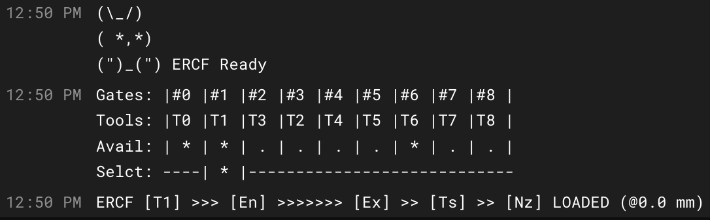

# "Happy Hare" - Universal MMU driver for Klipper

# IF YOU HAVE FOUND THIS... PLEASE DON'T EVEN THINK ABOUT TRYING TO INSTALL IT.  IT IS WORK IN PROGRESS AND WILL BREAK YOUR SYSTEM. Use ERCF-Software-V3 for ERCF. I will announce when this is ready as an alternative!!

Happy Hare (v2) is the second edition of what started life and as alternative software control for the ERCF v1.1 ecosystem.  Now in its second incarnation it has been re-architected to support any type of MMU (ERCF, Tradrack, Prusa) in a consistent manner on the Klipper platform.  It is best partnered with [KlipperScreen for Happy Hare](#klipperscreen-happy-hare-edition) until the Mainsail integration is complete :-)

Also, some folks have asked about making a donation to cover the cost of the all the coffee I'm drinking.  I'm not doing this for any financial reward but it you feel inclined a donation to PayPal https://www.paypal.me/moggieuk will certainly be spent making your life with your favorate MMU more enjoyable.

Thank you!

## Major features:
<ul>
  <li>Support any brand of MMU (and user defined monsters) Caveat only ERCF 1.1, 2,0 so far, Tradrack and Prusa comming very soon but I need to get ERCF rolling again first</li>
  <li>Companion KlipperScreen - Happy Hare edition for very simple graphical interaction</li>
  <li>Supports synchronized movement of extruder and gear motors during any part of the loading or unloading operations or during homing so it can overcome friction and even work with FLEX materials!</li>
  <li>Can leverage the gear motor synchronized to extruder to overcome friction whilst printing</li>
  <li>Allows for sophisticated multi-homing options including extruder!</li>
  <li>Implements a Tool-to-Gate mapping so that the physical spool can be mapped to any gate</li>
  <li>Implements “EndlessSpool” allowing one spool to automaticall be mapped and take over from a spool that runs out</li>
  <li>Sophisticated logging options so you can keep the console log to a minimum and send debugging information to `mmu.log` located in the same directory as Klipper logs</li>
  <li>Ability to define material type and color in each gate and leverage for visualization and customized setting tweaks (like Pressure Advance)</li>
  <li>Automated calibration for easy setup</li>
  <li>Supports MMU bypass "gate" functionality</li>
  <li>Ability to manipulate gear current (TMC) during various operations for reliable operation</li>
  <li>Convenience features to checks the availability of each gate and prepare filaments</li>
  <li>Moonraker update-manager support</li>
  <li>Complete persitance of state and statistics across restarts. That's right you don't even need to home!</li>
  <li>Reliable servo operation - no more "kickback" problems</li>
  <li>Cool visualizations of selector and filament position</li>
  <li>Highly configurable speed control that intelligently takes into account the realities of friction and tugs on the spool</li>
  <li>Optional integrated encoder driver that implements filament measurement, runout and automatic clog detection and flow rate verification!</li>
  <li>Vast customization options most of which can be changed and tested at runtime</li>
  <li>Integrated testing and soak-testing procedures</li>
  <li>Inegrated help</li>
</ul>

Customized [KlipperScreen for MMU](#klipperscreen-happy-hare-edition) touchscreen control

  
## Installation
The module can be installed into an existing Klipper installation with the install script. Once installed it will be added to Moonraker update-manager to easy updates like other Klipper plugins:

    cd ~
    git clone https://github.com/moggieuk/Happy-Hare.git
    cd Happy-Hare

    ./install.sh -i

The `-i` option will bring up an interactive installer  to aid setting some confusing parameters. For EASY-BRD and Fysetc ERB installations it will also configure all the pins for you. If not run with the `-i` flag the new template `mmu*.cfg` files will not be installed.  Note that if existing `mmu*.cfg` files are found the old versions will be moved to numbered backups like `<file>.<date>` extension instead so as not to overwrite an existing configuration.  If you still choose not to install the new `mmu*.cfg` files automatically be sure to examine them closely and compare to the supplied templates (this is completely different software from the original)
 

Note that the installer will look for Klipper install and config in standard locations.  If you have customized locations or multiple Klipper instances on the same rpi, or the installer fails to find Klipper you can use the `-k` and `-c` flags to override the klipper home directory and klipper config directory respectively.
 

REMEMBER that `mmu_hardware.cfg`, `mmu_software.cfg` & `mmu_parameters.cfg` must all be referenced by your `printer.cfg` master config file.  `client_macros.cfg` should also be referenced if you don't already have working PAUSE/RESUME/CANCEL_PRINT macros (but be sure to read the section before on macro expectations). These includes can be added automatically for you with the install script.
 

Pro tip: If you are concerned about running `install.sh -i` then run like this: `install.sh -i -c /tmp -k /tmp` This will build the `*.cfg` files for you but put then in /tmp.  You can then read them, pull out the bits your want to augment existing install or simply see what the answers to the various questions will do...
 

If you using ERCF v1.1 the original encoder can be problematic. I new back-ward compatible alternative is available in the ERCF v2.0 project and it strongly recommened.  If you insist on fighting with the original encoder be sure to read my [notes on Encoder problems](doc/ENCODER.md) - the better the encoder the better this software will work.
 

  
## Revision History
<ul>
<li>v2.0.0 - Initial Release (forked from my ERCF-Software-V3 project)</li>
</ul>

## Command Reference
The full list of commands can be [found here](doc/command_ref.md). But here is a quick list of the main (non test/calibration) commands:

    > MMU_HELP
    Happy Hare MMU commands: (use MMU_HELP MACROS=1 TESTING=1 for full command set)
    MMU - Enable/Disable functionality and reset state
    MMU_CHANGE_TOOL - Perform a tool swap
    MMU_CHECK_GATES - Automatically inspects gate(s), parks filament and marks availability
    MMU_DUMP_STATS - Dump the MMU statistics
    MMU_EJECT - Eject filament and park it in the MMU or optionally unloads just the extruder (EXTRUDER_ONLY=1)
    MMU_ENCODER - Display encoder position or temporarily enable/disable detection logic in encoder
    MMU_ENDLESS_SPOOL - Redefine the EndlessSpool groups
    MMU_FORM_TIP_STANDALONE - Convenience macro for calling standalone tip forming (defined in mmu_software.cfg)
    MMU_HELP - Display the complete set of MMU commands and function
    MMU_HOME - Home the MMU selector
    MMU_LOAD - Loads filament on current tool/gate or optionally loads just the extruder for bypass or recovery usage (EXTUDER_ONLY=1)
    MMU_MOTORS_OFF - Turn off both MMU motors
    MMU_PAUSE - Pause the current print and lock the MMU operations
    MMU_PRELOAD - Preloads filament at specified or current gate
    MMU_RECOVER - Recover the filament location and set MMU state after manual intervention/movement
    MMU_REMAP_TTG - Remap a tool to a specific gate and set gate availability
    MMU_RESET - Forget persisted state and re-initialize defaults
    MMU_RESET_STATS - Reset the MMU statistics
    MMU_SELECT - Select the specified logical tool (following TTG map) or physical gate
    MMU_SELECT_BYPASS - Select the filament bypass
    MMU_SERVO - Move MMU servo to position specified position or angle
    MMU_SET_GATE_MAP - Define the type and color of filaments on each gate
    MMU_STATUS - Complete dump of current MMU state and important configuration
    MMU_SYNC_GEAR_MOTOR - Sync the MMU gear motor to the extruder motor
    MMU_UNLOCK - Unlock MMU operations after an error condition
    
## MMU variables accessable for use in your own macros:
Happy Hare exposes the following 'printer' variables:

    printer.mmu.enabled : {bool}
    printer.mmu.is_locked : {bool}
    printer.ercf.is_homed : {bool}
    printer.mmu.tool : {int} 0..n | -1 for unknown | -2 for bypass
    printer.mmu.gate : {int} 0..n | -1 for unknown
    printer.mmu.material : {string} Material type for current gate (useful for print_start macro)
    printer.mmu.next_tool : {int} 0..n | -1 for unknown | -2 for bypass (during a tool change)
    printer.mmu.last_tool : {int} 0..n | -1 for unknown | -2 for bypass (during a tool change after unload)
    printer.mmu.last_toolchange : {string} description of last change similar to M117 display
    printer.mmu.clog_detection : {int} 0 (off) | 1 (manual) | 2 (auto)
    printer.mmu.endless_spool : {int} 0 (disabled) | 1 (enabled)
    printer.mmu.filament : {string} Loaded | Unloaded | Unknown
    printer.mmu.loaded_status : {int} state machine - exact location of filament
    printer.mmu.filament_direction : {int} 1 (load) | -1 (unload)
    printer.mmu.servo : {string} Up | Down | Unknown
    printer.mmu.ttg_map : {list} defined gate for each tool
    printer.mmu.gate_status : {list} per gate: 0 empty | 1 available | -1 unknown
    printer.mmu.gate_material : {list} of material names, one per gate
    printer.mmu.gate_color : {list} of color names, one per gate
    printer.mmu.endless_spool_groups : {list} group membership for each tool
    printer.mmu.action : {string} Idle | Loading | Unloading | Forming Tip | Heating | Loading Ext | Exiting Ext | Checking | Homing | Selecting

Optionally exposed on mmu_encoder (if fitted):

    printer['mmu_encoder mmu_encoder'].encoder_pos : {float} Encoder position measurement in mm
    printer['mmu_encoder mmu_encoder'].detection_length : {float} The detection length for clog detection
    printer['mmu_encoder mmu_encoder'].min_headroom : {float} How close clog detection was from firing on current tool change
    printer['mmu_encoder mmu_encoder'].headroom : {float} Current headroom of clog detection (i.e. distance from trigger point)
    printer['mmu_encoder mmu_encoder'].desired_headroom Desired headroom (mm) for automatic clog detection
    printer['mmu_encoder mmu_encoder'].detection_mode : {int} Same as printer.ercf.clog_detection
    printer['mmu_encoder mmu_encoder'].enabled : {bool} Whether encoder is currently enabled for clog detection
    printer['mmu_encoder mmu_encoder'].flow_rate : {int} % flowrate (extruder movement compared to encoder movement)

## MMU Setup and Calibration:
This will vary slightly depending on your particular brand of MMU but the steps are essentially the same with some being dependent on hardware configuration.

### Step 1. Validate your mmu_hardware.cfg configuration
This can be daunting but the interactive installer will make the process easy for common mcu's designed for a MMU (e.g. ERCF EASY-BRD, Burrows ERB, etc).  A detailed discusion of how to debug and confirm all the hardware can be [found here](doc/hardware_config.md).

Assuming you are familiar with all that there is one new IMPORTANT step that must be perform by hand.  You must move most of your `[extruder]` definition into `mmu_hardware.cfg`. This is best illustrated with my actual configuration (pulled from the top of mmu_hardware.cfg):
  
    # HOMING CAPABLE EXTRUDER --------------------------------------------------------------------------------------------------
    # With Happy Hare, it is important that the extruder stepper definition is moved here to allow for sophisticated homing and syncing
    # options.  This definition replaces the stepper definition part of you existing [extruder] definition.
    #
    # IMPORTANT: Move the complete stepper driver configuration associated with regular extruder here
    [tmc2209 manual_extruder_stepper extruder]
    uart_pin: E_TMCUART
    interpolate: true
    run_current: 0.55				# LDO 36STH20-1004AHG.  Match to macro below
    hold_current: 0.4
    sense_resistor: 0.110
    stealthchop_threshold: 0			# Spreadcycle (better for extruder)
    #
    # Uncomment two lines below if you have TMC and want the ability to use filament "touch" homing to nozzle
    diag_pin: E_DIAG				# Set to MCU pin connected to TMC DIAG pin for extruder
    driver_SGTHRS: 60				# 255 is most sensitive value, 0 is least sensitive
    
    # Define just your printer's extruder stepper here. Valid config options are:
    # step_pin, dir_pin, enable_pin, rotation_distance, gear_ratio, microsteps, full_steps_per_rotation
    # pressure_advance, pressure_advance_smooth_time
    # IMPORTANT: REMOVE these settings from your existing [extruder] configuration BUT LEAVE ALL OTHER parameters!
    #
    [manual_extruder_stepper extruder]
    step_pin: E_STEP
    dir_pin: !E_DIR
    enable_pin: !E_ENABLE
    microsteps: 64
    rotation_distance: 22.4522			# Calibrated by hand
    gear_ratio: 50:10
    full_steps_per_rotation: 200
    pressure_advance: 0.035			# Fairly arbitary default
    pressure_advance_smooth_time: 0.040		# Recommended default
    #
    # Uncomment two lines below to enable filament "touch" homing option to nozzle
    extra_endstop_pins: tmc2209_extruder:virtual_endstop
    extra_endstop_names: mmu_ext_touch

The first TMC definition was previous `[tmc2209 extruder]` and is moved in here as `[tmc2209 manual_extruder_stepper extruder]`. The original `[tmc2209 extruder]` should be deleted or commented out.
The second definion is the elements that define the extruder stepper motor taken from my original `[extruder]` definition. These parameters include only: `step_pin`, `dir_pin`, `enable_pin`, `rotation_distance`, `gear_ratio`, `microsteps`, `full_steps_per_rotation`, `pressure_advance` and `pressure_advance_smooth_time`.  Leave all the other parameters (things like pid controls, sensor type, etc) in the original `[extruder]` definition in your `printer.cfg` file. Make sense? The stepper definition moved here, the rest of the toolhead extruder definition left where it was originally.

For now, ignore all the enstop setup.  A separate guide on endstops and homing can be found in the MMU movement guide [found here](doc/movement_and_homing.md)

### Step 2. Calibrate your gear stepper
In this step you are simply ensuring that when the gear is told to move 100mm of filament it actually really does move that much.  It is akin to what you did when you set up your extruder rotational distance although no Klipper restart is necessary!
Position selector in from of gate #0 and put some filament into the gate. Run:

    > MMU_TEST_LOAD

This will load a short length of filament and ensure the servo is down.  Next cut the filament flush with the bowden on the selector (this is the encoder on the ERCF design). Run this command again to emit close to 100mm of filament:

    > MMU_TEST_LOAD

Get out your ruler can very carefully measure the length of the emited filament.  Hold your ruler up to the bowden and gently pull the filament straight to get an accurate measurement. Next run this specifying your actual measured value:

    > MMU_CALIBRATE_GEAR MEASURED=102.5
    > Gear stepper `rotation_distance` calculated to be 23.117387
    > Gear calibration has been saved for MMU ERCF v1.1sb

You can also measure over a different length by using something like `MMU_TEST_LOAD LENGTH=200` and `MMU_CALIBRATE_GEAR LENGTH=200 MEASURED=205.25` for a 200mm length for example.

### Step 3. Calibrate your encoder (if your MMU has own like the ERCF)
Next step is to calibrate the encoder so it measures distance accurately. Re-fit the bowden to the selector/encoder (you can insert the short length of filament to tube as you fit to save time). Now run:

    > MMU_CALIBRATE_ENCODER

You will see an output similar to:

    > + counts = 368
    > - counts = 368
    > + counts = 369
    > - counts = 369
    > + counts = 369
    > - counts = 369
    > Load direction: mean=368.67 stdev=0.58 min=368 max=369 range=1
    > Unload direction: mean=368.67 stdev=0.58 min=368 max=369 range=1
    > Before calibration measured length = 394.47
    > Resulting resolution of the encoder = 1.084991
    > After calibration measured length = 400.00
    > Encoder calibration has been saved for MMU ERCF v1.1sb

Notes: (i) Use fresh filament - grooves from previous passes through extruder gears can lead to slight count differences. (ii) You want the counts on each attempt to be the same or very similar but don't sweat +/-2 counts.  With ERCF v2.0, sprung servo and new Binky encoder design you should approach perfection though ;-) (iii) You can run this (like all calibration commands) without saving the result byt adding a `SAVE=0` flag.

### Step 4. Calibrate selector offsets
Before the final calibration of bowden load length, let's get the selector cailbrated in this easy step.  This sets up the position all of all the gates as well as the bypass position if fitted.  Firstly remove filament from gate #0 -- you may need to run `MMU_SERVO POS=up` to release the filament. Insert and remove filament through selector to ensure that gate #0 is correctly lined with selector. Then run:

    > MMU_CALIBRATE_SELECTOR

Sit back and relax. The selector will move to find the extremes of movement and then use information about the geometry of the particular MMU and version/options you are using to generate and save the selector offsets.  There are options to update a single position if you would like. See the calibration details page or command reference for more information.

Notes: (i) ERCF v1.1 users need to pay particular attention to letter suffixes after the version number in `mmu_parameters.cfg`  (ii) ERCF v1.1 users that are using a bypass block modification also need to secify the position of that block with `BYPASS_BLOCK=` (see detailed notes)

### Step 5. Calibrate bowden length:
Probably the last calibration before use! Here you can calibrate the length of your bowden from MMU gate to extruder entrance. This is important because it allows the MMU to move the filament at a fast pace over this distance because getting to the more complicated part of the load sequence. To speed up this process you need to give the calibration routine a hint of how far way the extruder is (but not exceeding the distance).  A good rule of thumb is to manually measure the distance from exit from the selector to the entrance to your extruder. Subtract 40-50mm from that distance. Approximate distance is 650mm on my system:

    > MMU_CALIBRATE_ENCODER BOWDEN_LENGTH=650
TODO

### Optional Step 6. Calibrating gates:
This step allows for calibrating slight differences between gates.  It isn't required (or useful) for designs that cannot have variation like the Tradrack MMU but is useful for designs like ERCF that can have variation of feed between gates.  Even with ERCF this is optional because if not run, the gates will tune themselves over time automatically!  It is useful on two occasions: (i) to remove the need and time to autotune, (ii) if there is substantial variation between gates -- e.g. if BMG gears for different gates are sourced from different vendors.

## Selected features in detail:
TODO

### Config Loading and Unload sequences explained
Note that if a toolhead sensor is configured it will become the default filament homing method and home to extruder an optional but unnecessary step. Also note the home to extruder step will always be performed during calibration of tool 0 (to accurately set `ercf_calib_ref`). For accurate homing and to avoid grinding, tune the gear stepper current reduction `extruder_homing_current` as a % of the default run current.

#### Understanding the load sequence:
    1. ERCF [T1] >.... [encoder] .............. [extruder] .... [sensor] .... [nozzle] UNLOADED (@0.0 mm)
    2. ERCF [T1] >>>>> [encoder] >>>........... [extruder] .... [sensor] .... [nozzle] (@48.2 mm)
    3. ERCF [T1] >>>>> [encoder] >>>>>>>>...... [extruder] .... [sensor] .... [nozzle] (@696.4 mm)
    4. ERCF [T1] >>>>> [encoder] >>>>>>>>>>>>>> [extruder] .... [sensor] .... [nozzle] (@696.4 mm)
    5. ERCF [T1] >>>>> [encoder] >>>>>>>>>>>>>> [extruder] >>>| [sensor] .... [nozzle] (@707.8 mm)
    6. ERCF [T1] >>>>> [encoder] >>>>>>>>>>>>>> [extruder] >>>> [sensor] >>>> [nozzle] LOADED (@758.7 mm)
  
The "visual log" above shows individual steps of the loading process:
  <ol>
    <li>Starting with filament unloaded and sitting in the gate for tool 1
    <li>Firstly ERCF clamps the servo down and pulls a short length of filament through the encoder. It it doesn't see filament it will try 'load_encoder_retries' times (default 2). If still no filament it will report the error. The speed of this initial movement is controlled by 'short_moves_speed', the acceleration is as defined on the gear stepper motor config in 'ercf_hardware.cfg'
    <li>ERCF will then load the filament through the bowden in a fast movement.  The speed is controlled by 'long_moves_speed' and optionally `long_moves_speed_from_buffer`.  This movement can be broken up into multiple movements with 'num_moves' as one workaround to overcome "Timer too close" errors from Klipper. If you keep your step size to 8 for the gear motor you are likely to be able to operate with a single fast movement.  The length of this movement is set when you calibrate ERCF and stored in 'ercf_vars.cfg'.  There is an advanced option to allow for correction of this move if slippage is detected controlled by 'apply_bowden_correction' and 'load_bowden_tolerance' (see comments in 'ercf_parameters.cfg' for more details)
    <li>The example shown uses a toolhead sensor, but if you configure sensorless filament homing then ERCF will now creep towards your extruder gears to detect this point as its homing position.  This homing move is controlled by 'extruder_homing_max' (maximum distance to advance in order to attempt to home the extruder), 'extruder_homing_step' (step size to use when homing to the extruder with collision detection), 'extruder_homing_current' (tunable to control how much % to temporarily reduce the gear stepper current to prevent grinding of filament)
    <li>This is the move into the toolhead and is the most critical transition point.  ERCF will advance the extruder looking to see that the filament was successfully picked up. In the case of a toolhead sensor this is deterministic because it will advance to the sensor and use this as a new homing point.  For sensorless ERCF will look for encoder movement implying that filament has been picked up.  Optionally this move can be made to run gear and extruder motors synchronously for greater reliability. 'sync_load_length' (mm of synchronized extruder loading at entry to extruder).  As a further aid to reliability ERCF will use the "spring" in the filament by delaying the servo release by 'delay_servo_release' mm. When using synchronous load this will relax the compression in the filament leading to quieter loading, for extruder only load this will keep pressure on the gear to aid grabbing the filament.
 
With toolhead sensor enabled there is a little more to this step: ERCF will home the end of the filament to the toolhead sensor controlled by 'toolhead_homing_max' (maximum distance to advance in order to attempt to home to toolhead sensor) and 'toolhead_homing_step (step size to use when homing to the toolhead sensor. If 'sync_load_length' is greater than 0 this homing step will be synchronised.
 The speed of all movements in this step is controlled by 'sync_load_speed'
    <li>Now the filament is under exclusive control of the extruder.  Filament is moved the remaining distance to the meltzone. This distance is defined by 'home_position_to_nozzle' and is either the distance from the toolhead sensor to the nozzle or the distance from the extruder gears to the nozzle depending on your setup.  This move speed is controlled by 'nozzle_load_speed'.  We are now loaded and ready to print.
  </ol>

#### Understanding the unload sequence:
    1. ERCF [T1] <<<<< [encoder] <<<<<<<<<<<<<< [extruder] <<<< [sensor] <... [nozzle] (@34.8 mm)
    2. ERCF [T1] <<<<< [encoder] <<<<<<<<<<<<<< [extruder] <<<| [sensor] .... [nozzle] (@87.7 mm)
    3. ERCF [T1] <<<<< [encoder] <<<<<<<<<<<<<< [extruder] .... [sensor] .... [nozzle] (@91.7 mm)
    4. ERCF [T1] <<<<< [encoder] <<<<<<<<...... [extruder] .... [sensor] .... [nozzle] (@729.9 mm)
    5. ERCF [T1] <<<<< [encoder] <<<........... [extruder] .... [sensor] .... [nozzle] (@729.9 mm)
    6. ERCF [T1] <<<.. [encoder] .............. [extruder] .... [sensor] .... [nozzle] (@795.5 mm)
    7. ERCF [T1] <.... [encoder] .............. [extruder] .... [sensor] .... [nozzle] UNLOADED (@795.5 mm)
  
The "visual log" above shows individual steps of the loading process:
  <ol>
    <li>Starting with filament loaded in tool 1. This example is taken from an unload that is not under control of the slicer, so the first thing that happens is that a tip is formed on the end of the filament which ends with filament in the cooling zone of the extruder. This operation is controlled but the user edited '_ERCF_FORM_TIP_STANDALONE' macro in 'ercf_software.cfg'
    <li>This step only occurs with toolhead sensor. The filament is withdrawn until it no longer detected by toolhead sensor. This is done at the 'nozzle_unload_speed' and provides a more accurate determination of how much further to retract and a safety check that the filament is not stuck in the nozzle
    <li>ERCF then moves the filament out of the extruder at 'nozzle_unload_speed'. This is approximate for sensorless but the distance moved can be optimized if using a toolhead sensor by the setting of 'extruder_to_nozzle' and 'sensor_to_nozzle' (the difference represents the distance moved)
    <li>Once at where it believes is the gear entrance to the extruder an optional short synchronized (gear and extruder) move can be configured. This is controlled by 'sync_unload_speed' and 'sync_unload_length'.  This is a great safely step and "hair pull" operation but also serves to ensure that the ERCF gear has a grip on the filament.  If synchronized unload is not configured ERCF will still perform the bowden unload with an initial short move with gear motor only, again to ensure filament is gripped
    <li>The filament is now extracted quickly through the bowden. The speed is controlled by 'long_moves_speed' and the movement can be broken up with 'num_moves' similar to when loading
    <li>Completion of the the fast bowden move
    <li>At this point ERCF performs a series of short moves looking for when the filament exits the encoder.  The speed is controlled by 'short_moves_speed'
    <li>When the filament is released from the encoder, the remainder of the distance to the park position is moved at 'short_moves_speed'.  The filament is now unloaded
  </ol>

When the state of ERCF is unknown, ERCF will perform other movements and look at its sensors to try to ascertain filament location. This may modify the above sequence and result in the omission of the fast bowden move for unloads.

#### Possible loading options (explained in ercf_parameters.cfg template):
     If you have a toolhead sensor for filament homing:
        toolhead_homing_max: 35            # Maximum distance to advance in order to attempt to home to toolhead sensor (default 20)
        toolhead_homing_step: 1.0          # Step size to use when homing to the toolhead sensor (default 1)

    Options without toolhead sensor (but still needed for calibration with toolhead sensor)

        extruder_homing_max: 50            # Maximum distance to advance in order to attempt to home the extruder
        extruder_homing_step: 2.0          # Step size to use when homing to the extruder with collision detection (default 2)
    
    For accurate homing and to avoid grinding, tune the gear stepper current reduction

        extruder_homing_current: 40        # Percentage of gear stepper current to use when extruder homing (TMC2209 only, 100 to disable)
    
    How far (mm) to run gear_stepper and extruder together in sync on load and unload. This will make loading and unloading
    more reliable and will act as a "hair pulling" step on unload.  These settings are optional - use 0 to disable
    Non zero value for 'sync_load_length' will synchronize the whole homing distance if toolhead sensor is installed

        sync_load_length: 10               # mm of synchronized extruder loading at entry to extruder
        sync_unload_length: 10             # mm of synchronized movement at start of bowden unloading
    
    This is the distance of the final filament load from the homing point to the nozzle
    If homing to toolhead sensor this will be the distance from the toolhead sensor to the nozzle
    If extruder homing it will be the distance from the extruder gears (end of bowden) to the nozzle
    
    This value can be determined by manually inserting filament to your homing point (extruder gears or toolhead sensor)
    and advancing it 1-2mm at a time until it starts to extrude from the nozzle.  Subtract 1-2mm from that distance distance
    to get this value.  If you have large gaps in your purge tower, increase this value.  If you have blobs, reduce this value.
    This value will depend on your extruder, hotend and nozzle setup.

        home_position_to_nozzle: 72        # E.g. Revo Voron with CW2 extruder using extruder homing

    Advanced and optional. If you regularly switch between sensorless and toolhead sensor or you want to optimize extruder
    unload when using toolhead sensor you can override 'home_position_to_nozzle' with these more specific values
    (Note that the difference between these two represents the extruder to sensor distance and is used as the final
    unload distance from extruder. An accurate setting can reduce tip noise/grinding on exit from extruder)

        extruder_to_nozzle: 72		# E.g. Revo Voron with CW2 extruder using extruder homing
        sensor_to_nozzle: 62		# E.g. Revo Voron with CW2 extruder using toolhead sensor homing

    Again, these last two settings are optional and can be omitted

*Obviously the actual distances shown above may be customized*
  
  **Advanced options**
When not using synchronous load move the spring tension in the filament held by servo will be leverage to help feed the filament into the extruder. This is controlled with the `delay_servo_release` setting. It defaults to 2mm and is unlikely that it will need to be altered.
 An option to home to the extruder using stallguard `homing_method=1` is available but not recommended: (i) it is not necessary with current reduction, (ii) it is not readily compatible with EASY-BRD and (iii) is currently incompatible with sensorless selector homing which hijacks the gear endstop configuration.
 The 'apply_bowden_correction' setting, if enabled, will make the driver "believe" the encoder reading and make correction moves to bring the filament to the desired end of bowden position. This is useful is you suspect slippage on high speed loading, perhaps when yanking on spool (requires accurate encoder). If disabled, the gear stepper will be solely responsible for filament positioning in bowden (requires minimal friction in feeder tubes). The associated (advanced) 'load_bowden_tolerance' defines the point at which to apply to correction moves. See 'ercf_parameters.cfg' for more details.
  
  **Note about post homing distance**
Regardless of loading settings above it is important to accurately set `home_to_nozzle` distance.  If you are not homing to the toolhead sensor this will be from the extruder entrance to nozzle.  If you are homing to toolhead sensor, this will be the (smaller) distance from sensor to nozzle.  For example in my setup of Revo & Clockwork 2, the distance is 72mm or 62mm respectively.
  
#### Possible unloading options:
This is much simplier than loading. The toolhead sensor, if installed, will automatically be leveraged as a checkpoint when extracting from the extruder.
`sync_unload_length` controls the mm of synchronized movement at start of bowden unloading.  This can make unloading more reliable if the tip is caught in the gears and will act as what Ette refers to as a "hair pulling" step on unload.  This is an optional step, set to 0 to disable.

### Synchronized Gear/Extruder motors
The ERCF system now offers the optional feature of coordinating its gear motor with the extruder stepper during printing. This added functionality enhances the filament pulling torque, potentially alleviating friction-related problems. **It is crucial, however, to maintain precise rotational distances for both the primary extruder stepper and the gear stepper. A mismatch in filament transfer speeds between these components could lead to undue stress and filament grinding.**

#### Setting up Print Synchronization
Synchronizion during printing is controlled by 'sync_to_extruder' in `ercf_parameters.cfg`. If set to 1, after a toolchange, the ERCF servo will stay engaged and the gear motor will sync with he extruder for move extrusion and retraction moves

#### Synchronization Workflow
If the `sync_to_extruder` feature is activated, the gear stepper will automatically coordinate with the extruder stepper following a successful tool change. Any ERCF operation that necessitates exclusinve gear stepper movement (like buzzing the gear stepper to verify filament engagement), will automatically disengage the sync. Generally, you don't need to manually manage the coordination/discoordination of the gear stepper — Happy Hare handles the majority of these actions. However, if the printer enters ERCF_PAUSE state (due to a filament jam or runout, for example), synchronization is automatically disengaged and the servo lifted.  Upon resuming a print synchronization will automatically be resumed however if you wist to enable it whilst operating the ERCF during a pause use the `ERCF_SYNC_GEAR_MOTOR` command.

The `ERCF_SYNC_GEAR_MOTOR sync={0|1} servo={0|1}` command functions as follows:
- Defaults to `sync=1` and `servo=1`
- If `sync=1` and `servo=1`, it triggers the servo and executes the synchronization
- If `sync=1` and `servo=0`, it performs only the synchronization
- If `sync=0` and `servo=1`, it disengages and lifts the servo
- If `sync=0` and `servo=0`, it only disengages the synchronization

You can still control the gear stepper motor with the `MANUAL_STEPPER` command, however, this will only be effective if the stepper is not currently syncing with the extruder.

#### Other synchonization options
In addition to synchronizing the gear motor to the extruder during print the same mechanism can be used to synchronize during other parts of the loading and unload process. Whilst these might seem like duplicates of previous partial load/unload sync movements they operate slightly more simlified manner. If they are all disabled, Happy Hare will operate as it did previously.  If these options are enabled they turn off the former functionality.  E.g. If `sync_extruder_load` is enabled it will keep the gear synchronized with the extruder for the entire loading of the extruder. 
Note that many run the gear stepper at maximum current to overcome friction. If you are one of those you might want to consider using `sync_gear_current` to reduce the current while it is synced during print to keep the temperature down.

`sync_extruder_load` turns on synchronization of extruder loading
`sync_extruder_unload` turns on synchronization of extruder unloading
`sync_form_tip` turns on syncronization of the stand alone tip forming movement
`sync_gear_current` the percentage reduction of gear stepper while it is synchronized with extruder

### Clog/runout detection
ERCF can use its encoder to detect filament runout or clog conditions. This functionality is enabled with the `enable_clog_detection` in ercf_parameters.cfg. It works by monitoring how much filament the extruder is pushing and comparing it that measured by the encoder.  If the extruder ever gets ahead by more that the calibrated `clog_detection_length` the runout/clog detection logic is triggered.  If it is determined to be a clog, the printer will pause in the usual manner and require `ERCF_UNLOCK` & `RESUME` to continue.  If a runout and endless spool is enabled the tool with be remaped and printing will automatically continue.

Setting this value to `1` enables clog detection employing the static clog detection length.  Setting it to `2` will enable automatic adjustment of the detection length. Whilst this doesn't guarantee you won't get a false trigger it will contiually tune until false triggers not longer occur.  The automatic algorithm is controlled by two variables in the `[ercf_encoder]` section:

    desired_headroom: 5.0		# The runout headroom that ERCF will attempt to maintain (closest ERCF comes to triggering runout)
    average_samples: 4		# The "damping" effect of last measurement. Higher value means clog_length will be reduced more slowly

### Tool-to-Gate (TTG) mapping and EndlessSpool application
When changing a tool with the `Tx` command the ERCF will by default select the filament at the gate (spool) of the same number.  The mapping built into this *Happy Hare* driver allows you to modify that.  There are 3 primary use cases for this feature:
<ol>
  <li>You have loaded your filaments differently than you sliced gcode file... No problem, just issue the appropriate remapping commands prior to printing
  <li>Some of "tools" don't have filament and you want to mark them as empty to avoid selection.
  <li>Most importantly, for EndlessSpool - when a filament runs out on one gate (spool) then next in the sequence is automatically mapped to the original tool.  It will therefore continue to print on subsequent tool changes.  You can also replace the spool and update the map to indicate availability mid print
</ol>

*Note that the initial availability of filament at each gate can also be specified in the `ercf_parameters.cfg` file by updating the `gate_status` list. E.g.
>gate_status = 1, 1, 0, 0, 1, 0, 0, 0, 1

  on a 9-gate ERCF would mark gates 2, 3, 5, 6 & 7 as empty
 
To view the current mapping you can use either `ERCF_STATUS` or `ERCF_DISPLAY_TTG_MAP`
  

 

Since EndlessSpool is not something that triggers very often you can use the following to simulate the action:
  > ERCF_ENCODER_RUNOUT FORCE_RUNOUT=1

This will emulate a filament runout and force ERCF to interpret it as a true runout and not a possible clog. ERCF will then run the following sequence:
<ul>
  <li>Move the toolhead up a little (defined by 'z_hop_distance & z_hop_speed') to avoid blobs
  <li>Call '_ERCF_ENDLESS_SPOOL_PRE_UNLOAD' macro.  Typically this where you would quickly move the toolhead to your parking area
  <li>Perform the toolchange and map the new gate in the sequence
  <li>Call '_ERCF_ENDLESS_SPOOL_POST_LOAD' macro.  Typically this is where you would clean the nozzle and quickly move your toolhead back to the position where you picked it up in the PRE_UNLOAD macro
  <li>Move the toolhead back down the final amount and resume the print
</ul>

The default supplied _PRE and _POST macros call PAUSE/RESUME which is typically a similar operation and may be already sufficient. Note: A common problem is that a custom _POST macro does not return the toolhead to previous position.  ERCF will still handle this case but it will move very slowly because it is not expecting large horizontal movement.
  
### Visualization of filament position
  The `log_visual` setting turns on an off the addition of a filament tracking visualization in either long form or abbreviated KlipperScreen form.  This is a nice with log_level of 0 or 1 on a tuned and functioning setup.
  

### Filament bypass
If you have installed the optional filament bypass block your can configure its selector position by setting `bypass_selector` in `ercf_parameters.cfg`. Once this is done you can use the following command to unload any ERCF controlled filament and select the bypass:
  > ERCF_SELECT_BYPASS`
  
  Once you have filament loaded <u>up to the extruder</u> you can load the filament to nozzle with:
  > ERCF_LOAD

  Finally, you can unload just the extruder using the usual eject.
  > ERCF_EJECT

### Adjusting configuration at runtime
  All the essential configuration and tuning parameters can be modified at runtime without restarting Klipper. Use the `ERCF_TEST_CONFIG` command to do this:
  
  
  
  Any of the displayed config settings can be modified.  E.g.
  > ERCF_TEST_CONFIG home_position_to_nozzle=45
  
  Will update the distance from homing position to nozzle.  The change is designed for testing was will not be persistent.  Once you find your tuned settings be sure to update `ercf_parameters.cfg`

### Updated Calibration Ref
  Setting the `ercf_calib_ref` is slightly different in that it will, by default, average 3 runs and compensate for spring tension in filament held by servo. It might be worth limiting to a single pass until you have tuned the gear motor current. Here is an example:
  
  
  
### Useful pre-print functionality
  The `ERCF_PRELOAD` is an aid to loading filament into the ERCF.  The command works a bit like the Prusa MMU and spins gear with servo depressed until filament is fed in.  Then parks the filament nicely. This is the recommended way to load filament into ERCF and ensures that filament is not under/over inserted blocking the gate.

Similarly the `ERCF_CHECK_GATES` command will run through all the gates (or those specified), checks that filament is loaded, correctly parks and updates the "gate status" map of empty gates. Could be a really useful pre-print check...

### Gate statistics
  Per-gate statistics that aggregate servo/load/unload failures and slippage are recorded throughout a session and can be logged at each toolchange.  An augmented `ERCF_DUMP_STATS` command will display these stats and will give a rating on the "quality assessment" of functionality of the gate (more info is sent to debug level typically found in the `ercf.log`).  The per-gate statistics will record important data about possible problems with individual gates.  Since the software will try to recover for many of these conditions you might not know you have a problem.  One particularly useful feature is being able to spot gates that are prone to slippage.  If slippage occurs on all gates equally, it is likely an encoder problem.  If on one gate if might be incorrect calibration of that gate or friction in the filament path.  Note that `ERCF_DUMP_STATS` will display this data but the details are sent to the DEBUG log level so you will only see it in the ercf.log file if you setup as I suggest.

### Logging
There are four configuration options that control logging:

    log_level & logfile_level can be set to one of (0 = essential, 1 = info, 2 = debug, 3 = trace, 4 = developer)
    Generally you can keep console logging to a minimal whilst still sending debug output to the ercf.log file
    Increasing the console log level is only really useful during initial setup to save having to constantly open the log file
      log_level: 1
      logfile_level: 3            # Can also be set to -1 to disable log file completely
      log_statistics: 1           # 1 to log statistics on every toolchange, 0 to disable (still recorded)
      log_visual: 1               # 1 to log a fun visual representation of ERCF state showing filament position, 0 disable

The logfile will be placed in the same directory as other log files and is called `ercf.log`.  It will rotate and keep the last 5 versions (just like klipper).  The default log level for ercf.log is "3" but can be set by adding `logfile_level` in you `ercf_parameters.cfg`.  With this available my suggestion is to reset the console logging level `log_level: 1` for an uncluttered experience knowing that you can always access `ercf.log` for debugging at a later time.  Oh, and if you don't want the logfile, no problem, just set `logfile_level: -1`

### Pause / Resume / Cancel_Print macros:
It is no longer necessary to added anything to these macros -- ERCF will automatically wrap anything defined.   If you have used other versions of the software then you should remove these customizations. To understand the philosophy and expectations here is the sequence:
 
  
During a print, if ERCF detects a problem, it will record the print position, safely lift the nozzle up to `z_hop_height` at `z_hop_speed` (to prevent a blob).  It will then call the user's PAUSE macro (which can be the example one supplied in `ercf_software.cfg`).  It is expected that pause will save it's starting position (GCODE_SAVE_STATE) and move the toolhead to a park area, often above a purge bucket, at fast speed.
 

The user then calls `ERCF_UNLOCK`, addresses the issue and calls `RESUME` to continue with the print.
 
  
The user's RESUME macro may do some purging or nozzle cleaning, but is expected to return the toolhead at higher speed to where it was left when the pause macro was called.  At this point the ERCF wrapper takes over and is responsible for dropping the toolhead back down to the print and resumes printing.
 
  
ERCF will always return the toolhead to the correct position, but if you leave it in your park area will will move it back very slowly.  You can to follow the above sequence to make this operation fast to prevent oozing from leaking on your print. 

### Recovering ERCF state:
At some point when a project occurs during a multi-color print ERCF will go into a `pause/locked` state.  Generally the user would then call `ERCF_UNLOCK`, fix the issue and then resume print with `RESUME`.   While fixing the problem you may find it useful to issue ERCF commands to move the filament around or change gate. If you do this the ERCF will "know" the correct state when resuming a print and everything will be copacetic. However, if you manually move the filament you are able to tell ERCF the correct state with the `ERCF_RECOVER` command.  This command is also useful when first turning on an ERCF with filament already loaded.  Instead of ERCF having to unload and reload to figure out the state you can simple tell it!  Here are some examples:

    ERCF_RECOVER - attempt to automatically recover the filament state.  The tool or gate selection will not be changed.
    ERCF_RECOVER TOOL=0 - tell ERCF that T0 is selected but automatically look at filament location
    ERCF_RECOVER TOOL=5 LOADED=1 - tell ERCF that T5 is loaded and ready to print
    ERCF_RECOVER TOOL=1 GATE=2 LOADED=0 - tell ERCF that T1 is being serviced by gate #2 and the filament is Unloaded

### State persistence
This is considered advanced functionality but it is incredibly useful once you are familar with the basic operation of ERCF. Essentially the state of everything from the EndlessSpool groups to the filament position and gate selection can be persisted accross restarts (homing is not even necessary)! The implication of using this big time saver is that you must be aware that if you modify ERCF whilst it is off-line you will need to correct the appropriate state prior to printing. Here is an example startup state:

  

(note this was accomplished by setting `startup_status: 1` in ercf_parameters.cfg and can be generated anytime with the `ERCF_DISPLAY_TTG_MAP SUMMARY=1` command)
This graphic indicates how I left ERCF the day prior... Filaments are loaded in gates 0,1 & 6; Gate/Tool #1 is selected; and the filament is fully loaded. If you are astute you can see I have remapped T2 to be on gate #3 and T3 to be on gate #2 because previously I had loaded these spools backward and this saved me from regenerating g-code.
 

In addition to basic operational state the print statistics and gate health statistics are persisted and so occasionally you might want to explicitly reset them with `ERCF_RESET_STATS`.  There are 5 levels of operation for this feature that you can set based on your personal preference/habbits. The level is controlled by a single variable `persistence_level` in `ercf_parameters.cfg`:

    Advanced: ERCF can auto-initialize based on previous persisted state. There are 5 levels with each level bringing in
    additional state information requiring progressively less inital setup. The higher level assume that you don't touch
    ERCF while it is offline and it can come back to life exactly where it left off.  If you do touch it or get confused
    then issue an appropriate reset command (E.g. ERCF_RESET) to get state back to the defaults.
    Enabling `startup_status` is recommended if you use persisted state at level 2 and above
    Levels: 0 = start fresh every time (the former default behavior)
            1 = restore persisted endless spool groups
            2 = additionally restore persisted tool-to-gate mapping
            3 = additionally restore persisted gate status (filament availability)
            4 = additionally restore persisted tool, gate and filament position!

Generally there is no downside of setting the level to 2 and so that is the suggested default.  Really, so long as you are aware that persistence is happening and know how to adjust/reset you can set the level to 4 and enjoy immediate ERCF availability.  So what options are there for resetting state?  Here is the complete list:

<ul>
  <li>`ERCF_RESET` - Reset all persisted state back to defaults / unknown except for print stats and per-gate health stats
  <li>`ERCF_RESET_STATS` - Reset print stats and per-gate health stats back to 0
  <li>`ERCF_REMAP_TTG RESET=1` - Reset just the tool-to-gate mapping
  <li>`ERCF_ENDLESS_SPOOL_GROUPS RESET=1` - Reset just the endless spool groups back to default
  <li>`ERCF_SET_GATE_MAP RESET=1` - Reset information about the filament type, color and availability
  <li>`ERCF_RECOVER` - Automatically discover or manually reset filament position, selected gate, selected tool, filament availability (lots of options)
  <li>Needless to say, other operations can also be used to update state
</ul>

Couple of miscellaneous notes:
<ul>
  <li>Closely relevant to the usefulness of this functionality is the `ERCF_CHECK_GATES` command that will examine all or selection of gates for presence of filament
  <li>In the graphic depictions of filament state the '*' indicates presence, '?' unknown and ' ' or '.' the lack of filament
  <li>With tool-to-gate mapping it is entirely possible to have multiple tools mapped to the same gate (for example to force a multi-color print to be monotone) and therefore some gates can be made inaccessable until map is reset
  <li>The default value for `gate_status`, `tool_to_gate_map` and `endless_spool_groups` can be set in `ercf_parameters.cfg`.  If not set the default will be, Tx maps to Gate#x, the status of each gate is unknown and each tool is in its own endless spool group (i.e. not part of a group)
</ul>

## KlipperScreen Happy Hare Edition

Even if not a KlipperScreen user you might be interested in my brand new [KlipperScreen version](https://github.com/moggieuk/KlipperScreen-Happy-Hare-Edition). Be sure to follow the install directions carefully and read the [panel-by-panel](https://github.com/moggieuk/KlipperScreen-Happy-Hare-Edition/blob/master/docs/ERCF.md) documentation.  It will make you even happier!!

## My Testing:
This software is largely rewritten as well as being extended and so, despite best efforts, has probably introduced some bugs that may not exist in the official driver.  It also lacks extensive testing on different configurations that will stress the corner cases.  I have been using successfully on Voron 2.4 / ERCF with EASY-BRD.  I use a self-modified CW2 extruder with foolproof microswitch toolhead sensor. My day-to-day configuration is to load the filament to the extruder in a single movement (`num_moves=1`) at 200mm/s, then home to toolhead sensor with synchronous gear/extruder movement (option #1 explained above).  I use the sensorless selector and have runout and EndlessSpool enabled.

### My Setup:

### Some setup notes based on my learnings:

Firstly the importance of a reliable and fairly accurate encoder should not be under estimated. If you cannot get very reliable results from `ERCF_CALIBRATE_ENCODER` then don't proceed with setup - address the encoder problem first. Because the encoder is the HEART of ERCF I [created a how-to](doc/ENCODER.md) on fixing many possible problems with encoder.
<ul>
  <li>If using a toolhead sensor, that must be reliable too.  The hall effect based switch is very awkward to get right because of so many variables: strength of magnet, amount of iron in washer, even temperature, therefore I strongly recommend a simple microswitch based detection.  They work first time, every time.
  <li>The longer the bowden length the more important it is to calibrate correctly (do a couple of times to check for consistency).  Small errors multiply with longer moves!
  <li>Eliminate all points of friction in the filament path.  There is lots written about this already but I found some unusual places where filament was rubbing on plastic and drilling out the path improved things a good deal.
  <li>This version of the driver software both, compensates for, and exploits the spring that is inherently built when homing to the extruder.  The `ERCF_CALIBRATE_SINGLE TOOL=0` (which calibrates the *ercf_calib_ref* length) averages the measurement of multiple passes, measures the spring rebound and considers the configuration options when recommending and setting the ercf_calib_ref length.  If you change basic configuration options it is advisable to rerun this calibration step again.
  <li>The dreaded "Timer too close" can occur but I believe I have worked around most of these cases.  The problem is not always an overloaded mcu as often cited -- there are a couple of bugs in Klipper that will delay messages between mcu and host and thus provoke this problem.  To minimize you hitting these, I recommend you use a step size of 8 for the gear motor. You don't need high fidelity and this greatly reduces the chance of this error. Also, increasing 'num_moves' also is a workaround.  I'm not experiencing this and have a high speed (200 mm/s) single move load with a step size of 8.
  <li>The servo problem where a servo with move to end position and then jump back can occur due to bug in Klipper just like the original software but also because of power supply problems. The workaround for the former is increase the same servo "dwell" config options in small increments until the servo works reliably. Note that this driver will retry the initial servo down movement if it detects slippage thus working around this issue to some extent.
  <li>I also added a 'apply_bowden_correction' config option that dictates whether the driver "believes" the encoder or not for long moves.  If enabled, the driver will make correction moves to get the encoder reading correct.  If disabled the gear stepper movement will be applied without slippage detection.  Details on when this is useful is documented in 'ercf_parameters'.  If enabled, the options 'load_bowden_tolerance' and 'unload_bowden_tolerance' will set the threshold at which correction is applied.
  <li>I can recommend the "sensorless selector" option -- it works well once tuned and provides for additional recovery abilities if filament gets stuck in encoder preventing selection of a different gate. However there are some important things to note:
  <ul>
    <li>The selector cart must home against something solid. You need to make sure there are no wires or zip tie getting in the way.
    <li>If the motor audibly vibrates but doesn't appear to reliably detect home you selector belt might be too loose.
    <li>It is likely necessary to change the square head homing screw for a lower profile button head one -- the reason is that you will get inaccurate homing position if you are forceable stopping on the microswitch.  You just want to make sure the microswitch is triggered when the selector cart comes to a stop.
    <li>You can also add a small spacer to the slider mechanism make the selector cart physically stops before fully pressing the microswitch fully. Just be sure that the homing point is before gate #0. (I use a 1mm thick printed washer on the 8mm rods. See my repro for ERCF hacks).
    <li>Finally it is important to experiement and tune the `driver_SGTHRS` value which is the point at which the TMC driver detects the stepper has stalled. Lower values are less sensitive (selector can ram too hard) and too high a value can mean a bit of friction on the selector is detected as a stall and interpreted as a blocked selector.
  </ul>
  <li>Speeds.... starting in v1.1.7 the speed setting for all the various moves made by ERCF can be tuned.  These are all configurable in the 'ercf_parameters.cfg' file or can be tested without restarting Klipper with the 'ERCF_TEST_CONFIG' command.  If you want to optimise performance you might want to tuning these faster.  If you do, watch for the gear stepper missing steps which will often be reported as slippage.
</ul>

Good luck! You can find me on discord as *moggieuk#6538*

    (\_/)
    ( *,*)
    (")_(") MMU Ready
  
