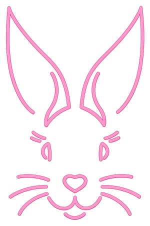
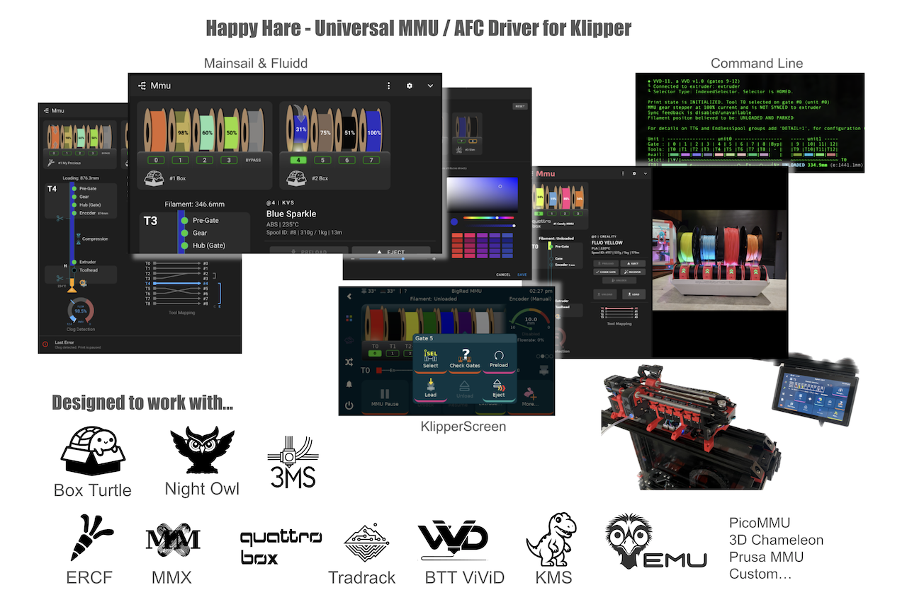
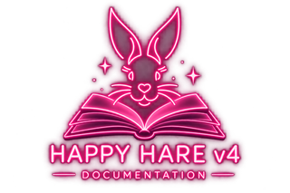
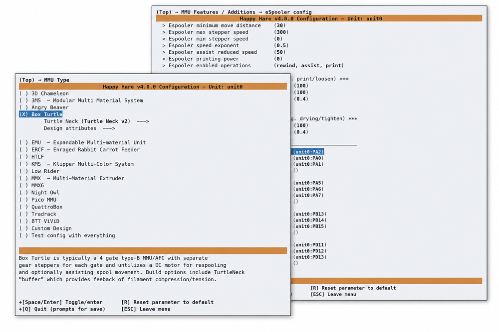
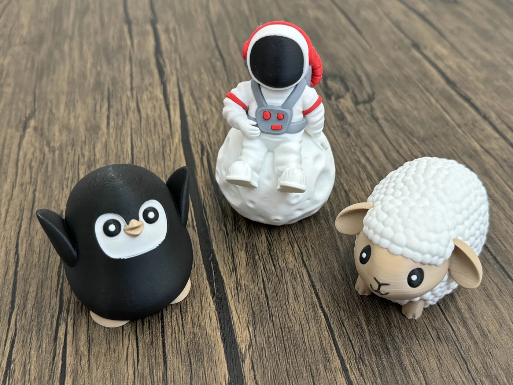

  

# Happy Hare

<em><strong>Universal Automated Filament Changer / MMU driver for Klipper</strong></em>

   &nbsp;
   &nbsp;
   &nbsp;
   &nbsp;
  

&nbsp;

  <strong>One driver. Every kind of MMU. A complete Klipper experience.</strong>

Happy Hare is the original open-source filament changer controller for
multi-color printing. Its philosophy is to provide a universal control system
that adapts to your choice of MMU (Multi-Material Unit): switch hardware and the
software transitions seamlessly with you.

It is implemented as a Klipper extension that drives the hardware directly and
exposes everything else through ordinary Klipper macros. It helps to think of it
in web-browser terms: Klipper is the browser, and Happy Hare is an extension that
adds a whole new capability without changing how Klipper works underneath. If
you can write a `gcode_macro`, you can customize how Happy Hare behaves.

Now in its fourth generation, Happy Hare brings the MMU, printer, slicer, spool
inventory and user interface together as one polished system. Configure it with
a guided installer, control it from Mainsail, Fluidd or KlipperScreen, and let it
manage the details from the first filament load to the last toolchange.

Happy Hare supports most community-built MMU/AFC systems, including
**Box Turtle**, **ERCF**, **EMU**, **Tradrack**, **BTT ViViD**, **Night Owl**,
**Angry Beaver**, **3MS**, **3D Chameleon**, **QuattroBox**, **PicoMMU**,
**MMX**, **KMS**, **QIDI Box**, and custom designs. Its capability-based architecture gives
selector machines and modular gear-per-gate systems native motor and sensor
control, with room to grow into multi-unit and mixed-hardware printers.

Pair it with
[KlipperScreen for Happy Hare](https://github.com/moggieuk/KlipperScreen-Happy-Hare-Edition)
for dedicated touchscreen control, or use the native Happy Hare panels in
Mainsail and Fluidd.

  

  <a href="https://moggieuk.github.io/Happy-Hare-Doc/">
    
    <strong>Explore the Happy Hare v4 documentation</strong>
  </a>

&nbsp;

## Features

- **Automated filament changing** from gate selection and preloading through
  load, unload, eject and complete toolchanges, with bypass support for ad hoc
  single-spool printing.
- **Flexible multi-MMU control** for selector and gear-per-gate designs,
  including independent units, dissimilar hardware and multiple toolheads on
  the same printer.
- **Guided calibration and validation** for selectors, drive gears, encoders,
  bowden paths, toolheads, motors and sensors.
- **Gate, slicer and tool-to-gate maps** that track every filament and remap any
  slicer tool to any physical spool, backed by upload-time G-code preprocessing.
- **Runout, clog and tangle protection** using filament-path sensors, encoders
  and FlowGuard, with automatic EndlessSpool handoff to a replacement spool.
- **Quality-focused filament movement** with synchronized gear/extruder control,
  sync-feedback buffers, encoder flow verification, tip forming or cutting,
  smart purging and guided cold pulls.
- **Spool intelligence** including material, color, temperature and availability,
  full Spoolman/Filament Hub integration, and beta NFC/RFID tag reading for
  automatic spool identification.
- **Active spool and enclosure hardware** with eSpooler rewind/assist, functional
  LEDs, physical eject buttons, temperature-controlled fans and managed filament
  drying.
- **Persistent state and deep diagnostics** including calibration and map
  recovery, toolchange statistics, maintenance counters, dedicated logging,
  built-in help, hardware tests and soak testing.
- **Complete UI control** through native MMU panels in Mainsail and Fluidd, plus
  the dedicated KlipperScreen Happy Hare extension for touchscreen operation.
- **Macro-level customization** for parking, pause/recovery, load/unload
  sequences, print lifecycle hooks and other printer-specific behavior.

&nbsp;

## v3 or v4?

Happy Hare v4 is a major rework, not a drop-in update to v3. It introduces a
modular multi-unit architecture, a restructured Klipper extension, and a guided
Kconfig/`menuconfig` installer. The module and configuration layouts are
different, so v3 configuration files cannot be loaded by v4, or vice versa.

- **New installations:** use **v4**, the current generation and the home of new
  development. Start with the [v4 documentation](https://moggieuk.github.io/Happy-Hare-Doc/).
- **Staying on v3:** the mature v3 release remains available on the `v3` branch;
  continue to use the [v3 wiki](https://github.com/moggieuk/Happy-Hare/wiki)
  and the [v3 resources and videos](README-V3.md).
- **Moving from v3 to v4:** read the
  [v3-to-v4 upgrade guide](https://moggieuk.github.io/Happy-Hare-Doc/Upgrade-v3-v4/)
  before changing branches. The installer preserves a backup, but v4 must be
  configured as a fresh setup.

&nbsp;

## What's new in v4?

Happy Hare has always been exceptionally flexible. That flexibility also earned
it a reputation for taking time and care to configure. **v4 changes that.**

The new Kconfig/`menuconfig`-based installer/configurator turns setup into a
guided, top-down series of choices. Select your MMU, control board, toolhead and
features; Happy Hare applies sensible defaults, asks only the questions relevant
to your hardware, validates the result, and generates the Klipper configuration
for you. The same configurator makes later changes and upgrades predictable,
without taking away the option to customize by hand.

  

Underneath the easier setup is a modular, multi-unit architecture. Different
MMU/AFC designs can run independently on the same printer, including machines
with multiple toolheads, while still sharing the mature mapping, runout,
Spoolman, NFC/RFID, encoder, eSpooler, LED and UI ecosystem Happy Hare is known
for.

&nbsp;

## Multi-color printing worth the machinery

The setup and tuning journey can take patience, but this is why we do it. These
prints from @igiannakas were produced with an ERCF v2, OrcaSlicer and Happy Hare.

  

&nbsp;

## Donations

Happy Hare is a labor of love rather than a funded project, but v4 and its new
documentation site are a substantial undertaking:

<table role="presentation" border="0" cellspacing="0" cellpadding="0">
  <tr>
    <td width="50%" align="center" valign="middle" style="border: 0;">
      
      ~55,000 lines: driver code 
      ~28,000 lines: installer/configurator 
      ~6,900 lines: macros/configuration 
      ~16,000 lines: docs across 67 pages 
      170+ documentation images
      
    </td>
    <td width="50%" align="center" valign="middle" style="border: 0;">
      

        
      

    </td>
  </tr>
</table>

If you have found value in Happy Hare and want to contribute, donations are
welcome via PayPal. Any support goes toward improving the experience for
whichever MMU/AFC you run. Thank you!

&nbsp;

## Getting help

Join the [Happy Hare Discord](https://discord.gg/98TYYUf6f2), where there are
channels for each MMU type and the main integrations. Bugs and feature requests
can also be filed in the [GitHub issue tracker](https://github.com/moggieuk/Happy-Hare/issues).

For the fastest help, include `klippy.log`, `mmu.log`, the output of
`MMU_STATUS SHOWCONFIG=1`, the exact error text, and a clear description of what
was happening. Pictures or video are especially useful for physical problems.

&nbsp;

## Built with five years of MMU experience (and probably too much coffee)

Happy Hare is built on over five years of hands-on experience with many MMU
designs, starting with **ERCF**, continuing through **Box Turtle**, and now the
modular **EMU** system. Every new design brings another interesting challenge to
solve—and another excuse to print something colorful.

Multi-color printing can be addictive and occasionally frustrating. Be patient,
read the docs, ask the community when you get stuck, and remember to enjoy the
machine you built.

<strong>❝</strong>
<em>There once was a printer so keen, 
To print in red, yellow, and green. 
It whirred and it spun, 
Mixing colors for fun, 
The most vibrant prints ever seen!</em>

<pre>
  (\_/)
  ( *,*)
  (")_(") Happy Hare Ready
</pre>

Copyright (C) 2022-2026 Paul Morgan
