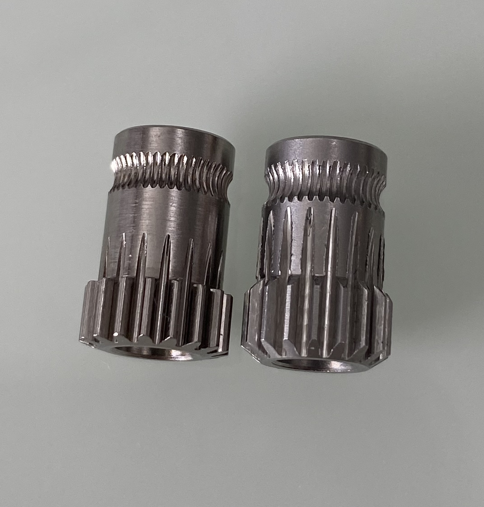
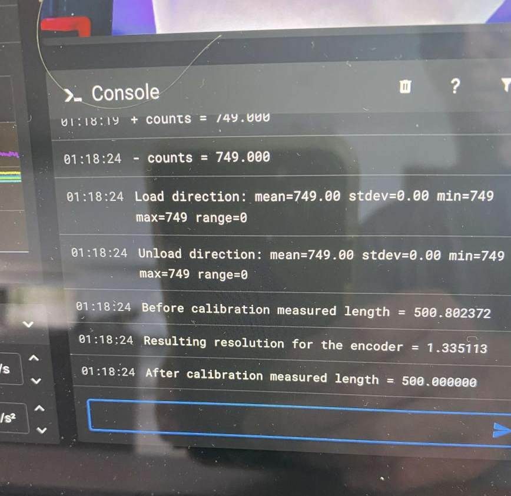

# Notes on building the best heart for ERCF - the Encoder
The encoder in the ERCF is one of the most vital components and has to work correctly. It is used to measure the length of filament that moves through ERCF for loading and unloading and optionally is used as a filament runout sensor for clog detection and Endless Spool functionality.  Whilst it doesn't have to be mm accurate, it does need to be approximately correct and consistent.  Whilst this has always been true it is even more important if you opt not to use a toolhead sensor. If the encoder is not the best it can be it will cause you will encounter all sorts of problems that will lead you to chase things that aren't really problems at all, and you will undoubtedly become an ENRAGED rabbit :-)

I've spent a little more time than I should have on this component and wanted to pull all my findings into one place.

### First a little context
This encoder sensor works with an IR light source being reflected by the gear teeth and the reflection is sensed by a phototransistor that turns the light into an electrical voltage, passes through some hysteresis correction and emits a digit "pulse" output. Each pulse is a calibrated distance of movement of approximately 0.7mm -- but the distance depends on your exact encoder gear diameter (filament notch to be perfectly correct) and accurate establishment of the rotation_distance for your gear stepper.

This is why the sequence to calibrate is in this order:
<ol>
<li>Set `rotation_distance` for the gear stepper of gate #0.  This will ensure that when the ERCF gear stepper is told to push 200mm of filament it will accurately push exactly that.  This is the same as you do for your extruder stepper and why you must calibrate a known length of filament (typically 200mm) to set the rotation_distance for your gear_stepper.
<li>Run calibration on encoder `ERCF_CALIBRATE_ENCODER` to establish the `encoder_resolution` of the gear wheel in the encoder.  Think of it as the reverse of above -- gear extruder pushes 200mm, the encoder gear sensor must measure 200mm..
<li>Then because the ERCF has many gates, a delta from the reference gate #0 is determined with `ERCF_CALIBRATE_SINGLE TOOL=<1,2,3,..,n> to compensate for slightly different effective diameters of the different gear wheels.
</ol>
 

## List of main issues:

Ok, with that context out of the way let's look at the possible problems.  One of the biggest issues is the differences in the many BMG gear clones that are available on AliExpress or elsewhere. Take a look at these two example gears:

Both are clones, but the one on the left is a more expensive and clearly a more accurately machined gear whilst the one on the right is a cheap clone which I received with a ERCF kit of parts .. I won't mention their name because I know their sourcing changes over time.  The left (higher quality) has much smoother meshing of gears (much better for filament gates too, but that's another story), a smooth surface and well formed filament gripping teeth. The one on the right is different in all respects!  The other slight variation is in the actual dimensions of the gears - more on than later.

### Optical sensor not getting reliable reflections
Firstly it is important to stress the need to adjust the height of the sensor from the gear wheel regardless.  Ette has created an adjustment screw with the latest STL's and if you are using a high quality gear and adjust correctly that might be all you need -- clearly many have success with just this.

I proposed a method of improving the reliability of reflections by blacking surfaces that could be creating additional unwanted reflections with the following modification, previously posted on discord (https://discord.com/channels/460117602945990666/909743915475816458/1023873076095615036):

    
Blacken the gear with a couple of applications of black felt tip pen or matt black paint, then when dry, polish of the tops of the gear with 2000 grit sandpaper - this can be done by hand but attaching to a drill and spinning is faster.   Make sure that **all** gear tops are shiny!

By blackening the gear troughs and polishing the top surfaces of the gears you are establishing a consistent set of surfaces for reflections. This method works well when the adjustment of the sensor is HIGHER than originally intended i.e. further away from gear.  This is because if it is too close the plastic separator between the IR led and phototransistor will impede reflections.

It has been pointed out to me that blacking the tips of the teeth and leaving the troughs to reflect would also work and maybe even more reliable with the sensor adjusted **close** to the gear wheel.  I have not verified this combination but it is logical.

### Offset filament cutout on cloned BMG gears
I have noticed that gears differ slightly in the location of the filament cutout.  You can see from the picture where mine sits relative to the filament path.  Whilst a little misalignment may be ok, if it is not centered the filament will cause sideways pressure on the gear wheel causing it to rub against one side of encoder housing and that friction can cause misreading through binding.

### Gear wheel in encoder getting pinched and binding
This one, if you experience it, is significant.  I belive that there is insufficient tolerance in the cutout for the gear idler and many gears bind in place when the encoder is screwed together.  This tight fit also exacerbate the misalignment of cutout described above because the gear cannot center on its own.

The correct fix will be through a pull request to alter the encoder STL, but as a short term solution, I added a little extra clearance on the right encoder half as illustrated here:

This ensures the gear does not bind when tightened but also allows for sligth side to side movement so that the gear can align naturally with the filament path.

Here is a reworked [Encoder_Cart_Right.stl](Encoder_Cart_Right_0_6mm.stl) for the right side of the encoder. This simply makes the gear cutout 0.6mm deeper. This gives the gear room to float and to align perfectly with the filament path.  If you want to offset the gear but feel the gear is too loose you can always had a plain metal washer in the left side part.

### Friction in filament path
Whilst not an encoder problem per se I think it is worth mentioning.  Slippage will occur in the gear motor if the drag on the filament is too great.  Remember the first step of calibrating the 'rotation_distance' for the gear stepper?  You have to be sure that the gear is moving the correct amount of filament when testing and calibrating the encoder else you won't be sure if it is filamenet slippage or the encoder causing the problem.

### To sum up
I was experiementing with a (larger) encoder wheel believing the current design couldn't get the accuracy I wanted.  That was a mistake. With careful attention to detail you should be able to get accurate encoder readings. I usually get a standard deviation of 0 when running `ERCF_CALIBRATE_ENCODER`
 

    (\_/)
    ( *,*)
    (")_(") ERCF Ready

