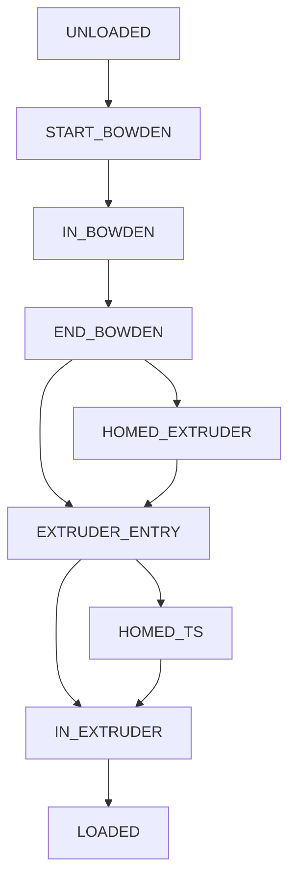
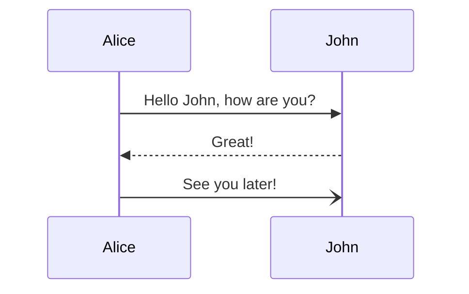
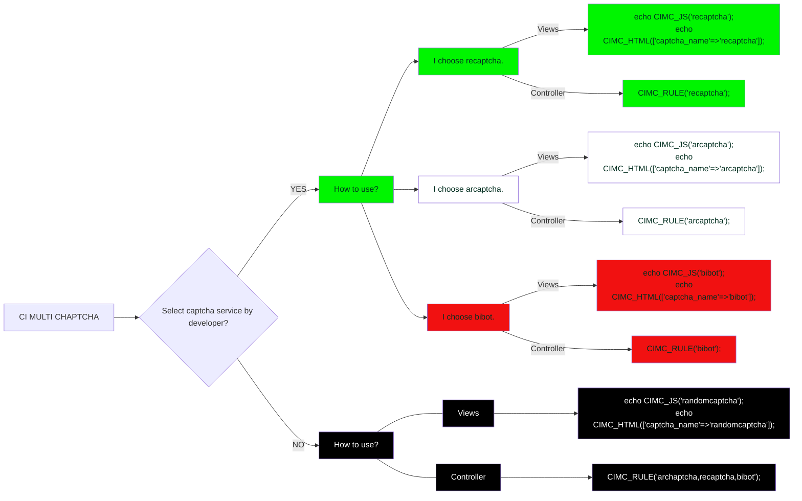

TODO list in progress
1. Simplify sync load and unload to boolean .. all sync or no sync
5. Somebody has 780 count (need to increase range a little)
6. Have per print metrics and total metrics without cmd line ability to clear the total
8. Bug: If EndlessSpool enabled and initial tool is empty, auto map to next gate

