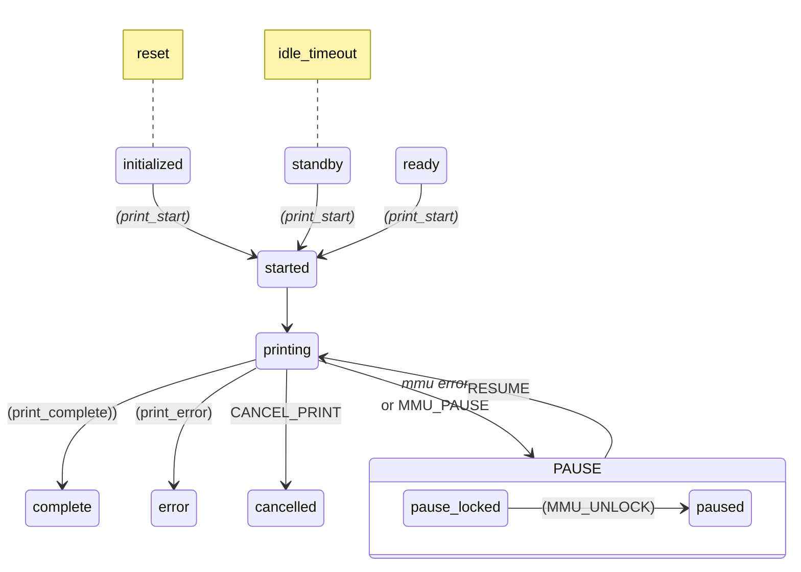
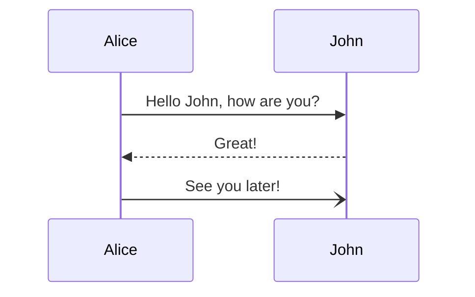
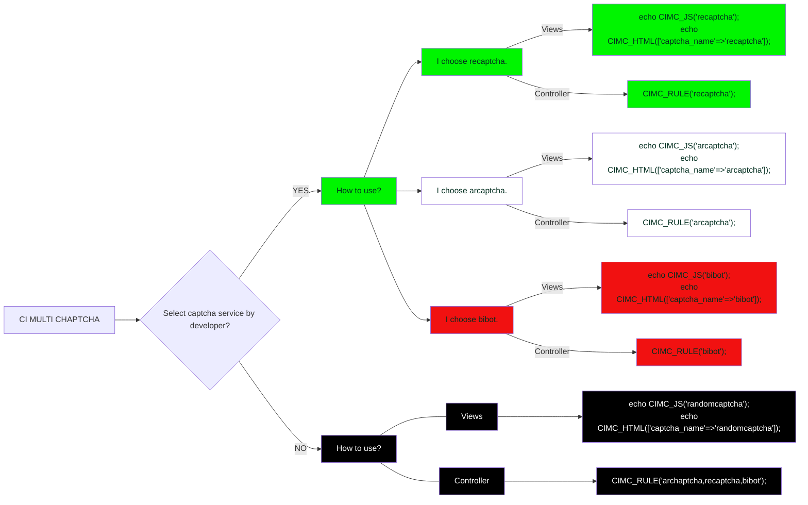

Scratch pad TODO list
1. DONE - Rewrite automated bowden calibration
2. DONE - Finish homing measurement for non-homing extruder
3. DONE - Pass params to RESUME
4. Compression pin homing feedback for extruder (same as collision)
5. DONE - Record the gate homing point with calibration so dead space can be added/subtracted for quick change
6. DONE - Check that entry_to_extruder amount is added / subtracted too
7. Virtual selector
8. Switching drive gear
9. Virtual servo (force sync KMS case)
10. Prusa_servo mock class .. maybe make servo a separate class for this and #9
11. Inattention time instead of retry on fail. Remove ‘retry_change_on_error’
12. force_form_tip_standalone —> allow_slicer_form_tip or tip forming strategy form|slicer|cut
cut_mmu??
13. _form_tip as separate “_STEP”
14. Externalize ‘boot up tasks’ so users could add things like “check_gates”
15. DONE - Remove sd_card pause..
16. DONE - Disable gate runout during tool change -- maybe code encoder to disable that way too..?
17. DONE - Ensure z_hop is correct if gcode offset is specified. E.g.
     
     
18. Add 'filament_temp' to gate_map.  Also, pull from spoolman. Edit `mmu_gate_map` command
19. Centralize macro variables .. need to update mmu.my for MMU_TEST_FORM_TIP
20. DONE Deprecate printer.mmu.material .. Replaced with active_gate.material, active_gate.color, ...
21.
# TODO For advanced calculated purge volumes
# Not sure where I'm going with this.  It could be a calculated matrix based on all the referenced tools
# assuming they have a pigment percentage (defaulting to 50%). Need to add a PIGMENT=[0-100] param. Or this
# could be an orthogonal purge matrix available for filaments on mmu_gate_map. Need to add pigment. Hmmm.
# Every update of pigment to gate map would recalc matrix and present as printer variable
#        nozzle_volume = gcmd.get_int('NOZZLE_VOLUME', -1, above=0)
#        multiplier = gcmd.get_int('MULTIPLIER', 100, above=0)
#        algorithm = gcmd.get('ALGORITHM', 'linear')
#        algorithms = ['linear', 'quadratic', 'hyperbolic']
#        if algorithm not in algorithms:
#            raise gcmd.error("ALGORITHM is invalid. Options are: %s" % algorithms]

--
Idea: DONE - If EndlessSpool enabled and initial tool is empty, auto map to next gate

DONE - Check comments on tool_tip_macro.  Example:
variable_cooling_tube_position should have the comment: Measured from Nozzle to Top of Heater Block
variable_cooling_tube_length should have the comment: Measured from Top of Heater Block to Top of Heatsink

### Reference Markdown

> [!NOTE]  
> Highlights information that users should take into account, even when skimming.

> [!TIP]
> Optional information to help a user be more successful.

> [!IMPORTANT]  
> Crucial information necessary for users to succeed.

> [!WARNING]  
> Critical content demanding immediate user attention due to potential risks.

> [!CAUTION]
> Negative potential consequences of an action.

