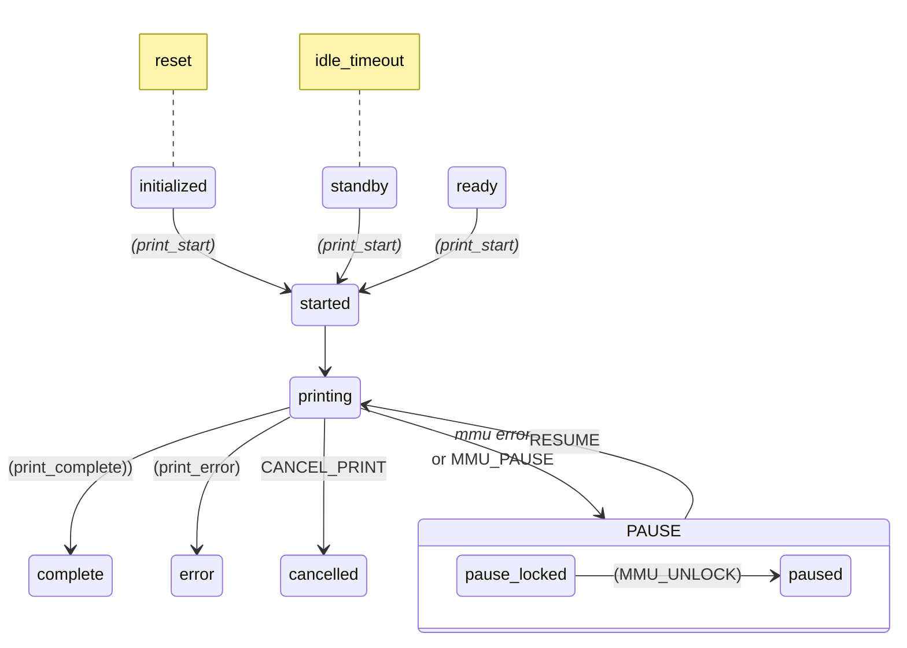
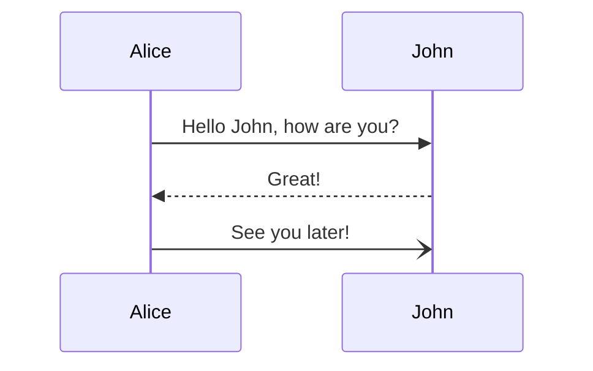
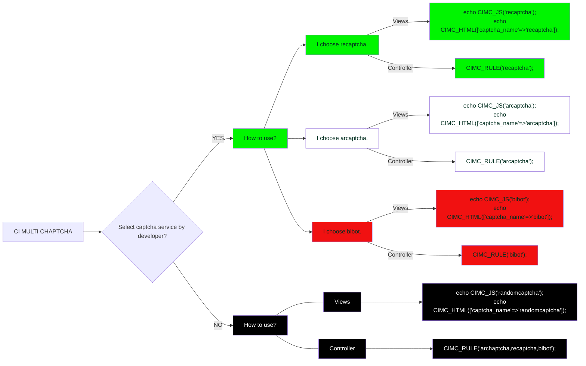

Scratch pad TODO list
1. Rewrite automated bowden calibration
2. Finish homing measured for non-homing extruder
3. Pass params to RESUME
4. Compression pin homing feedback for extruder (same as collision)
5. Record the gate homing point with calibration so dead space can be added/subtracted for quick change
6. Check that entry_to_extruder amount is added / subtracted too
7. Virtual selector
8. Switching drive gear
9. Virtual servo (force sync KMS case)
10. Prusa_servo mock class .. maybe make servo a separate class for this and #9
11. Inattention time instead of retry on fail. Remove ‘retry_change_on_error’
12. force_form_tip_standalone —> allow_slicer_form_tip or tip forming strategy form|slicer|cut
cut_mmu??
13. _form_tip as separate “_STEP”
14. Externalize ‘boot up tasks’ so users could add things like “check_gates”

--
USER FEEDBACK:
Bug?: If EndlessSpool enabled and initial tool is empty, auto map to next gate

USER FEEDBACK:
Check comments on tool_tip_macro.  Example:
variable_cooling_tube_position should have the comment: Measured from Nozzle to Top of Heater Block
variable_cooling_tube_length should have the comment: Measured from Top of Heater Block to Top of Heatsink

USER FEEDBACK:
Here are the parameters that would go in install.sh (using "MELLOW_FLY_ERCF" instead of ERB / EASY-BRD  /  etc)
 If it helps to improve HH (and HH2), here's the hardware config for the Mellow FLY ERCF board (supports canbus)  Of note is that the mcu config for this board might be something similar to  canbus_uuid: nnnnnnnnnnn instead of serial: xxx.  (The board can be used in either USB or canbus mode)

PIN[MELLOW_FLY_ERCF,gear_uart_pin]="ercf:gpio9";
PIN[MELLOW_FLY_ERCF,gear_step_pin]="ercf:gpio7";
PIN[MELLOW_FLY_ERCF,gear_dir_pin]="!ercf:gpio8"; 
PIN[MELLOW_FLY_ERCF,gear_enable_pin]="!ercf:gpio6";
PIN[MELLOW_FLY_ERCF,gear_diag_pin]="ercf:gpio23";
PIN[MELLOW_FLY_ERCF,gear_endstop_pin]="ercf:gpio13"; // this is a dummy unused pin because there's no actual endstop pin
PIN[MELLOW_FLY_ERCF,selector_uart_pin]="ercf:gpio0";
PIN[MELLOW_FLY_ERCF,selector_step_pin]="ercf:gpio2";
PIN[MELLOW_FLY_ERCF,selector_dir_pin]="!ercf:gpio1";
PIN[MELLOW_FLY_ERCF,selector_enable_pin]="!ercf:gpio3";
PIN[MELLOW_FLY_ERCF,selector_diag_pin]="^ercf:gpio22";
PIN[MELLOW_FLY_ERCF,selector_endstop_pin]="ercf:gpio20";
PIN[MELLOW_FLY_ERCF,servo_pin]="ercf:gpio21";
PIN[MELLOW_FLY_ERCF,encoder_pin]="ercf:gpio15";

### Reference Markdown

> [!NOTE]  
> Highlights information that users should take into account, even when skimming.

> [!TIP]
> Optional information to help a user be more successful.

> [!IMPORTANT]  
> Crucial information necessary for users to succeed.

> [!WARNING]  
> Critical content demanding immediate user attention due to potential risks.

> [!CAUTION]
> Negative potential consequences of an action.

