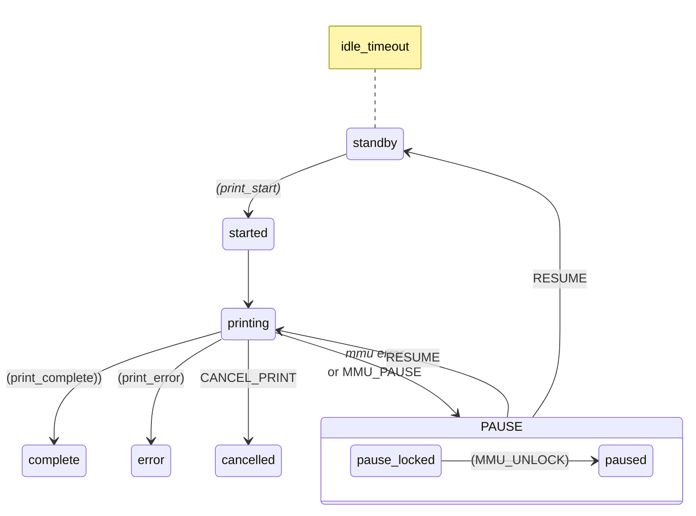

Scratch pad TODO list
--
DONE 1. For EASY-BRD, need to change GEAR_UART to share with SEL_UART cannot have two pointing to same pin.
DONE 2. Move copy of config in a differnet way .. copy directory or don't end backup files with ***.cfg
DONE 3. KlipperScreen puse/resume (goes back to printing screen .. @gneu)
DONE 4. KlipperScreen consider different buttons on main panel..
DONE 5. Ut would be nice that when we switch the mmu motors off that the servo goes to move position. It not that easy to move it manually.
WONT DO? 6. Augment form_tip_variable to allow for NO TOOLTIP (-1), 0 AUTO, 1 (FORCED)??
DONE 7. Autoconfigure Tx macros

DONE 8. Have macro level retry option similar to:
    ERCF_UNLOCK
    ERCF_EJECT
    T1
    RESUME

WONT DO FOR NOW 9. Endless spool pushing old filament option

10. Check comments on tool_tip_macro.
Example:
variable_cooling_tube_position should have the comment: Measured from Nozzle to Top of Heater Block
variable_cooling_tube_length should have the comment: Measured from Top of Heater Block to Top of Heatsink

11. UNSURE? Don't trigger 'gate_empty' before double checking if it is really empty!

13. Here are the parameters that would go in install.sh (using "MELLOW_FLY_ERCF" instead of ERB / EASY-BRD  /  etc)
 If it helps to improve HH (and HH2), here's the hardware config for the Mellow FLY ERCF board (supports canbus)  Of note is that the mcu config for this board might be something similar to  canbus_uuid: nnnnnnnnnnn instead of serial: xxx.  (The board can be used in either USB or canbus mode)

PIN[MELLOW_FLY_ERCF,gear_uart_pin]="ercf:gpio9";
PIN[MELLOW_FLY_ERCF,gear_step_pin]="ercf:gpio7";
PIN[MELLOW_FLY_ERCF,gear_dir_pin]="!ercf:gpio8"; 
PIN[MELLOW_FLY_ERCF,gear_enable_pin]="!ercf:gpio6";
PIN[MELLOW_FLY_ERCF,gear_diag_pin]="ercf:gpio23";
PIN[MELLOW_FLY_ERCF,gear_endstop_pin]="ercf:gpio13"; // this is a dummy unused pin because there's no actual endstop pin
PIN[MELLOW_FLY_ERCF,selector_uart_pin]="ercf:gpio0";
PIN[MELLOW_FLY_ERCF,selector_step_pin]="ercf:gpio2";
PIN[MELLOW_FLY_ERCF,selector_dir_pin]="!ercf:gpio1";
PIN[MELLOW_FLY_ERCF,selector_enable_pin]="!ercf:gpio3";
PIN[MELLOW_FLY_ERCF,selector_diag_pin]="^ercf:gpio22";
PIN[MELLOW_FLY_ERCF,selector_endstop_pin]="ercf:gpio20";
PIN[MELLOW_FLY_ERCF,servo_pin]="ercf:gpio21";
PIN[MELLOW_FLY_ERCF,encoder_pin]="ercf:gpio15";

14. Automatically perform gate chech if gate is empty and asked to load it before concluding failure.. Issue on ERCF-Software-V3
15. Bug: If EndlessSpool enabled and initial tool is empty, auto map to next gate

> **Note**\
> This is note!!

> **Warning**
> This is a warning2

> [!Important]\
> This is important!!

> [!NOTE]  
> Highlights information that users should take into account, even when skimming.

> [!IMPORTANT] test Crucial information necessary for users to succeed.

> [!WARNING]  
> Critical content demanding immediate user attention due to potential risks.

> Whoa! This will not be shown.\
> [!NOTE]\
> This is a note.

> Hello
>> [!NOTE]\
>> This is a note.

