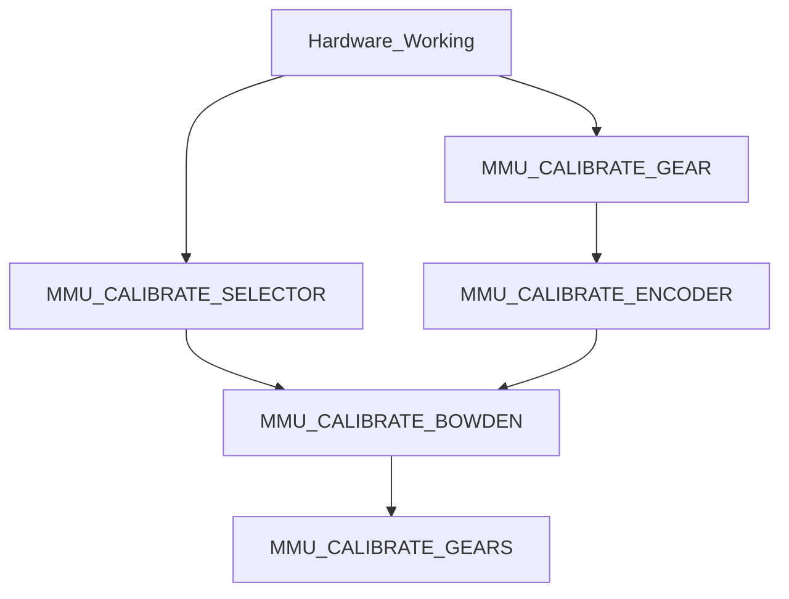

# MMU Calibration

This discussion assumes that you have setup and debugged your hardware configuration.  A detailed discusion can be [found here](hardware_config.md).

> **Warning** When calibrating the first time you must perform in the prescribed order.  Once complete you can re-calibrate particular steps but remember that some calibration changes will cascade.  E.g. after calibrating the gear, you must recalibrate the encoder, the bowden and possibly all the gates.  Generally you can re-calibrate the selector (step 1) and the gates (step 5) at any time, but the gear, encoder and bowden must always be done in that order!



##    Calibration Steps
### Step 1. Calibrate selector offsets
Let's start by getting the selector cailbrated in this easy step.  It is important to do this early because the encoder and bowden calibration need to be able to select gates.  This sets up the position all of all the gates as well as the bypass position if fitted.  Firstly ensure MMU motors are off by running `MMU_MOTORS_OFF` and remove filament from gate #0 -- you may need to run `MMU_SERVO POS=up` to release the filament.  Then re-insert and remove filament through selector to ensure that gate #0 is correctly alined with selector. Be careful and move the selector side to side whilst moving the filament inside the gate. Try to assess where the filament is centered in the gate and leave the selector in that position. Then run:

  > MMU_CALIBRATE_SELECTOR

Sit back and relax. The selector will move to find the extremes of movement and then use information about the geometry of the particular MMU and version/options you are using to generate and save the selector offsets automatically!

> **Note** ERCF v1.1 users need to pay particular attention to letter suffixes after the version number in `mmu_parameters.cfg`<br>ERCF v1.1 users that are using a bypass block modification also need to specify the position of that block with `BYPASS_BLOCK=` (see command reference) to indicate which bearing block contains the bypass.

Although it should not be necessary, there are options to update a single position if you would like to or run into problems. See the command reference for more detailed information on options, but basically you turn MMU motors off, line up the desired gate with the selector and run:

  > MMU_CALIBRATE_SELECTOR GATE=...

**Validation:** At the end of this step you should be able to select any tool/gate on your MMU. For instance, try running `MMU_HOME TOOL=3` to re-home and select too/gate #3.

<br>

### Step 2. Calibrate your gear stepper
In this step you are simply ensuring that when the gear stepper is told to move 100mm of filament it really does move 100mm.  It is akin to what you did when you set up your extruder rotational distance although in this case no Klipper restart is necessary!  Position selector in front of gate #0 and put some filament into the gate. Run:

  > MMU_TEST_LOAD

This will load a short length of filament and ensure the servo is down.  Next remove the bowden tube and cut the filament flush with the ECAS connector on the selector (this is the encoder on the ERCF design). Run this command to attemp to move 100mm of filament:

  > MMU_TEST_MOVE MOVE=100

Get out your ruler can very carefully measure the length of the emited filament.  Hold your ruler up to the bowden and gently pull the filament straight to get an accurate measurement. Next run this specifying your actual measured value (102.5 used in this example):

  > MMU_CALIBRATE_GEAR MEASURED=102.5

```
    Gear stepper `rotation_distance` calculated to be 23.117387
    Gear calibration has been saved
```

> **Note** You can also measure over a different length by using something like `MMU_TEST_MOVE MOVE=200` and `MMU_CALIBRATE_GEAR LENGTH=200 MEASURED=205.25` for a 200mm length for example.

**Validation:** If you want to test, snip the filament again flush with the ECAS connector and run `MMU_TEST_MOVE`.  Exactly 100mm should be moved this time.

<br>

### Step 3. Calibrate your encoder (if your MMU has one like the ERCF design)
Next step is to calibrate the encoder so it measures distance accurately. Re-fit the bowden to the selector/encoder (you can insert the short length of filament to tube as you fit to save time). Now run:

  > MMU_CALIBRATE_ENCODER

You will see an output similar to:

```
    + counts = 368
    - counts = 368
    + counts = 369
    - counts = 369
    + counts = 369
    - counts = 369
    Load direction: mean=368.67 stdev=0.58 min=368 max=369 range=1
    Unload direction: mean=368.67 stdev=0.58 min=368 max=369 range=1
    Before calibration measured length = 394.47
    Resulting resolution of the encoder = 1.084991
    After calibration measured length = 400.00
    Encoder calibration has been saved for MMU ERCF v1.1sb
```

> **Note**<br>(i) Use fresh filament - grooves from previous passes through extruder gears can lead to slight count differences.<br>(ii) Make sure the selector is aligned with the gate. If it is off to one side you will almost certainly get disimilar counts in forward and reverse directions.<br>(iii) You want the counts on each attempt to be the same or very similar but don't sweat +/-2 counts.  With ERCF v2.0, sprung servo and new Binky encoder design you should approach perfection though ;-)<br>(iv) You can run this (like all calibration commands) without saving the result byt adding a `SAVE=0` flag.

<br>

### Step 4. Calibrate bowden length:
Optionally the last calibration before use! Here you can calibrate the length of your bowden from MMU gate to extruder entrance. This is important because it allows the MMU to move the filament at a fast pace over this distance because getting to the more complicated part of the load sequence. To speed up this process you need to give the calibration routine a hint of how far way the extruder is (but not exceeding the distance).  A good rule of thumb is to manually measure the distance from exit from the selector to the entrance to your extruder. Subtract 40-50mm from that distance. Approximate distance is 650mm on my system:

  > MMU_CALIBRATE_ENCODER BOWDEN_LENGTH=640

```
    Homing MMU...
    Tool T0 enabled
    Calibrating bowden length from reference Gate #0
    Tool T0 enabled
    Heating extruder to minimum temp (200.0)
    Finding extruder gear position (try #1 of 3)...
    Run Current: 0.21A Hold Current: 0.09A
    Run Current: 0.49A Hold Current: 0.09A
    Pass #1: Filament homed to extruder, encoder measured 683.5mm, filament sprung back 3.2mm
    - Bowden calibration based on this pass is 683.5
    Finding extruder gear position (try #2 of 3)...
    Run Current: 0.21A Hold Current: 0.09A
    Run Current: 0.49A Hold Current: 0.09A
    Pass #2: Filament homed to extruder, encoder measured 682.7mm, filament sprung back 3.2mm
    - Bowden calibration based on this pass is 682.7
    Finding extruder gear position (try #3 of 3)...
    Run Current: 0.21A Hold Current: 0.09A
    Run Current: 0.49A Hold Current: 0.09A
    Pass #3: Filament homed to extruder, encoder measured 683.9mm, filament sprung back 3.2mm
    - Bowden calibration based on this pass is 683.4
    Recommended calibration reference is 680.2mm. Clog detection length: 16.8mm
    Bowden calibration and clog detection length have been saved for MMU ERCF v1.1sbTODO
```

> **Note**<br>(i) This calibration assumes that the selector has been calibrated first.<br>(ii) This may cause the extruder to be heated. This is to ensure that the extruder motor is energized and can resist the impact of the collision with the filament

<br>

### Optional Step 5. Calibrating gates:
This step allows for calibrating slight differences between gates.  It isn't required (or useful) for designs that cannot have variation like the Tradrack MMU but is useful for designs like ERCF that can have variation of feed between gates.  Even with ERCF this is optional because if not run, the gates will tune themselves as they are used automatically!  That said it be beneficial to get this out of the way with a test piece of filament but doing it also: (i) removes the need to set the `auto_calibrate_gates` in `mmu_parameters.cfg`, (ii) is necessary if there is substantial variation between gates -- e.g. if BMG gears for different gates are sourced from different vendors.

Simply make sure filament is available at the gate you want to calibrate -- you can hold a (500mm) loose piece of filament and run:

> MMU_CALIBRATE_GATES GATE=1

You will see an output similar to:

```
    Tool T1 enabled
    Calibrating gate 1 over 400.0mm...
    + measured = 404.4mm
    - measured = 404.4mm
    + measured = 404.4mm
    - measured = 404.4mm
    + measured = 405.5mm
    - measured = 405.5mm
    Load direction: mean=404.7 stdev=0.63 min=404.4 max=405.5 range=1.1
    Unload direction: mean=404.7 stdev=0.63 min=404.4 max=405.5 range=1.1
    Calibration move of 6x 400.0mm, average encoder measurement: 404.7mm - Ratio is 1.011872
    (Gate #1 rotation_distance: 22.941324 vs Gate #0: 22.672165)
    Calibration for gate #1 has been saved
```

> **Note** You can also quickly run through all gates (even pass the loose filament gate to gate) with `MMU_CALIBRATE_GATES ALL=1`

<br>

> **Warning**<br>All of the calibration steps can be run in a "check/test" mode.  Simply add `SAVE=0` to the command and the calibration will be run but the results will not be saved.  This is very useful for verification.<br>Finally, remember that the results from all the calibration is stored in `mmu_vars.cfg` so you can also view/edit that file directly.

<br>

##    Calibration Command Reference

  | Command | Description | Parameters |
  | ------- | ----------- | ---------- |
  | `MMU_CALIBRATE_SELECTOR` | Calibration of the selector gate positions. By default will automatically calibrate every gate.  ERCF v1.1 users must specify the bypass block position if fitted.  If GATE to BYPASS option is sepcifed this will update the calibrate for a single gate | `GATE=[0..n]` The individual gate position to calibrate <br> `BYPASS=[0\|1]` Calibrate the bypass position <br>`BYPASS_BLOCK=..` Optional (v1.1 only). Which bearing block contains the bypass where the first one is numbered 0 <br>`SAVE=[0\|1]` (default 1)  Whether to save the result |
  | `MMU_CALIBRATE_GEAR` | Calibration rourine for the the gear stepper rotational distance | `LENGTH=..` length to test over (default 100mm) <br>`MEASURED=..` User measured distance <br>`SAVE=[0\|1]` (default 1) Whether to save the result |
  | `MMU_CALIBRATE_ENCODER` | Calibration routine for MMU encoder | LENGTH=.. Distance (mm) to measure over. Longer is better, defaults to 500mm <br>`REPEATS=..` Number of times to average over <br>`SPEED=..` Speed of gear motor move. Defaults to long move speed <br>`ACCEL=..` Accel of gear motor move. Defaults to motor setting in ercf_hardware.cfg <br>`MINSPEED=..` & `MAXSPEED=..` If specified the speed is increased over each iteration between these speeds (only for experimentation) <br>`SAVE=[0\|1]` (default 1)  Whether to save the result |
  | `MMU_CALIBRATE_BOWDEN` | Measure the calibration length of the bowden tube used for fast load movement. This will be performed on gate #0 | `BOWDEN_LENGTH=..` The approximate length of the bowden tube but NOT longer than the real measurement. 50mm less that real is a good starting point <br>`HOMING_MAX=..` (default 100) The distance after the sepcified BOWDEN_LENGTH to search of the extruder entrance <br>`REPEATS=..` (default 3) Number of times to average measurement over <br>`SAVE=[0\|1]` (default 1)  Whether to save the result |
  | `MMU_CALIBRATE_GATES` | Optional calibration for loading of a sepcifed gate or all gates. This is calculated as a ratio of gate #0 and thus this is usually the last calibration step | `GATE=[0..n]` The individual gate position to calibrate <br>`ALL[0\|1]` Calibrate all gates 1..n sequentially (filament must be available in each gate) <br>`LENGTH=..` Distance (mm) to measure over. Longer is better, defaults to 400mm <br>`REPEATS=..` Number of times to average over <br>`SAVE=[0\|1]` (default 1)  Whether to save the result |

