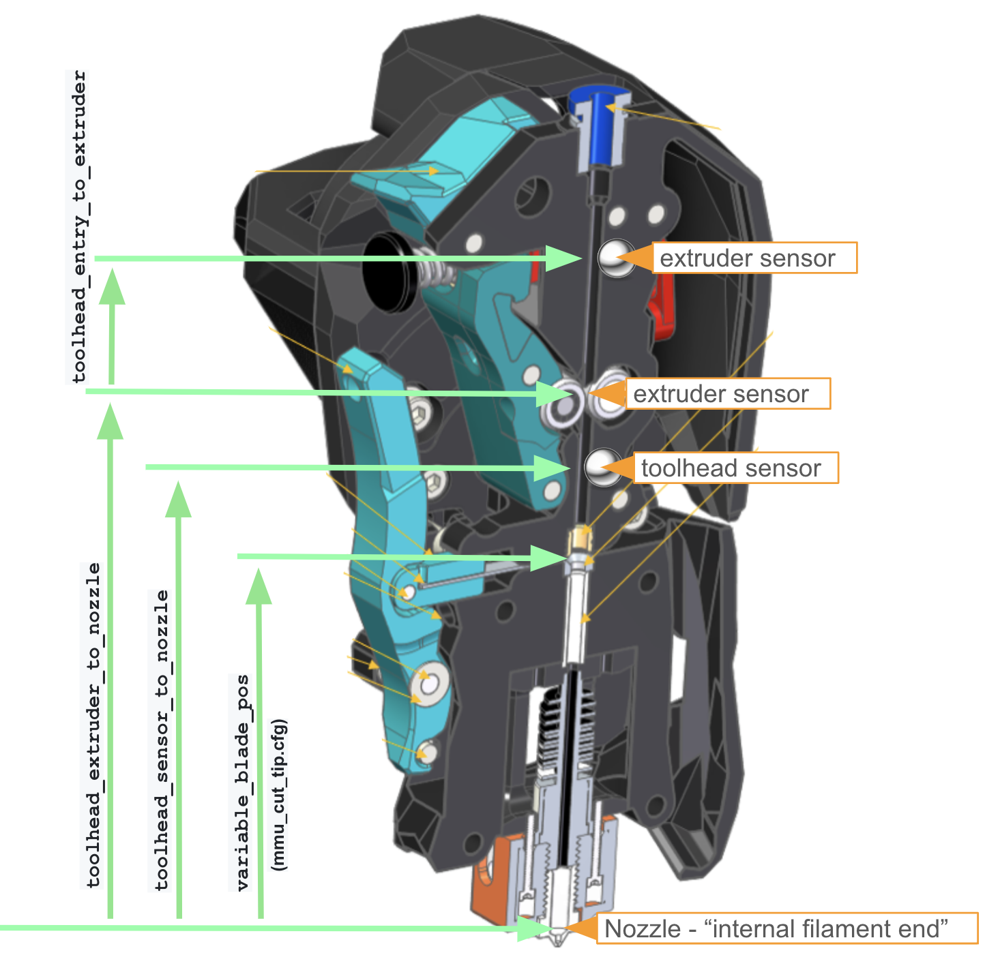

# Detailed Configuration Guide (mmu_parameters.cfg)

This is a sequential walkthrough of the main configuration files for Happy Hare. You should have tertiary understanding and awareness of all the settings but some are essential.  Those are labeled with "IMPORTANT" and you must setup for your MMU setup.

##    MMU Vendor, Type & Size

The first section specifies the type of MMU and is used by Happy Hare to adjust (primarily CAD) options. It is documented in the main [README.md](/README.md)

> [!IMPORTANT]  
> These three settings must be set. If "Other" is specified you will also need to specify cad dimensions [here](https://github.com/moggieuk/Happy-Hare?tab=readme-ov-file#1-important-mmu-vendor--version-specification)

```yml
#
# The vendor and version config is important to define the capabilities of the MMU and basic CAD dimensions. These can
# all be overridden with the `cad` parameters detailed in the documentation but the vendor setting saves time.
#
# ERCF
# 1.1 original design, add "s" suffix for Sprigy, "b" for Binky, "t" for Triple-Decky
#     e.g. "1.1sb" for v1.1 with Springy mod and Binky encoder
#
# 2.0 new community ERCFv2
#
# Tradrack
# 1.0 add "e" if using encoder is fitted
#
# Prusa
#  - Comming soon (use Other for now)
#
# Other
#  - Generic setup that will require further customization of `cad` parameters. See doc
#
mmu_vendor: ERCF			# MMU family
mmu_version: 1.1sb			# MMU hardware version number (add mod suffix documented above)
mmu_num_gates: 9 			# Number of selector gates
```

##    Hardware limits

This section is where you define the hardware limitations of your build. These can be consisted the never to be exceeded settings but one important one if you are using `selector touch` operation is `selector_max_accel`. Since stallguard doesn't behave well at slow speed it is important that the accelation isn't set too low - below 600 causes problems, over 1000 ensures reliable operation. Generally these defaults work with the majority of setups.

```yml
# MMU Limits ---------------------------------------------------------------------------------------------------------------
#
# Define the physical limits of your MMU. These setings will be respected regardless of individual speed settings.
#
gear_max_velocity: 300                  # Never to be exceeded gear velocity regardless of specific parameters
gear_max_accel: 1500                    # Never to be exceeded gear accelaration regardless of specific parameters
selector_max_velocity: 250              # Never to be exceeded selector velocity regardless of specific parameters
selector_max_accel: 1200                # Never to be exceeded selector accelaration regardless of specific parameters
```

##    Selector Servo

The servo configuration allows for up to three positions but some designs (e.g. Tradrack, ERCF v1.1) only require `up`/`down`.  If `move` is not used then comment it out or set it to the same value as `up`.  The servo duraction is the length of PWM burst.  Most digital servos only require a short 0.2 second or so but slower analog servos may require longer (0.4 - 0.5s).  Be very careful if you use the `servo_active_down` option because it will can strain your electronics.

```yml
# Servo configuration  -----------------------------------------------------------------------------------------------------
#
# Angle of the servo in three named positions
#   up   = tool is selected and filament is allowed to freely move through gate
#   down = to grip filament
#   move = ready the servo for selector move (optional - defaults to up)
# V2.4 on: These positions are only for initial config they are replaced with calibrated servo positions in `mmu_vars.cfg`
#
# Note that leaving the servo active when down can stress the electronics and is not recommended with EASY-BRD or ERB board
# unless the 5v power supply has been improved and it is not necessary with standard ERCF builds
# Make sure your hardware is suitable for the job!
#
servo_up_angle: 125                     # Default: MG90S servo: Up~30    ; SAVOX SH0255MG: Up~140
servo_down_angle: 45                    # Default: MG90S servo: Down~140 ; SAVOX SH0255MG: Down~30
servo_move_angle: 110                   # Optional angle used when selector is moved (defaults to up position)
servo_duration: 0.2			# Duration of PWM burst sent to servo (automatically turns off)
servo_dwell: 0.5			# Minimum time given to servo to complete movement prior to next move
servo_active_down: 0			# CAUTION: 1=Force servo to stay active when down, 0=Release after movement
servo_buzz_gear_on_down: 1              # Whether to "buzz" the gear stepper on down to aid engagement
```
> [!TIP]  
> As of HHv2.4 the servo calibration can be performed without updating these values and klipper restarts.  The procedure is documented in the [calibration](/doc/calibration.md) doc, but briefly `MMU_SERVO SAVE=1 POS=[up|down|move]` can be used to persist position after setting correct angle with `MMU_SERVO ANGLE=..`

##    Logging

Logging controls control the verbosity level of logging to console and separate `mmu.log` file as well and fun visual filament position and various status messages - it really is unessessary to have verbose logging to the console so defaults are recommended.

> [!TIP]  
> When an error occurs there may be insufficent information on the console to diagnose. In this case open up `mmu.log` (Mainsail now has button for this) and review the DEBUG details.

```yml
# Logging ------------------------------------------------------------------------------------------------------------------
#
# log_level & logfile_level can be set to one of (0 = essential, 1 = info, 2 = debug, 3 = trace, 4 = stepper moves)
# Generally you can keep console logging to a minimal whilst still sending debug output to the mmu.log file
# Increasing the console log level is only really useful during initial setup to save having to constantly open the log file
#
log_level: 1
log_file_level: 3			# Can also be set to -1 to disable log file completely
log_statistics: 1 			# 1 to log statistics on every toolchange (default), 0 to disable (but still recorded)
log_visual: 2				# 1 log visual representation of filament, 2 compact form (default) , 0 disable
log_startup_status: 1			# Whether to log tool to gate status on startup, 1 = summary (default), 2 = full, 0 = disable
```

##    Speeds and Accelaration

All Happy Hare speeds can be configured in this section.  Most are self-explanatory and are separated into gear stepper speeds, speeds inside of the extruder (either just extruder motor or when synced with gear stepper) and selector movement. If your 'gear' filament drive stepper whines without moving it is likely that the speed or accelaration are too high.  Similarly what out that the extruder stepper can handle the load and unload speeds. If it skips steps the loading/unload process can fail. The skipping of steps can usually be heard with you ear close to the toolhead.

> [!IMPORTANT]  
> These three settings must be reviewed. While they are conservative for a lot of MMUs (and can be increased significantly) they may still exceed the capabilities of your setup

```yml
# Movement speeds ----------------------------------------------------------------------------------------------------------
#
# Long moves are faster than the small ones and used for the bulk of the bowden movement. Note that you can set two fast load
# speeds depending on whether MMU thinks it is pulling from the buffer or from the spool. It is often helpful to use a lower
# speed when pulling from the spool because more force is required to overcome friction and this prevents loosing steps.
# 100mm/s should be "quiet" with the NEMA14 motor or a NEMA17 pancake, but you can go lower for really low noise
# NOTE: Encoder cannot keep up much above 300mm/s so make sure `bowden_apply_correction` is off at very high speeds!
#
gear_from_buffer_speed: 150             # mm/s Normal speed when loading filament. Conservative is 100mm/s, Max around 300mm/s
gear_from_buffer_accel: 400             # Normal accelaration when loading filament
gear_from_spool_speed: 80               # mm/s Use (lower) speed when loading from a gate for the first time (i.e. pulling from spool)
gear_from_spool_accel: 100              # Accelaration when loading from spool
gear_short_move_speed: 80               # mm/s Speed when making short moves (like incremental retracts with encoder)
gear_short_move_accel: 400              # Usually the same as gear_from_buffer_accel (for short movements)
gear_short_move_threshold: 70           # Move distance that controls application of 'short_move' speed/accel
gear_homing_speed: 50                   # mm/s Speed of gear stepper only homing moves (e.g. extruder homing)

# Speeds of extruder movement. The 'sync' speeds will be used when gear and extruder steppers are moving in sync
#
extruder_load_speed: 16                 # mm/s speed of load move inside extruder from homing position to meltzone
extruder_unload_speed: 16               # mm/s speed of unload moves inside of extruder (very initial move from meltzone is 50% of this)
extruder_sync_load_speed: 18            # mm/s speed of synchronized extruder load moves
extruder_sync_unload_speed: 18          # mm/s speed of synchronized extruder unload moves
extruder_homing_speed: 20               # mm/s speed of extruder only homing moves (e.g. to toolhead sensor)

# Selector movement speeds. (Accelaration is defined by physical MMU limits set above and passed to selector stepper driver)
#
selector_move_speed: 200                # mm/s speed of selector movement (not touch)
selector_homing_speed: 60               # mm/s speed of initial selector homing move (not touch)
selector_touch_speed: 80                # mm/s speed of all touch selector moves (if stallguard configured)

# Selector touch (stallguard) operation. If stallguard is configured, then this can be used to switch on touch movement which
# can detect blocked filament path and try to recover automatically but it is more difficult to set up
#
selector_touch_enable: 0                # If selector touch operation configured this can be used to disable it 1=enabled, 0=disabled
```

Note: Selector touch operation is discussed elsewhere and has a separate speed setting. Even if configured you can disable it's operation with the `selector_touch_enable` setting.

##    Gate Loading & Unloading

This section controls the module that controls filament loading and unload at the gate when an encoder is present. The `gate_unload_buffer` represents how close to the gate the filament ends up after fast bowden move. You want it close (for speed) but not too close that it can overshoot.  `gate_parking_distance` is how fast away from the gate exit the filament should be parked when unloaded.  It rarely needs to be changed from the default.

```yml
# Gate loading/unloading ------------------------------------------------------------------------------------------------
#
# These setttings control the loading and unloading filament at the gate. The primary options are you use a endstop switch
# at the gate (ala TradRack) or an encoder (ERCF default).  You can even have both a gate sensor for loading/parking and still use
# the encoder for other move verification (see advanced 'gate_endstop_to_encoder' option).
# Note: the `encoder` method, due to the nature of its operation will overshoot a little. This is not a problem in practice
# because the overshoot will simply be compensated for in the subsequent fast bowden move.
# 
# Possible gate_homing_endtop names:
#   encoder  - Detect filament position using movement of the encoder
#   mmu_gate - Detect filament using a gate endstop if configured
#
gate_homing_endstop: encoder            # Name of gate endstop, "encoder" forces use of encoder for parking
gate_homing_max: 70                     # Maximum move distance to home to the gate (actual move distance for encoder parking)
gate_unload_buffer: 50                  # Amount to reduce the fast unload so that filament doesn't overshoot when parking
gate_load_retries: 2                    # Number of times MMU will attempt to grab the filament on initial load (max 5)
gate_parking_distance: 23               # ADVANCED: Parking postion in the gate (distance back from gate endstop/encoder point)
gate_endstop_to_encoder: 20             # ADVANCED: Distance between gate endstop and encoder (IF both fitted. +ve if encoder after endstop)
```

##    Bowden Loading & Unloading

For more information on the bowden correct move, read about the loading sequence [here](https://github.com/moggieuk/Happy-Hare#---filament-loading-and-unloading-sequences).  The `bowden_num_moves` allows a long move to be broken into separate moves.  Only increase this if Klipper throws errors with very long moves - setting it higher than `1` will long down the loading process.

```yml
# Bowden tube loading/unloading --------------------------------------------------------------------------------------------
#
# In addition to different bowden loading speeds for buffer and non-buffered filament it is possible to detect missed steps
# caused by "jerking" on a heavy spool. If bowden correction is enabled the driver with "believe" the encoder reading and
# make correction moves to bring the filament to within the 'bowden_allowable_load_delta' of the end of bowden position
# (this does require a reliable encoder and is not recommended for very high speed loading >200mm/s)
#
bowden_apply_correction: 0              # 1 to enable, 0 disabled (default) [Requires Encoder]
bowden_allowable_load_delta: 20.0       # How close in mm the correction moves will attempt to get to target [Requires Encoder]

# This test verifies the filament is free of extruder before the fast bowden movement to reduce possibility of grinding filament
bowden_pre_unload_test: 1               # 1 to check for bowden movement before full pull (slower), 0 don't check (faster) [Requires Encoder]

# ADVANCED: If pre-unload test is enabled, this controls the detection of successful bowden pre-unload test and represents the
# fraction of allowable mismatch between actual movement and that seen by encoder. Setting to 50% tolerance usually works well.
# Increasing will make test more tolerent. Value of 100% essentially disables error detection
#
bowden_pre_unload_error_tolerance: 50
```

##    Extruder Homing

This section controls the optional extruder homing step. With a toolhead sensor fitted this step is not necessary and will be ignored unless you set `extruder_force_homing: 1`. Without toolhead sensor you really need to home although there is an option not to. The `extruder_homing_endstop` is either a real endstop name (the virtual `mmu_gear_touch` or the pre entry `extruder` sensor), or the string `collision` which causes Happy Hare to "feel" for the extruder entrance using the encoder, or `none` to skip homing.  Whatever homing method is chosen the maximum distance travelled before an error is declared is defined by `extruder_homing_max`. Very long bowden may want to increase this value to add error tolerance caused by slippage on earlier bowden move. When the `collision` method is employed the current of the gear stepper can be reduced to the specified %. This makes detection more sensitive and helps to prevent filament grinding.

```yml
# Extruder homing ---------------------------------------------------------------------------------------------------------
#
# Happy Hare needs a reference "homing point" close to the extruder from which to accurately complete the loading of the toolhead.
# This homing operation takes place after the fast bowden load and it is anticipated that that load operation will leave the
# filament just shy of the homing point. If using a toolhead sensor this initial extruder homing is unecessary (but can be forced)
# because the homing will occur inside the extruder for the optimum in accuracy.
#
# In addition to an entry sensor "mmu_extruder" it is possbile for Happy Hare to "feel" for the extruder gear entry by colliding
# with it. Because this method is not completely deterministic you might find have to find the sweetspot for your setup by adjusting
# the TMC current reduction. Also, touch (stallguard) sensing is possible to configure but unfortunately doesn't work well with
# some external mcu's. Note that reduced current during collision detection can also prevent unecessary filament griding
#
# Possible homing_endtop names:
#   collision      - Detect the collision with the extruder gear by monitoring encoder movement (Requires encoder)
#   mmu_gear_touch - Use touch detection when the gear stepper hits the extruder (Requires stallguard)
#   extruder       - If you have a "filament entry" endstop configured (Requires 'extruder' endstop)
#   none           - Don't attempt to home. Only possibiliy if lacking all sensor options (not recommended)
# Note: The homing_endstop will be ignored if a toolhead sensor is available unless `extruder_force_homing: 1`
#
extruder_homing_max: 80                 # Maximum distance to advance in order to attempt to home the extruder
extruder_homing_endstop: collision      # Filament homing method/endstop name (fallback if toolhead sensor is available)
extruder_homing_current: 40             # % gear_stepper current (10%-100%) to use when homing to extruder homing (100 to disable)

# In the absence of a toolhead sensor Happy Hare will automatically default to extruder entrance detection regardless of
# this setting, however if you have a toolhead sensor you can still force the additional (unecessary) step of initially homing to
# extruder entrance then home to the toolhead sensor
#
extruder_force_homing: 0
```

##    Toolhead Loading & Unloading

> [!IMPORTANT]  
> This section controls the module responsible for loading filament into and unloading from the extruder/toolhead and thus is probably one of the most important sections to get right. These settings ineract with each other so you should not guess, instead refer to the picture before and make sure you set accordingly.

  

Consult this illustration of a typical toolhead or table of popular configurations to determine these dimensions. `toolhead_extruder_to_nozzle` must always be set accurately. It is a fixed distance based on your extruder and hotend and should not be tuned (use `toolhead_ooze_reduction` to tune out oozing of filament after the load). If you have a toolhead sensor then you also need to specify `toolhead_sensor_to_nozzle`. In practive this is often best performed by placing a fragment of filament at the extruder gears and "extruding" 1mm at a time until the toolhead sensor triggers. If you have a pre-extruder or "entry" sensor then you must also specify the distance from when this sensor triggers to the extruder (gears) entrance. The `toolhead_homing_max` determines the maximum distance from the extruder entrance to advance filament to home to the toolhead sensor - make sure this is a little larger than actually required to compensation for previous inaccuracies that may have occured. To further increase reliability, when unloading the `toolhead_unload_safety margin` is added to every theoretical move distance. Typically 5mm-10mm is sufficient. The starting value for `toolhead_ooze_reduction` shoud be `0` but as you tune printing you may increase it to reduce total loading distance to reduce blobs on the purge tower.

| Dimension | CW2 | G2E |
| --------- | --- | --- |
| `toolhead_entry_to_extruder` | 13 | 13.29 |

**CW2** dimensions for each hotend:

| Dimension | Rapido/R2 | Dragon SF | Dragon HF | Revo |
| --------- | ------ | --------- | --------- | ---- |
| `toolhead_extruder_to_nozzle`<br>(in mmu_parameters.cfg) | | | | 72 | 
| `toolhead_sensor_to_nozzle`<br>(in mmu_parameters.cfg) | | | | 62 | 
| `variable_blade_pos`<br>(in mmu_macro_vars.cfg) | | | | 37.5 |
| `variable_retract_length`<br>(in mmu_macro_vars.cfg) | | | | |
| `variable_pushback_length`<br>(in mmu_macro_vars.cfg) | | | | |

**G2E** dimensions for each hotend:

| Dimension | Rapido/R2 | Dragon SF | Dragon HF | Revo |
| --------- | ------ | --------- | --------- | ---- |
| `toolhead_extruder_to_nozzle`<br>(in mmu_parameters.cfg) | 99.38 | | | 99.18<sup>1</sup> |
| `toolhead_sensor_to_nozzle`<br>(in mmu_parameters.cfg) | 79.78 | | | 79.58<sup>1</sup> |
| `variable_blade_pos`<br>(in mmu_macro_vars.cfg) | 61.22 | | | 61.03<sup>1</sup> |
| `variable_retract_length`<br>(in mmu_macro_vars.cfg) | 32.22 | | | 32.03<sup>2</sup> |
| `variable_pushback_length`<br>(in mmu_macro_vars.cfg) | 31.22 | | | 31.03<sup>2</sup> |  

*<sup>1</sup> Taken directly from CAD - <ins>NOT</ins> tested.*  
*<sup>2</sup> Estimated based on Rapido*  

** These settings assume you have turned off all the slicer settings like toolchange retraction!<br>
_(please submit your verified additions to build out this table)_

Read about the loading and unloading sequences [here](https://github.com/moggieuk/Happy-Hare#---filament-loading-and-unloading-sequences).

> [!TIP]  
> Once Happy Hare is loaded you can use `MMU_STATUS SHOWCONFIG=1` to describe in english what you have configured for loading and unloading sequences. After changing a config value (see how to use `MMU_TEST_CONFIG` for runtime changes) you can run again to see the impact of the change. Note that this also works for dynamic changes to sensors: e.g. if you disable your toolhead sensor via Mainsail, you will be able to see the fallback approach that Happy Hare is configured to do

```yml
# Default toolhead loading and unloading ----------------------------------------------------------------------------------
#
# It is possible to define highly customized loading and unloading sequences, however, unless you have a specialized setup
# it is probably easier to opt for the built-in toolhead loading and unloading sequence which already offers a high degree
# of customization. If you need even more control then edit the _MMU_LOAD_SEQUENCE and _MMU_UNLOAD_SEQUENCE macros in
# mmu_sequence.cfg - but be careful!
#
# An MMU must have a known point at the end of the bowden from which it can precisely load the extruder. Generally this will
# either be the extruder extrance (which is controlled with settings above) or by homing to toolhead sensor. If you have
# toolhead sensor it is past the extruder gear and the driver needs to know the max distance (from end of bowden move) to
# attempt homing
#
toolhead_homing_max: 40                 # Maximum distance to advance in order to attempt to home to defined homing endstop

# IMPORTANT: These next three settings are based on the physical dimensions of your toolhead
# Once a homing position is determined, Happy Hare needs to know the final move distance to the nozzle. There is only one
# correct value for your setup - use 'toolhead_ooze_reduction' to control excessive oozing on load. See doc for table of
# proposed values for common configurations. E.g Revo Voron with CW2 extruder values are 72 & 62 respectively
#
toolhead_extruder_to_nozzle: 72         # Distance from extruder gears (entrance) to nozzle
toolhead_sensor_to_nozzle: 62           # Distance from toolhead sensor to nozzle (ignored if not fitted)
toolhead_entry_to_extruder: 8           # Distance from extruder "entry" sensor to extruder gears (ignored if not fitted)

# TUNING: The is a tuning setting that should start at 0. It represents how much to reduce the extruder loading to prevent
# excessive ooze. It is important to tune this parameter and not the dimensions above which are shared by unload logic.
# If you experience blobs on your purge tower, increase this value. If you experience gaps, decrease this value. If gaps and
# already at 0 then perhaps the 'toolhead_extruder_to_nozzle' setting is incorrect
#
toolhead_ooze_reduction: 0              # Reduction in extruder loading length to fine tune ooze (default: 0mm)

# Distance added to the extruder unload movement to ensure filament is free of extruder. This adds some degree of tolerance
# to slightly incorrect configuration or extruder slippage. However don't use as an excuse for incorrect toolhead settings
#
toolhead_unload_safety_margin: 10       # Extra movement saftey margin (default: 10mm)

# ADVANCED: Controls the detection of successful extruder load/unload movement and represents the fraction of allowable
# mismatch between actual movement and that seen by encoder. Setting to 100% tolerance effectively turns off checking.
# Some designs of extruder have a short move distance that may not be picked up by encoder and cause false errors. This allows
# masking of those errors. However the error often indicates that your extruder load speed is too high or the friction is too
# high on the filament and in that case masking the error is not a good idea. Try reducing friction and lowering speed first!
#
toolhead_move_error_tolerance: 60       # ADVANCED default is probably ok
```

##    Tip Forming

TODO...

Some more details on slicer setup can be found [here](/doc/toolchange_movement.md#---role-of-the-slicer)

``` yml
# Tip forming -------------------------------------------------------------------------------------------------------------
#
# Tip forming responsibity is typically split between slicer (in-print) and standalone macro (not in-print). Whilst there is
# an option to choose for every toolchange, setting 'force_form_tip_standalone: 1' will always do the standalone sequence.
# Frankly it is usually recommended to disable tip forming in your slicer and to do exclusively in Happy Hare so tuning only
# has to be done in one place.
#
# When Happy Hare is asked to form a tip it will run the referenced macro. Two are reference examples are provided:
#   _MMU_FORM_TIP .. default tip forming similar to popular slicers like Superslicer and Prusaslicer
#   _MMU_CUT_TIP  .. for Filametrix (ERCFv2) style toolhead filament cutting system
#
# Often it is useful to increase the current for the (generally) rapid movement to ensure high torque and no skipped steps
#
# If opting for slicer tip forming you must configure where the slicer leaves the filament in the extruder since there
# is no way to determine this. This can be ignored if all tip forming is performed by Happy Hare
#
force_form_tip_standalone: 0             # 0 = Default smart behavior, 1 = Always do standalone tip forming (TURN SLICER OFF!)
form_tip_macro: _MMU_FORM_TIP            # Name of macro to call to perform the tip forming (or cutting) operation
extruder_form_tip_current: 100           # % of extruder current (100%-150%) to use when forming tip (100 to disable)
slicer_tip_park_pos: 0                   # This specifies the position of filament in extruder after slicer tip forming move
```

> [!NOTE]  
> Setting `force_form_tip_standalone: 1` will cause Happy Hare to always run the supplied tip shaping macro.  If you set this then make sure your slicer is not adding tip shaping logic of its own else tips will attempt to be created twice and knowledge of the filament position in the extruder may become inaccurate

##    Gear/Extruder Synchronization

Happy Hare has the ability to synchronize various motors during printing operation and this section controls those options. Make sure you have [understand the caution](https://github.com/moggieuk/Happy-Hare#4-synchronized-gearextruder-motors) needed when `sync_to_extruder: 1` is enabled.

```yml
# Synchronized gear/extruder movement --------------------------------------------------------------------------------------
#
# This controls whether the extruder and gear steppers are synchronized during printing operations
# If you normally run with maxed out gear stepper current consider reducing it with 'sync_gear_current'
# If equipped with TMC drivers the current of the gear and extruder motors can be controlled to optimize performance.
# This can be useful to control gear stepper temperature when printing with synchronized motor
#
sync_to_extruder: 0                     # Gear motor is synchronized to extruder during print
sync_gear_current: 70                   # % of gear_stepper current (10%-100%) to use when syncing with extruder during print
sync_form_tip: 0                        # Synchronize during standalone tip formation (initial part of unload)

# Optionally it is possible to leverage feedback for a "compression/expansion" sensor in the bowden path from MMU to extruder
# to ensure that the two motors are kept in sync as viewed by the filament (the signal feedback state can be binary supplied
# by one or two switches: -1 (expanded) and 1 (compressed) of proportional value between -1.0 and 1.0
# Requires [mmu_sensors] setting
#
sync_feedback_enable: 0                 # 0 = Turn off (even with fitted sensor), 1 = Turn on when printing
sync_multiplier_high: 1.05              # Maximum factor to apply to gear stepper `rotation_distance`
sync_multipler_low: 0.95                # Minimum factor to apply
```

##    Filament Management Options

```yml
# Filament Management Options ----------------------------------------------------------------------------------------------
#
# - Clog detection is available when encoder is fitted and it can detect when filament is not moving and pause the print.
# - EndlessSpool feature allows detection of runout on one spool and the automatic mapping of tool to an alternative
#   gate (spool). Set to '1', this feature requires clog detection or gate sensor or pre-gate sensors. EndlessSpool
#   functionality can optionally be extended to attempt to load an empty gate with 'endless_spool_on_load'
# - Spoolman support will use the SpoolId configured with the gate to load filament details and color from spoolman.
#
enable_clog_detection: 2                # 0 = disable, 1 = static length clog detection, 2 = automatic length clog detection
enable_endless_spool: 1                 # 0 = disable, 1 = enable endless spool
endless_spool_on_load: 0                # 0 = don't apply endless spool on load, 1 = run endless spool if gate is empty
endless_spool_final_eject: 50           # Extra unload distance on runout to prevent accidental reload
enable_spoolman: 0                      # 0 = disable spoolman support,  1 = enable spoolman (requires spoolman setup)
#endless_spool_groups: 1,1,1,1,2,2,2,2  # Default EndlessSpool groups after reset
```

> [!NOTE]  
> Default EndlessSpool groups can be pre-configured by setting the `endless_spool_groups` parameter to an array specifying the group for each gate. See the doc towards the end of this page for more details

Clog detection and EndlessSpool feature is well documented [here](https://github.com/moggieuk/Happy-Hare#5-clogrunout-detection-endlessspool-and-flowrate-monitoring).

##    State Persistence

State persisence is a powerful feature of Happy Hare and is documented [here](https://github.com/moggieuk/Happy-Hare#2-state-and-persistence). I highly recommend level `4` as soon as you understand how it works.

```yml
# Turn on behavior -------------------------------------------------------------------------------------------------------
#
# MMU can auto-initialize based on previous persisted state. There are 5 levels with each level bringing in
# additional state information requiring progressively less inital setup. The higher level assume that you don't touch
# MMU while it is offline and it can come back to life exactly where it left off!  If you do touch it or get confused
# then issue an appropriate reset command (E.g. MMU_RESET) to get state back to the defaults.
# Enabling 'startup_status' is recommended if you use persisted state at level 2 and above
# Levels: 0 = start fresh every time except calibration data (the former default behavior)
#         1 = restore persisted endless spool groups
#         2 = additionally restore persisted tool-to-gate mapping
#         3 = additionally restore persisted gate status (filament availability, material and color, spoolID) (default)
#         4 = additionally restore persisted tool, gate and filament position! (Recommended when MMU is working well)
#
persistence_level: 3
```

##    Miscellaneous

This section contains an eclectic set of remaining options. Ask on discord if any aren't clear, however a couple warrant further explantion:<br>
`default_extruder_temp` - This is the default temperature for performing swaps and tip forming when outside of a print. It's also a fallback in the event that your printer tries to print with an unsafe temperature after a pause. When printing, the slicer will be responsible for setting the temperature. You may want to set this to a middleground temperature that works "well enough" with the full range of filaments you regularly print.<br>
`extruder_temp_variance` - When waiting for extruder to get to temperature this is the permissible range: desired +/- extruder_temp_variance.<br>
`slicer_tip_park_pos` - If you use the default slicer tip shaping logic then it will leave the filament at a particular place in the extruder. Unfortunately Happy Hare has no way to detect this like it can when it takes care of tip shaping. This parameter usually exists in the slicer and setting it will pass on to Happy Hare for more efficient subsequent unloading.<br>
`auto_calibrate_gates` - discussed in main readme but avoids having to calibrate since that are automatically calibrated on first use.<br>
`strict_filament_recovery` - Occassionaly Happy Hare will be forced to try to figure our where the filament is. It employs various mechanisms to achive this depending on the capability of the MMU. Some of this steps are invasive (e.g. warming the extruder when it is cold) and are therefore skipped by default. Enabling this option will force extra detection steps.
`retry_tool_change_on_error` - This setting defaults to off (0) because it can hide problems with your MMU, however, if enabled (1) it will cause Happy Hare to automatically retry a failed tool change but performing the equivalent commands as `MMU_RECOVER` + `Tx`.  It is useful for long prints to minimize "baby-sitting" false failures.
`print_start_detection` - Default is `1` which will cause Happy Hare to correctly initialize the MMU on print start and finalize on print end. Set to `0` if you wish to include `_MMU_PRINT_START` and `_MMU_PRINT_END` directly in your own print start/end macros.


```yml
# Misc configurable, but fairly fixed values -----------------------------------------------------------------------------
#
extruder: extruder              # Name of the toolhead extruder that MMU is using
timeout_pause: 72000            # Idle time out in seconds used when in MMU pause state
disable_heater: 600             # Delay in seconds after which the hotend heater is disabled in the MMU_PAUSE state
default_extruder_temp: 200      # The baseline temperature for performing swaps and forming tips outside of a print
extruder_temp_variance: 2       # When waiting for extruder temperature this is the +/- permissible variance in degrees (>= 1)
z_hop_height_error: 5           # Height in mm of z_hop move on pause to avoid blob on print
z_hop_height_toolchange: 1      # Height in mm of z_hop move on toolchange or runout to avoid blob on print
z_hop_speed: 15                 # Speed of z_hop move (mm/s)
auto_calibrate_gates: 0         # ADVANCED: Automated gate (not gate#0) calibration. 1=calibrated automatically on first load, 0=disabled
strict_filament_recovery: 0     # If enabled with MMU with toolhead sensor, this will cause filament position recovery to
                                # perform extra moves to look for filament trapped in the space after extruder but before sensor
retry_tool_change_on_error: 0   # Whether to automatically retry a failed tool change. If enabled Happy Hare will perform
                                # the equivalent of 'MMU_RECOVER' + 'Tx' commands which usually is all that is necessary
                                # to recover. Note that enabling this can mask problems with your MMU
print_start_detection: 1        # ADVANCED: Enabled for Happy Hare to automatically detect start and end of print and call
                                # _MMU_START_PRINT and _MMU_END_PRINT. Disable if you want to include in your own macros
encoder_move_validation: 1      # 1 = Normally Encoder validates move distances are within given tolerance (slower but more safe)
                                # 0 = Validation is disabled for many moves (eliminates slight pause between moves but less safe)
gcode_load_sequence: 0          # VERY ADVANCED: Gcode loading sequence 1=enabled, 0=internal logic (default)
gcode_unload_sequence: 0        # VERY ADVANCED: Gcode unloading sequence, 1=enabled, 0=internal logic (default)
```

##    Macro Naming

This section contains a list of overrides for macros that Happy Hare calls internally. You can replace these with macros of your own names and is preferred to editing the shipped defaults. The reason is that the defaults may be overwritten on updates to Happy Hare. You can also use the Klipper convention of `rename_existing` but be sure to include in your own `.cfg` file.

All of the load/unload sequence macros are well explained [here](/doc/macro_customization.md). It is unlikely that you would want to change the `pause_macro` which is called on MMU error, but some community cited reasons include:
* You are using a sparse purge tower and you want Happy Hare errors to park above your purge tower as to not hit any models that are between your tower and normal pause location
* You want to additionally call a macro that sends a push notification on filament swap error
* You want to set additional static arguments to either the default pause macro or your own macro
IMPORTANT: Whatever macro you call _must_ ultimately leave the printer in a paused state

```yml
# ADVANCED: MMU macro overrides --- ONLY SET IF YOU'RE COMFORTABLE WITH KLIPPER MACROS -----------------------------------
#
# 'pause_macro' defines what macro to call on MMU error (must put printer in paused state)
# Other macros are detailed in 'mmu_sequence.cfg'
#
pause_macro: PAUSE
pre_unload_macro: _MMU_PRE_UNLOAD               # Called before starting the unload
post_form_tip_macro: _MMU_POST_FORM_TIP         # Called immediately after tip forming
post_unload_macro: _MMU_POST_UNLOAD             # Called after unload completes
pre_load_macro: _MMU_PRE_LOAD                   # Called before starting the load
post_load_macro: _MMU_POST_LOAD                 # Called after the load is complete
unload_sequence_macro: _MMU_UNLOAD_SEQUENCE     # VERY ADVANCED: Optionally called based on 'gcode_unload_sequence'
load_sequence_macro: _MMU_LOAD_SEQUENCE         # VERY ADVANCED: Optionally called based on 'gcode_load_sequence'
```

##    Statically defined "reset" defaults

This final section is commented out because it is not generally needed. It retains abilities that existed in earlier versions of Happy Hare which may still be useful in some specific cases.  Normally when reset Happy Hare will default to empty or simple values for these settings. However, you can define the default here so that after a MMU reset has been performed they will be the starting values perhaps saving some additional configuration. E.g. if you always have specific filament spools loaded on a particular gate (I always have ABS black on gate #8 for example) you can define that here by setting the starting `gate_material` and `gate_color` arrays. Read [here](https://github.com/moggieuk/Happy-Hare#3-tool-to-gate-ttg-mapping) and [here](https://github.com/moggieuk/Happy-Hare#12-gate-map-describing-filament-type-color-and-status) for more details.

> [!NOTE]  
> Happy Hare will report error if these arrays are not the same length as the configured number of gates.

<br>
Happy Hare has advanced features like:
1. Managing a tool to gate mapping so you can remap incorrectly spools or map all tools to one gate for mono color prints!
2. Remembering the state of (presence) of filament in each gate
3. The filament material loaded in each gate
4. The filament color in each gate
5. Grouping gates (spools) into Endless Spool groups

Typically these will be set dynamically over time and automatically saved to 'mmu_vars.cfg'.  When you power up your MMU these values are loaded. However, if you explicity reset your MMU state through one of the many reset commands, these values will be restored to a default. The system default values are typically empty or in the case of TTG map, 1:1 mapping of Tx to Gate #x, or no Endless Spool groups.  However you have the option to define starting values here.

> [!IMPORTANT]  
> The arrays of values must be the same length as the number of gates on your MMU otherwise they will be rejected.

This group of settings collectively form the default gate map which can be updated with the `MMU_GATE_MAP` command or similar commands that determine gate status. They must all be the same length at the number of gates (0 .. n). Note that these are the defaults and will be overriden by saved values in mmu_vars.cfg

1. `gate_material` - Similarly this specifies the material type present in the gate. If not specified or commented out the name will be empty `MMU_GATE_MAP` is used to adjust and persist during use
2. `gate_color` - Similarly this specifies the color of the filament in each gate. If not specified or commented out the color will be default Color can be w3c color name or RRGGBB (no leading #) `MMU_GATE_MAP` is used to adjust and persist during use
3. `gate_spool_id` - If spoolman is active, you can here define the gate to spoolId mapping. This would typically be kept up-to-date with the `MMU_GATE_MAP GATE=... SPOOLID=...` command and refreshed with `MMU_GATE_MAP REFRESH=1`
4. `gate_status` - Whether gate has filament available (2=available from buffer, 1=available from spool, 0=empty). If not specified or commented out the system default of all gates in an unknown state will be assumed `MMU_GATE_MAP` is used to adjust and persist during use
5. `tool_to_gate_map` - The default mapping for tool to gate.  If not specified out the default mapping will be "Tx = Gate #x".  `MMU_RESET_TTG_MAP` will revert current map to these default values. `MMU_REMAP_TTG` will modify and persist during use.
6. `endless_spool_groups` - If endless spool is turned on, this will define the default EndlessSpool groups mapping with one entry for each gate in your MMU.  When filament runs out on a gate, it will switch to the next gate with the same group number for example, if set to `1, 2, 3, 1, 2, 3, 1, 2, 3` on a 9 cart MMU, and a runout occurs on gate #0 (in group 1) the MMU will switch to using gate #3 and then gate #6 automatically remapping the tool as it goes. Note that this will be overriden by a saved value in mmu_vars.cfg, if modified with `MMU_ENDLESS_SPOOL_GROUPS` command

For completeness and primarily for historical reasons rather than usefulness, the default position of each gate on the selector and the optional bypass position can be specified. These would only ever be used if 'mmu_vars.cfg' was deleted
> #selector_offsets: 3.2, 24.2, 45.2, 71.3, 92.3, 113.3, 141.6, 162.6, 183.6 <br>
> #selector_bypass: 123.4   # Set to your measured bypass position, 0 to disable
<br>

```yml
# ADVANCED: See documentation for use of these ---------------------------------------------------------------------------
#
# Gate:                0       1       2       3       4       5       6       7       8
#gate_material:        PLA,    ABS,    ABS,    ABS+,   PLA,    PLA,    PETG,   ABS,    ABS
#gate_color:           red,    black,  yellow, green,  blue,   indigo, ffffff, back,   black
#gate_spool_id:        3,      2,      1,      4,      5,      6,      7,      8,      9
#gate_status:          1,      0,      1,      2,      2,     -1,     -1,      0,      1
#endless_spool_groups: 0,      1,      2,      1,      0,      0,      3,      4,      1
#
# Tool:                T0      T1      T2      T3      T4      T5      T6      T7      T8
#tool_to_gate_map:     0,      1,      2,      3,      4,      5,      6,      7,      8
```

##    "Other" MMU CAD Dimensions

When `mmu_vendor` and `mmu_version` are set, Happy Hare will use the correct CAD dimensions to aid setup.  Typically this is used for calibration and to apply sensible limits. If you are not using one of those standard MMUs or have heavily customized your setup you can set or override settings by uncommenting the appropriate line and setting a suitable value.

```yml
# ADVANCED/CUSTOM MMU: See documentation for use of these ----------------------------------------------------------------
#
# Normally all these settings are set based on your choice of 'mmu_vendor' and 'mmu_version', but they can be overridden.
# If you have selected a vendor of "Other" you must set these else you will get arbitary ERCFv1.1 defaults.
#
#cad_gate0_pos: 4.2			# Approximate distance from endstop to first gate. Used for rough calibration only
#cad_gate_width: 21.0			# Width of each gate
#cad_bypass_offset: 0			# Distance from limit of travel back to the bypass (ERCF v2.0)
#cad_last_gate_offset: 2.0		# Distance from limit of travel back to last gate
#cad_selector_tolerance: 10.0 		# How much extra selector movement to allow
#
#encoder_default_resolution: 0.676	# Approximate resolution(mm) of a single encoder "count". Not used for measurement
```
