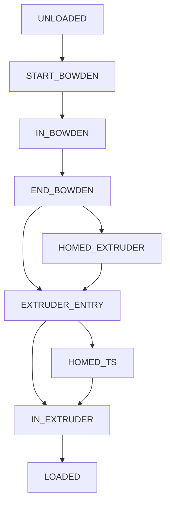

# Happy Hare Macro Customization (including Filament Loading and Unloading)
Happy Hare provides many "callback macros" that, if they exist, will be called at specific times.  They are designed for you to be able to extend the base functionality and to implement additional operations.  For example, if you want to control your printers LED's based on the action Happy Hare is performing you would modify `_MMU_ACTION_CHANGED`.

All of the default handlers and examples are defined in either `mmu_software.cfg`, `mmu_sequence.cfg`, `mmu_form_tip.cfg` or `mmu_cut_tip.cfg` and serve as a starting point for modification.

> [!NOTE]  
> Most of the macro names can be changed in `mmu_parameters.cfg`.  Therefore it is best practice to copy the reference macro as a starting point into your own `cfg` file and to RENAME it.  Then simply point to your macro instead of these defaults.  The reason for that is that the reference set can be upgraded and that would overwrite your changes.
>
> You can also use the klipper mechanism of renaming macros, replacing with your own of the original name and still calling the reference ones here from your custom macro to maintain functionality.

<br>

Here are all the callout macros together with details of where to find them:

##    _MMU_ACTION_CHANGED (mmu_software.cfg)
Most of the time Happy Hare will be in the `Idle` state but it starts to perform a new action this macro is called.  The action string is passed as a `ACTION` parameter to the macro but can also be read with the printer variable `printer.mmu.action`. The previous action is passed in as `OLD_ACTION`

Possible action strings are:

```yml
    Idle           No action being performed
    Loading        Filament loading
    Unloading      Filamdng unloading
    Loading Ext    Loading filament into the extruder (usually occurs after Loading)
    Exiting Ext    Unloading filament from the extruder (usually after Foriming Tip and before Unloading)
    Forming Tip    When running standalone tip forming (cannot detect when slicer does it)
    Heating        When heating the nozzle
    Checking       Checking gates for filament (MMU_CHECK_GATES)
    Homing         Homing the selector
    Selecting      When the selector is moving to select a new filament
    Unknown        Should not occur
```

Here is the start of the reference macro packaged in `mmu_software.cfg` used to drive LED effects:

```yml
###########################################################################
# Called when when the MMU action status changes
#
# The `ACTION` parameter will contain the current action string
# (also available in `printer.mmu.action` printer variable).
# Also the previous action is available in `OLD_ACTION`.
#
# See Happy Hare README for full list of action strings, but a quick ref is:
#
#  Idle|Loading|Unloading|Loading Ext|Exiting Ext|Forming Tip|Heating|Checking|Homing|Selecting
#
# The reference logic here drives a set of optional LED's
#
[gcode_macro _MMU_ACTION_CHANGED]
description: Called when an action has changed
gcode:
    
    
```

<br>

##    _MMU_PRINT_STATE_CHANGED (mmu_software.cfg)
Happy Hare implements a state machine tracking the prgoress of a print. It is difference from the klipper `print_stats` because it is specific to MMU state during a print. Full details can be found [here](/https://github.com/moggieuk/Happy-Hare/tree/development?tab=readme-ov-file#13-job-state-transistions-and-print-startend-handlingdoc/TODO).  Every time a state changes this macro will be called. Then new state will be passed with the `STATE` parameter and the previous state as `OLD_STATE`. The state can also be read with the printer variable `printer.mmu.print_state`

Possible state strings are:

```yml
    initialized    State occurs on first bootup or after initialization command like `MMU_RESET` or `MMU ENABLE=0 -> MMU ENABLE=1`
    ready          MMU is idle out of a print
    started        Short lived state the occurs during the startup phase when starting a print
    printing       State meaning that a print is underway
    complete       End state that occurs after a print has sucessfully finished printing
    cancelled      End state that occurs if a print is cancelled
    error          End state when a print ends in an error
    pause_locked   State that indicates MMU has experienced and error and certain features are locked until `MMU_UNLOCK` is run
    paused         State that occurs after `MMU_UNLOCK`
    standby        Printer has been idle for extended period of time
```

Here is the start of the reference macro packaged in `mmu_software.cfg` used to drive LED effects:

```yml
###########################################################################
# Called when the MMU print state changes
#
# The `STATE` parameter will contain the current state string
# (also available in `printer.mmu.print_state` printer variable)
# Also the previous action is available in `OLD_STATE`.
#
# See Happy Hare README for full list of state strings and the state transition
# diagram, but a quick ref is:
#
#  initialized|ready|started|printing|complete|cancelled|error|pause_locked|paused|standby
#
# The reference logic here drives a set of optional LED's
#
[gcode_macro _MMU_PRINT_STATE_CHANGED]
description: Called when print state changes
gcode:
    
    
```

<br>

##    _MMU_GATE_MAP_CHANGED (mmu_software.cfg)
Happy Hare maintains a map of all the filaments in the MMU including material type, color, etc.  When this map changes this macro is called. The `GATE` parameter will either represent a specific gate that has been updated or `-1` meaning that mutliple gates are updated. The actual gate map infomation can be read through printer variables `printer.mmu.gate_color`, `printer.mmu.gate_material`, etc..

Here is the start of the reference macro packaged in `mmu_software.cfg` used to drive LED effects:


```yml
###########################################################################
# Called when the MMU gate_map (containing information about the filament
# type, color, availability and spoolId) is updated
#
# The `GATE` parameter will contain the gate that is updated or -1 if all updated
#
# The reference logic here drives a set of optional LED's
#
[gcode_macro _MMU_GATE_MAP_CHANGED]
description: Called when gate map is updated
gcode:
    
```

<br>

##    Unloading / Loading "Sequence" Macros (mmu_sequence.cfg)
This set of macros are called during filament loading or unloading. They can be used for the insertion of logic specific to your printer setup. The ordering of these macros is as follows (if any are not defined they are skipped):

```yml
Unloading sequence...
  _MMU_PRE_UNLOAD             Called before starting the unload
    'form_tip_macro'          User defined macro for tip forming
  _MMU_POST_FORM_TIP          Called immediately after tip forming
    (_MMU_UNLOAD_SEQUENCE)    Advanced: Optionally called based on 'gcode_unload_sequence'
  _MMU_POST_UNLOAD            Called after unload completes

Loading sequence...
  _MMU_PRE_LOAD               Called before starting the load
    (_MMU_LOAD_SEQUENCE)      Advanced: Optionally called based on 'gcode_load_sequence'
  _MMU_POST_LOAD              Called after the load is complete
```

If changing a tool the unload sequence will be immediately followed by the load sequence. Note that Happy Hare has some built in functionality to minimize the logic necessary in these macros:
* Happy Hare separately implements z-hop moves on toolchange (including EndlessSpool) specified with the 'z_hop_height_toolchange' parameter as well as on errors and print cancellation with 'z_hop_error' parameter.
* Toolhead will be correctly placed prior to resuming the print although the logic will only be expecting to correct z_hop height and will be slow if horizonal moves are necessary
* Pressure advance will automatically be restored after tip forming
* M220 & M221 overrides will be retained after a toolchange
* If configured, Spoolman will be notified of toolchange
* Should an error occur causing a pause, the extruder temperature will be saved and restored on MMU_UNLOCK or resume


Leveraging the basic callbacks is usually sufficent for customization, however if you really want to do something unusual you can enable the gcode loading/unloading sequences by setting the following in 'mmu_parameters.cfg'
```yml
gcode_load_sequence: 1
gcode_unload_sequence: 1
```
This is quite advanced and you will need to understand the Happy Hare state machine before embarking on changes

<p>

The behavior of these default macros is controlled by the following set of variables found at the top of the `mmu_sequence.cfg` file.  Once you have set `variable_park_xy` to the coordinates of a safe park area (usually over your purge bucket) you can set `variable_enable_park: 1` to enable movement of the toolhead away from the print while changing filaments.
```yml
###########################################################################
# Variables controlling sequence macros are all set here
#
[gcode_macro _MMU_Variables]
variable_enable_park: 0                 # Whether the parking move is enabled. Turn on after setting park_xy
variable_park_xy: 50, 50                # Coordinates of park position for toolchange
variable_park_z_hop: 1                  # Additional Z_hop when toolchanging
variable_travel_speed: 200              # XY travel speed in mm/s
variable_lift_speed: 15                 # Z travel speed in mm/s
variable_auto_home: 0                   # Automatically home if necessary (mainly testing use case)
variable_park_after_form_tip: 0         # Set to 1 if tip cutting at toolhead to delay move to park position
```

> [!NOTE]  
> Generally `variable_park_after_form_tip` will be `0` meaning the move away from the print is immediate.  If you are using a cutter at the toolhead you will want to set this to `1`.  This delays the move until after the movement defined in the tip cutting macro.

Here are some examples of logic that might be put in these macros:

#### _MMU_PRE_UNLOAD (mmu_sequence.cfg)
Logic here would typically move the toolhead to a safe spot like over the purge bucket

#### _MMU_POST_FORM_TIP (mmu_sequence.cfg)
Optional this logic would do the same this as `_MMU_PRE_UNLOAD` in the case of a tip cutting movement

#### _MMU_POST_UNLOAD (mmu_sequence.cfg)
Logic here can be used to implement tip cutting and cleanup at the MMU gate

#### _MMU_PRE_LOAD (mmu_sequence.cfg)
This is a great spot to add logic to take time lapse photography (although it can also be done elsewhere)

#### _MMU_POST_LOAD (mmu_sequence.cfg)
Logic here can perform extra purging operations, pause for ooze and then wipe nozzle before returning to the original position recorded in either the `_MMU_PRE_UNLOAD` or `_MMU_POST_FORM_TIP` macros

> [!NOTE]  
> Although Happy Hare has defensive logic to always return the toolhead to the correct position it may do this slowly because it is only anticipating a z_hop movement. A common problem is that the `_MMU_POST_LOAD` does not restore the X/Y toolhead position correctly leading to this strange slow movement.

<br>

##    _MMU_FORM_TIP (form_tip.cfg)
This is probably the most important aspect of getting a reliable MMU after basic calibration is complete. There is plenty written about tip forming and lots of advice in the forums.  What is important to understand here is that this macro mimicks the tip forming logic from SuperSlicer (almost identical to PrusaSlicer). Read SuperSlicer documentation for hints. That said, here are a few things you should know:

* This macro will always be used when not printing, but you can elect to use it instead of your slicers logic by:</li>
  - Turning OFF all tip forming logic in your slicer</li>
  - Setting the `variable_standalone: 1` in the `T0` macro</li>
* When tuning if is useful to pull the bowden from your extruder, load filament with the `MMU_LOAD EXTRUDER_ONLY=1` command, then call `MMU_FORM_TIP` command (and not the macro directly) or better still `MMU_EJECT EXTRUDER_ONLY=1`</li>
  - The benefit of calling as desribed is the additional TMC current control and pressure advance restoration will occur so it exactly mimicks what will occur when called automatically later</li>
  - If calling `MMU_FORM_TIP` you will want to set `variable_final_eject: 1` so that the filament is fully ejected for inspection (MMU_EJECT will automatically do this and therefore is recommended)
  - Calling with `MMU_EJECT EXTRUDER_ONLY=1` will also report on the final parking position of the filament</li>
* Before you start tweaking, make sure the settings accurately represent the geometry of your extruder. The defaults are for my Voron Clockwork 2 extruder with Voron Revo hotend with 0.4mm tip</li>
* Lastely there is a setting called `parking_distance` which, if set, will determine the final resting place measured from the nozzle. This should be a postive number!</li>

Here are the default values for tip forming.  These are the exact values I used for non PLA filaments (PLA seems to like skinny dip):

```yml
# Unloading and Ramming values - Initial moves to form and shape tip
variable_unloading_speed_start: 80     # Fast here to seperate the filament from meltzone (Very intitial retract SS uses distance of E-15)
variable_unloading_speed: 20           # Too fast forms excessively long tip or hair. Slow is better here UNLOADING_SPEED_START/COOLING_MOVES seems a good start
variable_ramming_volume: 0             # in mm3 SS default values = 2, 5, 9, 13, 18, 23, 27. Only Used to Simulate SS Ramming during standalone
variable_ss_ramming: 0                 # Set to 0 for standalone ramming (RAMMING_VOLUME) or tuning, 1 to let the slicer do it (i.e. turn off standalone)

# Cooling Move Values - To cool the tip formed and separate from strings
variable_cooling_tube_position: 35     # Dragon ST: 35, Dragon HF: 30, Mosquito: 30, Revo: 35, Phaetus Rapido HF: 43;  Measured from Top of Heater Block to Top of Heatsink
variable_cooling_tube_length: 10       # Dragon ST: 15, Dragon HF: 10, Mosquito: 20, Revo: 10, Phaetus Rapido HF: 22; Measured from Nozzle to Top of Heater Block
variable_initial_cooling_speed: 10     # Slow to solidify tip and cool string if formed.
variable_final_cooling_speed: 50       # High speed break the string formed. Too fast = tip deformation during eject. Too Slow = long string/no seperation
variable_toolchange_temp: 0            # Used if you want to lower temp during toolchanges default 0
variable_cooling_moves: 4              # 2-4 is a good start

# SkinnyDip values - To burn off VERY FINE hairs only (This is NOT for long tip reshaping)
variable_use_skinnydip: 1              # Tune this LAST, this is for removal of VERY FINE hairs only (Different than a long tip)
variable_skinnydip_distance: 30        # Start just under Cooling_tube_position and increase - Will depend on how much Ramming Volume is used
variable_dip_insertion_speed: 30       # Medium-Slow - Just long enough to melt the fine hairs. Too slow will pull up molten filament
variable_dip_extraction_speed: 70      # Around 2x Insertion speed, Prevents forming new hairs
variable_melt_zone_pause: 0            # in milliseconds - default 0
variable_cooling_zone_pause: 0         # in milliseconds - default 0 - If you need to adjust here its possible Dip Insertion too slow
variable_use_fast_skinnydip: 0         # Skip the toolhead temp change during skinnydip move - default 0

# Park filament ready to eject
variable_parking_distance: 35          # Final filament parking position after final cooling move, 0 will leave filament where it naturally ends up

# Final Eject - for standalone tuning only. Automatically set by `MMU_FORM_TIP` command
variable_final_eject: 0                # default 0, enable during standalone tuning process to eject the filament
```

##    _MMU_CUT_TIP (cut_tip.cfg)
To elminate the need to spend time tuning the tip forming procedure (you never wanted to understand fluid dynamics, right?!) you can opt to cut filament at the toolhead. The filametrix cutter bundled with ERCFv2 is an example of this. Note that Happy Hare can only have one tip creation macro defined. You can switch from the default tip forming to this tip cutting macro by setting `form_tip_macro: _MMU_CUT_TIP` in `mmu_parameters.cfg` to point to this macro instead.

Here are the default values for tip cutting with explanation:

```yml
###########################################################################
# Happy Hare supporting macros
#   Standalone Tip Cutting for Filametrix and toolhead cutters
#
# To configure, set
#   'form_tip_macro: _MMU_CUT_TIP' in 'mmu_parameters.cfg'
#
# Default configuration is good for Stealthburner with CW2 and Voron Revo nozzle
#
# IMPORTANT:
#   The park position of the filament is relative to the nozzle and
#   represents where the end of the filament is after cutting. The park position
#   is important and used by Happy Hare both to finish unloading the extruder
#   as well as to calculate how far to advance the filament on the subsequent load.
#   It is important to report back the position your cutter leaves the filament
#   in the extruder via the variable 'output_park_pos'.
#
#   This can be set dynamically in gcode with this construct:
#     SET_GCODE_VARIABLE MACRO=_MMU_CUT_TIP VARIABLE=output_park_pos VALUE=..
#   or preset as a variable on the macro like this:
#     'variable_output_park_pos: 35'
#
# When using this macro it is important to turn off tip forming in your slicer and
# force Happy Hare to always run this when loading filament by adding:
#   'force_form_tip_standalone: 1' in 'mmu_parameters.cfg'
#
[gcode_macro _MMU_CUT_TIP]
description: Cut filament by pressing the cutter on a pin with a horizontal movement

# This should be set to the distance from the internal nozzle tip to the cutting blade and is used in calculations on the
# final location of the filament end (output_park_pos) and remaining filament fragment size (output_remaining_filament)
# for use by Happy Hare
variable_blade_pos: 37.5

# Distance to retract prior to making the cut, this reduces wasted filament but might cause clog 
# if set too large and/or if there are gaps in the hotend assembly 
# This must be less than 'balde_pos' - the distance from the nozzle to the cutter 
variable_retract_length: 32.5

# The location of the pin, this should be the position of the toolhead when the cutter 
# just lightly touches the pin
variable_pin_loc_x: 14
variable_pin_loc_y: 250

# The starting and end positions when making the cut
# In particular, instead of making the cut by traveling to the pin location above, 
# we leave a small safety margin along X-axis to avoid scratching on the pin when traveling
# This should also give a small distance to produce some momentum when pressing on the pin 
variable_pin_park_x_dist: 5.0

# Position of the toolhead when the cutter is fully compressed
# Should leave a small headroom (e.g., should be a bit larger than 0, or whatever xmin is) to avoid banging the toolhead or gantry
variable_pin_loc_x_compressed: 0.5
variable_pin_loc_x_compressed: 0.5

# Retract length and speed after the cut so that the cutter can go back into its origin position
variable_rip_length: 1                  # Distance to retract to aid lever decompression (>= 0)
variable_rip_speed: 3                   # mm/s

# Pushback of the remaining tip from the cold end into the hotend. Cannot be larger than 'retract_length'
variable_pushback_length: 5
variable_pushback_dwell_time: 0         # Time to dwell after the pushback

# Speed related settings
# Note that if the cut speed is too fast, the steppers can lose steps. Therefore, for a cut: 
# - We first make a fast move to accumulate some momentum and get the cut blade to the initial contact with the filament
# - We then make a slow move for the actual cut to happen 
variable_travel_speed: 150              # mm/s
variable_cut_fast_move_speed: 32        # mm/s
variable_cut_slow_move_speed: 8         # mm/s
variable_evacuate_speed: 150            # mm/s
variable_cut_dwell_time: 50             # Time to dwell at the cut point in ms
variable_cut_fast_move_fraction: 1.0    # Fraction of the move that uses fast move 

variable_extruder_move_speed: 25        # mm/s for all extruder movement

# Safety margin for fast vs slow travel
# When traveling to the pin location, we make a safer but longer move if we closer to the pin than this specified margin
# Usually setting these to the size of the toolhead (plus a small margin) should be good enough 
variable_safe_margin_x: 30
variable_safe_margin_y: 30

# If gantry servo option is installed, enable the servo and set up and down angle positions
variable_gantry_servo_enabled: 0
variable_gantry_servo_down_angle: 55
variable_gantry_servo_up_angle: 180

# Testing only: Whether to eject the filament at the end
variable_final_eject: 0                 # Don't leave enabled!

# -------------------------- Internal Don't Touch -------------------------
variable_output_park_pos: 0             # Dynamically set in macro
```

> [!NOTE]  
> The `output_park_pos` variable is used to pass the resultant position of the filament back to Happy Hare and in this reference macro it is set dynamically.

<br>

##    _MMU_LOAD_SEQUENCE & _MMU_UNLOAD_SEQUENCE (mmu_sequence.cfg)

> [!WARNING]  
> This is new EXPERIMENTAL functionality and as such is subject to change (with only a mild apology :-)

By default these macros are not called, however, if `gcode_load_sequence: 1` or `gcode_unload_sequence: 1` are enabled they will be.  The two default macros in `mmu_sequence.cfg` (copied here) will/should provide exactly the same logic as the internal logic using a set of provided "modular" loading/unloading functions. They are a good starting point.

<br>

`mmu_sequence.cfg` contains futher examples for alternative MMU setups, but before experimenting it is essential to understand the state machine for filament position.  These states are as follows and the loading/unloading sequence must be capable of completing the load/unload sequence for any starting state.<br>



In additon to these states the macros are passed some additional information and hints about the context.  An important one is `FILAMENT_POS` which represents the position of the filament in mm either from "point 0" in the gate (load direction) or from the nozzle (unload direction).  Here are the default macros with additional information:<br>


```yml
###########################################################################
# ADVANCED: User modifable loading and unloading sequences
#
# By default Happy Hare will call internal logic to handle loading and unloading
# sequences. To enable the calling of user defined sequences you must add the
# following to your mmu_parameters.cfg
#
# gcode_load_sequence: 1	# Gcode loading sequence 1=enabled, 0=internal logic (default)
# gcode_unload_sequence: 1	# Gcode unloading sequence, 1=enabled, 0=internal logic (default)
#
# This reference example load sequence mimicks the internal ones exactly. It uses the
# high level "modular" movements that are all controlled by parameters defined in
# mmu_parameters.cfg and automatically keep the internal filament position state up-to-date.
# Switching to these macros should not change behavior and can serve as a starting point for
# your customizations
#
# State Machine:
# If you experiment beyond the basic example shown here you will need to understand
# the possible states for filament position.  This is the same state that is exposed
# as the `printer.mmu.filament_pos` printer variable. This internal state must be
# kept up-to-date and will need to be set directly as you progress through your
# custom move sequence.  At this time the state machine is non-extensible.
#
#        FILAMENT_POS_UNKNOWN = -1
#  L  ^  FILAMENT_POS_UNLOADED = 0
#  O  |  FILAMENT_POS_START_BOWDEN = 1
#  A  |  FILAMENT_POS_IN_BOWDEN = 2
#  D  U  FILAMENT_POS_END_BOWDEN = 3
#  |  N  FILAMENT_POS_HOMED_EXTRUDER = 4
#  |  L  FILAMENT_POS_EXTRUDER_ENTRY = 5
#  |  O  FILAMENT_POS_HOMED_TS = 6
#  |  A  FILAMENT_POS_IN_EXTRUDER = 7    # AKA Filament is past the Toolhead Sensor
#  v  D  FILAMENT_POS_LOADED = 8         # AKA Filament is homed to the nozzle
#
# Final notes:
# 1) You need to respect the context being passed into the macro such as the
#    desired 'length' to move because this can be called for test loading
# 2) The unload macro can be called with the filament in any position (states)
#    You are required to handle any starting point. The default reference
#    serves as a good guide
#
[gcode_macro _MMU_LOAD_SEQUENCE]
description: Called when MMU is asked to load filament
gcode:
    
    
    
    
    
    

    
        _MMU_STEP_LOAD_TOOLHEAD EXTRUDER_ONLY=1

    
        {action_raise_error("Can't load - already in extruder!")}

    
                              # FILAMENT_POS_UNLOADED
            _MMU_STEP_LOAD_GATE
        

                               # FILAMENT_POS_END_BOWDEN
            _MMU_STEP_LOAD_BOWDEN LENGTH={length}
        

             # FILAMENT_POS_HOMED_EXTRUDER
            _MMU_STEP_HOME_EXTRUDER
        

                              # FILAMENT_POS_PAST_EXTRUDER
            _MMU_STEP_LOAD_TOOLHEAD
        

    

[gcode_macro _MMU_UNLOAD_SEQUENCE]
description: Called when MMU is asked to unload filament
gcode:
    
    
    
    

    
                              # FILAMENT_POS_PAST_EXTRUDER
            _MMU_STEP_UNLOAD_TOOLHEAD EXTRUDER_ONLY=1 PARK_POS={park_pos}
        
            {action_raise_error("Can't unload extruder - already unloaded!")}
        

    
        {action_raise_error("Can't unload - already unloaded!")}

    
                              # FILAMENT_POS_PAST_EXTRUDER
            # Exit extruder, fast unload of bowden, then slow unload encoder
            _MMU_STEP_UNLOAD_TOOLHEAD PARK_POS={park_pos}
        

                              # FILAMENT_POS_END_BOWDEN
            # Fast unload of bowden, then slow unload encoder
            _MMU_STEP_UNLOAD_BOWDEN FULL=1
            _MMU_STEP_UNLOAD_GATE

                            # FILAMENT_POS_START_BOWDEN
            # Have to do slow unload because we don't know exactly where in the bowden we are
            _MMU_STEP_UNLOAD_GATE FULL=1
        

    
```

> [!NOTE]  
> Additional examples can be found at the end of `mmu_sequence.cfg`

<br>

##    Internal "step" Macro Reference

The following are internal macros that can be called from within the `_MMU_LOAD_SEQUENCE` and `MMU_UNLOAD_SEQUENCE` callbacks:

  | Macro | &nbsp;&nbsp;&nbsp;&nbsp;&nbsp;&nbsp;&nbsp;&nbsp;&nbsp;&nbsp;&nbsp;&nbsp;Description&nbsp;&nbsp;&nbsp;&nbsp;&nbsp;&nbsp;&nbsp;&nbsp;&nbsp;&nbsp;&nbsp;&nbsp; | Parameters |
  | ----- | ----------- | ---------- |
  | `_MMU_STEP_LOAD_GATE` | User composable loading step: Move filament from gate to start of bowden using gate sensor or encoder | |
  | `_MMU_STEP_LOAD_BOWDEN` | User composable loading step: Smart loading of bowden | `LENGTH=..` |
  | `_MMU_STEP_HOME_EXTRUDER` | User composable loading step: Extruder collision detection | |
  | `_MMU_STEP_LOAD_TOOLHEAD` | User composable loading step: Toolhead loading | `EXTRUDER_ONLY=[0\|1]` |
  | `_MMU_STEP_UNLOAD_TOOLHEAD` | User composable unloading step: Toolhead unloading | `EXTRUDER_ONLY=[0\|1]` <br> `PARK_POS=..` |
  | `_MMU_STEP_UNLOAD_BOWDEN` | User composable unloading step: Smart unloading of bowden | `FULL=[0\|1]` <br> `LENGTH=..` |
  | `_MMU_STEP_UNLOAD_GATE` | User composable unloading step: Move filament from start of bowden and park in the gate using gate sensor or encoder | `FULL=[0\|1]` |
  | `_MMU_STEP_SET_FILAMENT` | User composable loading step: Set filament position state | `STATE=[0..8]` The filament position (see states below) <br> `SILENT=[0\|1] <br> States: <br> UNKNOWN = -1 <br> UNLOADED = 0 <br> START_BOWDEN = 1 <br> IN_BOWDEN = 2 <br> END_BOWDEN = 3 <br> HOMED_EXTRUDER = 4 <br> EXTRUDER_ENTRY = 5 <br> HOMED_TS = 6 <br> IN_EXTRUDER (past TS) = 7 <br> LOADED = 8 |
  | `_MMU_STEP_MOVE` | User composable loading step: Generic move | `MOVE=..[100]` Length of gear move in mm <br>`SPEED=..` (defaults to speed defined to type of motor/homing combination) Stepper move speed <br>`ACCEL=..` (defaults to min accel defined on steppers employed in move) Motor acceleration <br>`MOTOR=[gear\|extruder\|gear+extruder\|extruder+gear]` (default: gear) The motor or motor combination to employ. gear+extruder commands the gear stepper and links extruder to movement, extruder+gear commands the extruder stepper and links gear to movement |
  | `_MMU_STEP_HOMING_MOVE` | User composable loading step: Generic homing move | `MOVE=..[100]` Length of gear move in mm <br>`SPEED=..` (defaults to speed defined to type of motor/homing combination) Stepper move speed <br>`ACCEL=..` Motor accelaration (defaults to min accel defined on steppers employed in homing move) <br>`MOTOR=[gear\|extruder\|gear+extruder\|extruder+gear]` (default: gear) The motor or motor combination to employ. gear+extruder commands the gear stepper and links extruder to movement, extruder+gear commands the extruder stepper and links gear to movement. This is important for homing because the endstop must be on the commanded stepper <br>`ENDSTOP=..` Symbolic name of endstop to home to as defined in mmu_hardware.cfg. Must be defined on the primary stepper <br>`STOP_ON_ENDSTOP=[1\|-1]` (default 1) The direction of homing move. 1 is in the normal direction with endstop firing, -1 is in the reverse direction waiting for endstop to release. Note that virtual (touch) endstops can only be homed in a forward direction |

